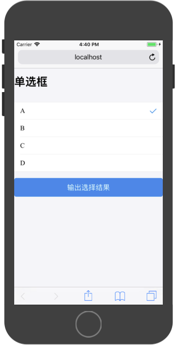

# antd基础组件

### Button 按钮

按钮作为WebApp一个基础组件，其展现形式一般如下：


常用API：

|属性|说明|类型|默认值|
|:---|:---|:---|
|type|按钮默认样式类型|string:`primary`、`ghost`、`warning`|空|
|size|按钮默认样式大小|string:`large`、`small`|`large`|
|onClick|点击按钮的点击回调函数|(e: Object): void|无|
|loading|设置按钮载入状态|boolean|false|
|disabled|设置按钮禁用状态|boolean|false|
|style|自定义样式|Object|无|
|activeStyle|点击反馈的自定义样式|Object|无|


在默认情况下，按钮的宽度和屏幕宽度相同。高度为47px。

Button组件自带四种样式，通过配置`type`属性控制：

* `default`
* `primary`
* `ghost`
* `warning`

```
import React, { Component } from 'react';

import { Button } from 'antd-mobile';

export default class App extends Component {

  render() {
    return (
        <div>
          <h1>按钮type演示</h1>
          <br/>
          <Button>default</Button>
          <br/>
          <Button type="primary">primary</Button>
          <br/>
          <Button type="warning">warning</Button>
          <br/>
          <Button type="ghost">warning</Button>
        </div>
    );
  }
}
```

运行结果：


Button自带两种尺寸样式，通过配置`size`属性控制：

* `large`。默认尺寸（推荐使用）
* `small`。小尺寸（特点场景下使用）

```
import React, { Component } from 'react';

import { Button } from 'antd-mobile';

export default class App extends Component {

  render() {
    return (
        <div>
          <h1>按钮Size演示</h1>
          <br/>
          <Button type="primary" size='small'>primary-small</Button>
          <br/>
          <Button type="primary">primary</Button>
        </div>
    );
  }
}
```

运行结果：


通过组件的`onClick`属性，可以响应Button的点击事件：

```
import React, { Component } from 'react';

import { Button } from 'antd-mobile';

export default class App extends Component {

  onButtonClick = ()=>{
    console.log('按钮被点击');
  }

  render() {
    return (
        <div>
          <h1>按钮点击事件演示</h1>
          <br/>
          <Button 
            type="primary"
            onClick={this.onButtonClick}
          >Click</Button>
        </div>
    );
  }
}
```
运行结果：


点击按钮效果：

```
按钮被点击
```

通过配置组件的`loading`和`disabled`属性，可以在按钮在异步操作时暂时暂停交互：

```
import React, { Component } from 'react';

import { Button } from 'antd-mobile';

export default class App extends Component {

  constructor(props) {
    super(props)
  
    this.state = {
       isLoading:false,
       isDisabled:false
    }
  }
  

  onButtonClick = (e)=>{
    console.log('按钮被点击');
    this.setState({
      isLoading:true,
      isDisabled:true
    });
    setTimeout(()=>{
      this.setState({
        isLoading:false,
        isDisabled:false
      });
    },3000)
  }

  render() {
    return (
        <div>
          <h1>按钮加载演示</h1>
          <br/>
          <Button 
            type="primary"
            onClick={this.onButtonClick}
            loading={this.state.isLoading}
            disabled={this.state.isDisabled}
          >Click</Button>
        </div>
    );
  }
}
```

运行效果：


点击之后效果：


### 自定义样式

如Button组件默认样式不能满足产品要求，可以通过配置`style`和`activeStyle`属性来自定义样式：

```
import React, { Component } from 'react';

import { Button } from 'antd-mobile';

export default class App extends Component {

  render() {
    return (
        <div>
          <h1>按钮加载演示</h1>
          <br/>
          <Button 
            type="primary"
            onClick={this.onButtonClick}
            style={{
              backgroundColor:'red',
            }}
            activeStyle={{
              backgroundColor:'green',
            }}
          >Click</Button>
        </div>
    );
  }
}
```

运行效果：


点击后效果：


### Switch 滑动开关

Switch组件提供一个移动开关。


>该组件的尺寸不推荐更改。

常用API：

|属性|说明|类型|默认值|
|:---|:---|:---|
|checked|开关选中状态|Boolean|false|
|onChange|change 事件触发的回调函数|(checked: bool): void|无|
|color|开关打开后的颜色|String|#4dd865|


该组件使用方式推荐为受控组件模式

```
import React, { Component } from 'react';

import { Button,Switch } from 'antd-mobile';

export default class App extends Component {

  constructor(props) {
    super(props)
  
    this.state = {
      checkedA:false,
      checkedB:false
    }
  }
  

  render() {
    return (
        <div>
          <h1>开关演示</h1>
          <br/>
          <Switch 
            checked={this.state.checkedA}
            onChange={(checkedA)=>{this.setState({checkedA})}}
          />
          <Switch 
            checked={this.state.checkedB}
            onChange={(checkedB)=>{this.setState({checkedB})}}
            color={'red'}
          />
        </div>
    );
  }
}
```

运行结果为：


### Stepper 步进器


常用API：

|属性|说明|类型|默认值|
|:---|:---|:---|
|min|	最小值|	Number|	-Infinity|
|max|	最大值|	Number|	Infinity|
|value|	当前值|	Number|	
|step	|每次改变步数，可以为小数|	Number 	|1|	
|onChange|	变化时回调函数|	(): void	|
|showNumber|是否显示数值，默认不显示|Boolean|false|


该组件推荐使用受控模式，使用案例：

```
import React, { Component } from 'react';

import { Button,Switch, Stepper} from 'antd-mobile';

export default class App extends Component {

  constructor(props) {
    super(props)
  
    this.state = {
      count:5,
    }
  }
  

  render() {
    return (
        <div>
          <h1>步进器演示1</h1>
          <br/>
          <Stepper 
            min={0}
            max={10}
            value={this.state.count}
            step={0.5}
            onChange={(count)=>{this.setState({count})}}
            showNumber={true}
          /> 
        </div>
    );
  }
}
```


使用步进器控制器其他组件，使用案例：

```
import React, { Component } from 'react';

import { Button,Switch, Stepper} from 'antd-mobile';

export default class App extends Component {

  constructor(props) {
    super(props)
  
    this.state = {
      count:5,
    }
  }
  

  render() {
    return (
        <div>
          <h1>步进器演示2</h1>
          <br/>
          <p>{`步进器数值：${this.state.count}`}</p>
          <Stepper 
            min={0}
            max={10}
            value={this.state.count}
            step={0.5}
            onChange={(count)=>{this.setState({count})}}
            showNumber={false}
          /> 
        </div>
    );
  }
}
```


### Slider 滑动输入条

允许用户在一个区间中选择特定值，例如：控制屏幕的显示亮度。

默认规则：

* 默认状态下，左边为最小值，右边为最大值。
* 一般水平放置。


常用API：

|属性|说明|类型|默认值|
|:---|:---|:---|
|min|	Number|	0	|最小值|
|max|	Number|	100	|最大值|
|step|	Number or null|	1	|步长，取值必须大于 0，并且可被 (max - min) 整除|
|value	|Number|	|	设置当前取值|
|onChange|	Function|	Noop	|当 Slider 的值发生改变时，会触发 onChange 事件，并把改变后的值作为参数传入|


该组件推荐使用受控模式进行操作，参考代码：

```
import React, { Component } from 'react';

import { Button,Switch, Stepper,Slider} from 'antd-mobile';

export default class App extends Component {

  constructor(props) {
    super(props)
  
    this.state = {
      value:0,
    }
  }
  

  render() {
    return (
        <div>
          <h1>滑动输入条演示</h1>
          <br/>
          <p>{`滑动输入条数值：${this.state.value}`}</p>
          <Slider 
            min={0}
            max={10}
            value={this.state.value}
            step={0.1}
            onChange={(value)=>{this.setState({value})}}
            showNumber={false}
          /> 
        </div>
    );
  }
}
```

运行效果：


### InputItem 文本输入

用于接受单行文本，采用受控组件模型开发。

默认规则：

* 支持通过键盘或者剪切板输入文本。
* 通过光标可以在水平方向进行移动。
* 对特定格式的文本进行处理，例如：隐藏密码。

常用API：

|属性|说明|类型|默认值|
|:---|:---|:---|
|type|依据不同类型，展示不同键盘|string|`text`|
|value|组件输入内容|string|无|
|placeholder|内容占位符|string|无|
|onChange	|change 事件触发的回调函数	|(val: string): void	|-|
|onBlur	|blur 事件触发的回调函数	|(val: string): void|	-|
|onFocus|	focus 事件触发的回调函数|	(val: string): void	|-|


基本使用：

```
import React, { Component } from 'react';

import { Button,Switch, Stepper,Slider,InputItem} from 'antd-mobile';

export default class App extends Component {

  constructor(props) {
    super(props)
  
    this.state = {
      text:'',
    }
  }

  onButtonClick = ()=>{
    alert(this.state.text);
  }
  

  render() {
    return (
        <div>
          <h1>输入框演示</h1>
          <br/>
          <InputItem
            type={'text'}
            value={this.state.text}
            placeholder={'请输入内容'}
            onChange={(text)=>{this.setState({text})}}
          >
            输入内容
          </InputItem>
          <br/>
          <Button
            type={'primary'}
            onClick={this.onButtonClick}
          >
            打印内容
          </Button>
        </div>
    );
  }
}
```

运行效果：


获取焦点之后键盘自动弹出：


点击打印内容之后，通过`alert`输出内容：


组件的`type`属性有以下类型可以使用：

* `text`：普通文本
* `number`：数字内容
* `password`：密码
* `phone`：手机号
* `bankCard`：银行卡
* `money`：金额

```
import React, { Component } from 'react';

import { Button,Switch, Stepper,Slider,InputItem} from 'antd-mobile';

export default class App extends Component {

  render() {
    return (
        <div>
          <h1>输入框演示</h1>
          <br/>
          <InputItem
            type={'money'}
          >
            输入金额
          </InputItem>
          <br/>
          <InputItem
            type={'text'}
          >
            输入文字
          </InputItem>
          <br/>
          <InputItem
            type={'number'}
          >
            输入数字
          </InputItem>
          <br/>
          <InputItem
            type={'password'}
          >
            输入密码
          </InputItem>
          <br/>
          <InputItem
            type={'phone'}
          >
            输入手机
          </InputItem>
          <br/>
          <InputItem
            type={'bankCard'}
          >
            输入银行卡
          </InputItem>
          <br/>
        </div>
    );
  }
}

```

运行效果：


Ant Design规定，`InputItem`需要放在`List`组件内才能正常使用，所有使用该组件时应该配合`List`组件，我们在下面的章节会详细介绍`List`组件。

构建一个登陆页用来演示`InputItem`标准使用方法：

```
import React, { Component } from 'react';

import { Button,Switch, Stepper,Slider,InputItem,List} from 'antd-mobile';

export default class App extends Component {

  constructor(props) {
    super(props)
  
    this.state = {
       username:'',
       password:''
    }
  }
  


  render() {
    return (
        <div>
          <h1>登陆</h1>
          <br/>
          <List>
            <InputItem
              type={'phone'}
              value={this.state.username}
              onChange={(username)=>{this.setState({username})}}
            >
              手机号
            </InputItem>
            <InputItem
              type={'password'}
              value={this.state.password}
              onChange={(password)=>{this.setState({password})}}
            >
              密码
            </InputItem>
          </List>
          <br/>
          <Button
            type={'primary'}
            onClick={()=>{
              const user = {
                username:this.state.username.replace(/\s+/g,""),//需要将自动排版中的空格字符去掉
                password:this.state.password
              };

              //模拟登陆
              console.log(user)
            }}
          >登陆</Button>
        </div>
    );
  }
}
```


点击登录按钮之后，控制台输出：

```
{username: "18612341234", password: "xxx"}
```

### Radio 单选框

WebApp中的单选框和传统Web中的样式不一样，因WebApp中主要使用手指进行触控操作，而传统Web中是使用鼠标进行操作。所以传统Web中的小圆点不在适用于WebApp。

一个简单的多选页面如下：


AntDesign框架采用 `RadioItem`组件实现单选操作，其组件API如下：

|属性|说明|类型|默认值|
|:---|:---|:---|
|name	|name|	String|	无|
|checked|	指定当前是否选中|	Boolean	|无|
|onChange	|change |事件触发的回调函数|	(e: Object): void	|无|


```
import React, { Component } from 'react';

import { Button,Radio,List} from 'antd-mobile';

const RadioItem = Radio.RadioItem;

export default class App extends Component {

  constructor(props) {
    super(props)
  
    this.state = {
      checked:0
    }
  }
  


  render() {
    return (
        <div>
          <h1>单选框</h1>
          <br/>
          <List>
            <RadioItem
              key={0}
              checked={0===this.state.checked}
              onChange={()=>{this.setState({checked:0})}}
            >x1</RadioItem>
            <RadioItem
              key={1}
              checked={1===this.state.checked}
              onChange={()=>{this.setState({checked:1})}}
            >x2</RadioItem>
          </List>
          <br/>
          <Button
            type={'primary'}
            onClick={()=>{
              //模拟登陆
              console.log(this.state.checked)
            }}
          >输出选择结果</Button>
        </div>
    );
  }
}
```

对于动态单选框，可以参考如下代码进行实现：

```
import React, { Component } from 'react';

import { Button,Radio,List} from 'antd-mobile';

const RadioItem = Radio.RadioItem;

//单选选项数据
const radioDatas = [
  {
    id:0,
    title:'A'
  },
  {
    id:1,
    title:'B'
  },
  {
    id:2,
    title:'C'
  },
  {
    id:3,
    title:'D'
  },
]

export default class App extends Component {

  constructor(props) {
    super(props)
  
    this.state = {
      checked:0
    }
  }
  


  render() {

    //通过循环使用单选数据构造RadioItem数组
    const radioItems = [];
    for(let i = 0;i<radioDatas.length;i++){
      const radioData = radioDatas[i];
      const radioItem = (
        <RadioItem
          key={radioData.id}
          checked={radioData.id === this.state.checked}
          onChange={()=>{this.setState({checked:radioData.id})}}
        >
          {radioData.title}
        </RadioItem>
      )
      radioItems.push(radioItem);
    }

    return (
        <div>
          <h1>单选框</h1>
          <br/>
          <List>
            {radioItems}
          </List>
          <br/>
          <Button
            type={'primary'}
            onClick={()=>{
              //模拟登陆
              console.log(this.state.checked)
            }}
          >输出选择结果</Button>
        </div>
    );
  }
}
```

运行结果为：

