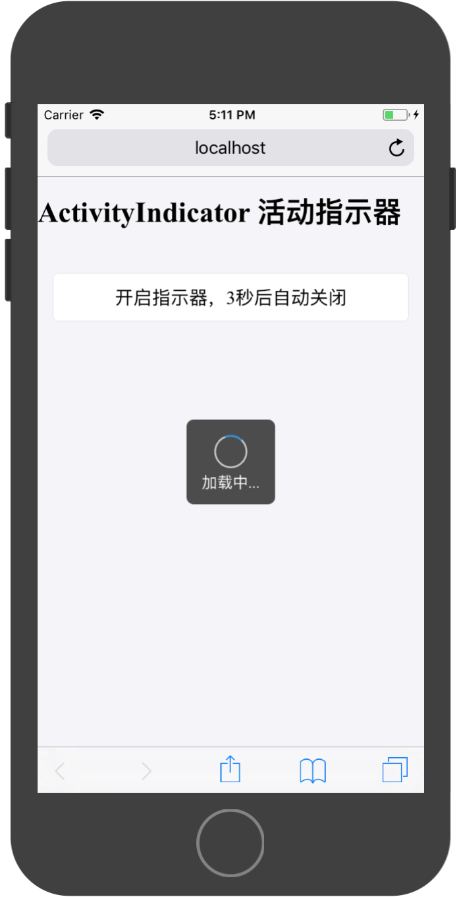
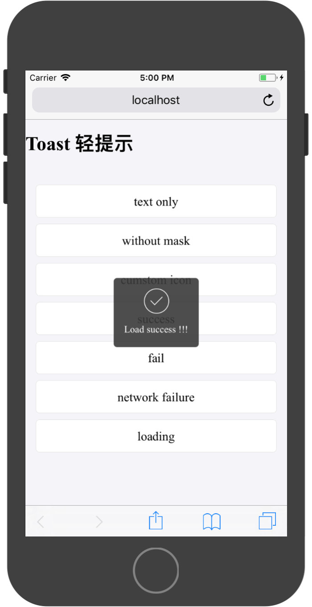
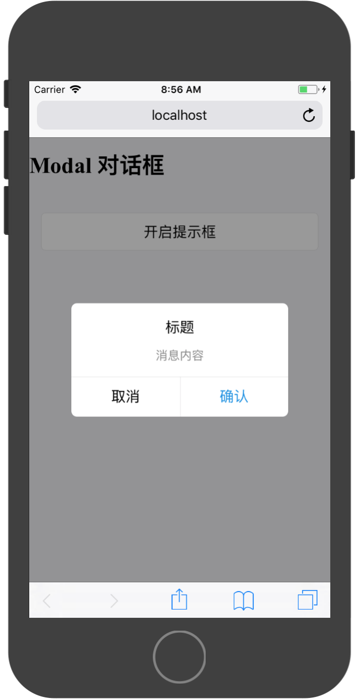
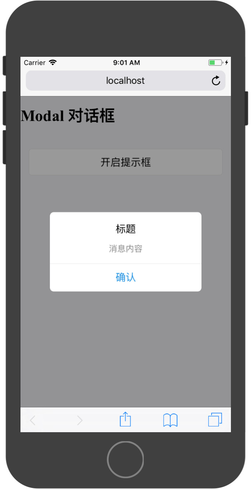
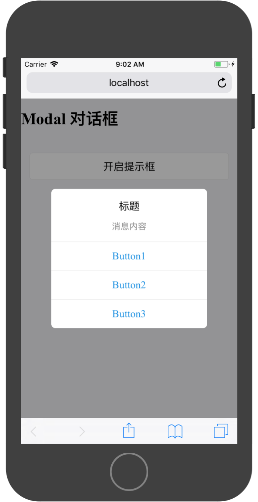
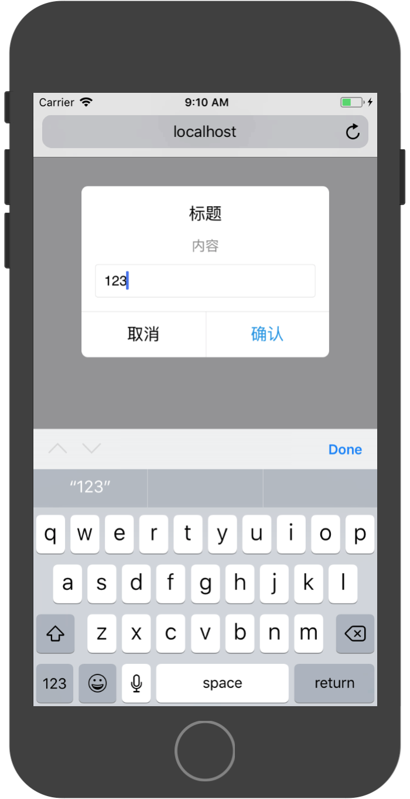
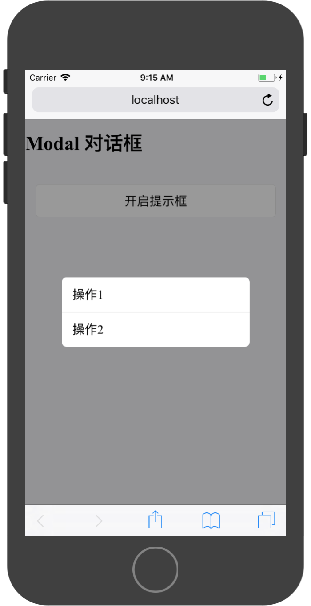
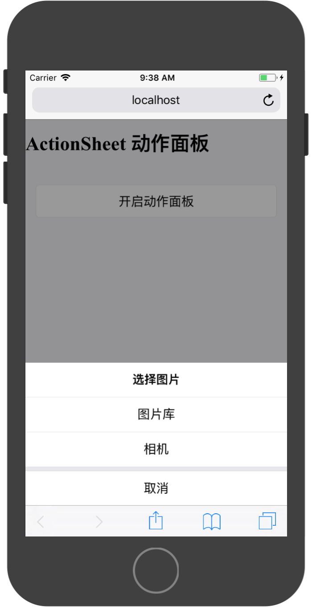
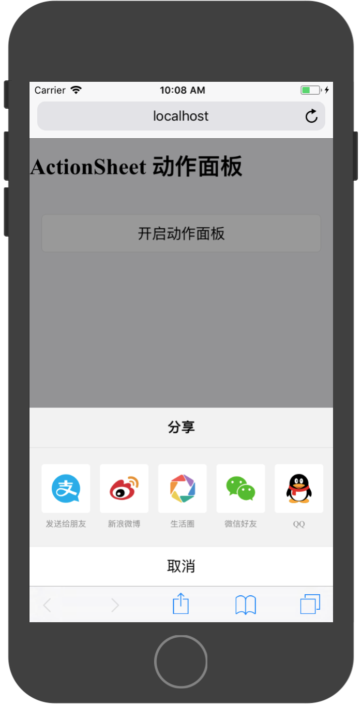

# Ant消息响应组件

### ActivityIndicator 活动指示器

活动指示器。 表明某个任务正在进行中。

默认规则：

* 不要让活动指示器静止，用户会以为该任务停滞了。
* 在某些特定场景下，提供有意义的文案，帮助用户明白哪个任务正在进行中，eg：正在上传照片。
* 如果能知道用户的等待时间，可以使用组件 Progress 来替代。

组件API：

|属性|	说明|	类型	|默认值|
|:---|:---|:---|:---|
|animating|	显隐状态	|boolean|	true|
|size	|spinner大小，可选small/large|	string|	small|
|toast	|loading样式类型	|boolean	|false|
|ext	|loading文本|	string|	-|

使用参考：

```
<ActivityIndicator />
<ActivityIndicator color="white" />
<ActivityIndicator size="large" />
<ActivityIndicator text="正在加载" />
<ActivityIndicator toast />
<ActivityIndicator toast text="正在加载" />
```



实现代码：

```
import React, { Component } from 'react';

import {ActivityIndicator,Toast, Icon,WhiteSpace,Button,List,Carousel,Card,WingBlank,Grid,NoticeBar,Tag} from 'antd-mobile';


export default class App extends Component {

  constructor(props) {
    super(props)
  
    this.state = {
      animating:false,
    }
  }
  
  

  render() {

    return (
        <div>
          <ActivityIndicator
            animating={this.state.animating}
            size={'large'}
            toast={true}
            text={'加载中...'}
          />
          <h1>{'ActivityIndicator 活动指示器'}</h1>
          <WhiteSpace size="lg" />
          <WingBlank>
            <WhiteSpace />
            <Button 
              onClick={()=>{
                this.setState({
                  animating:true
                });
                setTimeout(()=>{
                  this.setState({
                  animating:false
                });
                },3000)
              }}
            >
              开启指示器，3秒后自动关闭
            </Button>
          </WingBlank>
        </div>
    );
  }
}

```


### Toast 轻提示

一种轻量级反馈/提示，可以用来显示不会打断用户操作的内容，适合用于页面转场、数据交互的等场景中。

默认规则：

* 一次只显示一个 toast。
* 有 Icon 的 Toast，字数为 4-6 个；没有 Icon 的 Toast，字数不宜超过 14 个。

该组件提供了五个静态方法，用于展示Toast提示框：

* `Toast.success(content, duration, onClose, mask)`
* `Toast.fail(content, duration, onClose, mask)`
* `Toast.info(content, duration, onClose, mask)`
* `Toast.loading(content, duration, onClose, mask)`
* `Toast.offline(content, duration, onClose, mask)`

参数说明：

|属性|	说明|	类型	|默认值|
|:---|:---|:---|:---|
|content|	提示内容|	React.Element or String	|无|
|duration	|自动关闭的延时，单位秒	|number	|3|
|onClose	|关闭后回调|	Function|	无|
|mask	|是否显示透明蒙层，防止触摸穿透|	Boolean|	true|

>注： `duration = 0` 时，`onClose` 无效，`toast` 不会消失；隐藏 `toast` 需要手动调用 `hide()`

组件提供了全局配置和全局销毁方法：

* `Toast.hide()`



参考代码实现：

```
import React, { Component } from 'react';

import {Toast, Icon,WhiteSpace,Button,List,Carousel,Card,WingBlank,Grid,NoticeBar,Tag} from 'antd-mobile';

function showToast() {
  Toast.info('This is a toast tips !!!', 1);
}

function showToastNoMask() {
  Toast.info('Toast without mask !!!', 2, null, false);
}

function successToast() {
  Toast.success('Load success !!!', 10);
}

function failToast() {
  Toast.fail('Load failed !!!', 1);
}

function offline() {
  Toast.offline('Network connection failed !!!', 1);
}

function loadingToast() {
  Toast.loading('Loading...', 1, () => {
    console.log('Load complete !!!');
  });
}

const customIcon = () => (
  <svg xmlns="http://www.w3.org/2000/svg" viewBox="0 0 64 64" className="am-icon am-icon-md">
    <path fillRule="evenodd" d="M59.177 29.5s-1.25 0-1.25 2.5c0 14.47-11.786 26.244-26.253 26.244C17.206 58.244 5.417 46.47 5.417 32c0-13.837 11.414-25.29 25.005-26.26v6.252c0 .622-.318 1.635.198 1.985a1.88 1.88 0 0 0 1.75.19l21.37-8.545c.837-.334 1.687-1.133 1.687-2.384C55.425 1.99 53.944 2 53.044 2h-21.37C15.134 2 1.667 15.46 1.667 32c0 16.543 13.467 30 30.007 30 16.538 0 29.918-13.458 29.993-30 .01-2.5-1.24-2.5-1.24-2.5h-1.25" />
  </svg>
);

export default class App extends Component {

  componentDidMount() {
    Toast.loading('Loading...', 30, () => {
      console.log('Load complete !!!');
    });

    setTimeout(() => {
      Toast.hide();
    }, 3000);
  }

  render() {

    return (
        <div>
          <h1>{'Toast 轻提示'}</h1>
          <WhiteSpace size="lg" />
          <WingBlank>
            <WhiteSpace />
            <Button onClick={showToast}>text only</Button>
            <WhiteSpace />
            <Button onClick={showToastNoMask}>without mask</Button>
            <WhiteSpace />
            <Button onClick={() => Toast.info(customIcon(), 1)}>
              cumstom icon
            </Button>
            <WhiteSpace />
            <Button onClick={successToast}>success</Button>
            <WhiteSpace />
            <Button onClick={failToast}>fail</Button>
            <WhiteSpace />
            <Button onClick={offline}>network failure</Button>
            <WhiteSpace />
            <Button onClick={loadingToast}>loading</Button>
            <WhiteSpace />
          </WingBlank>
        </div>
    );
  }
}

```

### Modal 对话框

用作显示系统的重要信息，并请求用户进行操作反馈，eg：删除某个重要内容时，弹出 Modal 进行二次确认。

* 尽可能少用。Modal 会打断用户操作，只用在重要的时候。
* 标题应该简明，不能超过 1 行；描述内容应该简明、完整，一般不多于 2 行。
* 操作按钮最多到 3 个（竖排），一般为 1-2 个（横排）；3 个以上建议使用组件 ActionSheet 来完成。
* 一般将用户最可能点击的按钮，放在右侧。另外，取消按钮应当始终放在左侧。


Modal对话框提供了三种默认样式：

* `Modal.alert`，模态信息提示框
* `Modal.prompt`，带输入内容的信息提示框
* `Modal.operation`，操作选择提示框

使用`Modal.alert`展现如下：



通过配置其API，可以调整标题、内容和按钮的响应事件

|属性|	说明|	类型	|默认值|
|:---|:---|:---|:---|
|title|	标题	|String 或 React.Element	|无|
|message|	提示信息|	String 或 React.Element|	无|
|actions|	按钮组, |{text, onPress, style}	|Array|	无|

使用参考代码：

```
import React, { Component } from 'react';

import {Modal,Toast, Icon,WhiteSpace,Button,List,Carousel,Card,WingBlank,Grid,NoticeBar,Tag} from 'antd-mobile';


export default class App extends Component {

  render() {

    return (
        <div>
          <h1>{'Modal 对话框'}</h1>
          <WhiteSpace size="lg" />
          <WingBlank>
            <WhiteSpace />
            <Button 
              onClick={()=>{
                Modal.alert(
                  '标题', 
                  '消息内容', 
                  [
                    {
                      text:'取消',
                      onPress:()=>{
                        console.log('点击取消按钮');
                        Toast.info('点击取消按钮');
                      }
                    },
                    {
                      text:'确认',
                      onPress:()=>{
                        console.log('点击确认按钮')
                        Toast.info('点击确认按钮');
                      }
                    },
                  ]
                )
              }}
            >
              开启提示框
            </Button>
          </WingBlank>
        </div>
    );
  }
}

```

提示框支持1到n个按钮展示，通过配置`actions`属性即可实现：





使用`Modal.prompt`基本展示效果如下：



API列表为：

|属性|	说明|	类型	|默认值|
|:---|:---|:---|:---|
|title|	标题	|String 或 React.Element	|无|
|message|	提示信息|	String 或 React.Element|	无|
|actions|	按钮组, |{text, onPress, style}	|Array|	无|
|type	|prompt 的样式	|String (default, secure-text, login-password)|	default|

在配置按钮回调的`onPress`函数时，该函数会携带一个参数，该参数存储用户的输入内容。如在`login-password`模式下，函数携带两个参数，第一个参数为用户名，第二个参数为密码。

上图的实现代码为：

```
import React, { Component } from 'react';

import {Modal,Toast, Icon,WhiteSpace,Button,List,Carousel,Card,WingBlank,Grid,NoticeBar,Tag} from 'antd-mobile';


export default class App extends Component {

  render() {

    return (
        <div>
          <h1>{'Modal 对话框'}</h1>
          <WhiteSpace size="lg" />
          <WingBlank>
            <WhiteSpace />
            <Button 
              onClick={()=>{
                Modal.prompt(
                  '标题', 
                  '内容', 
                  [
                    {
                      text:'取消',
                    },
                    {
                      text:'确认',
                      onPress:(value)=>{
                        Toast.info(`输入内容为：${value}`);
                      }
                    }
                  ]
                )
              }}
            >
              开启提示框
            </Button>
          </WingBlank>
        </div>
    );
  }
}

```


`Modal.operation`为操作选择提示框，没有标题和内容，只有要执行的操作。



其API只有一个属性：

|属性|	说明|	类型	|默认值|
|:---|:---|:---|:---|
|actions|	按钮组, |{text, onPress, style}	|Array|	无|

实现代码：

```
import React, { Component } from 'react';

import {Modal,Toast, Icon,WhiteSpace,Button,List,Carousel,Card,WingBlank,Grid,NoticeBar,Tag} from 'antd-mobile';


export default class App extends Component {

  render() {

    return (
        <div>
          <h1>{'Modal 对话框'}</h1>
          <WhiteSpace size="lg" />
          <WingBlank>
            <WhiteSpace />
            <Button 
              onClick={()=>{
                Modal.operation(
                  [
                    {
                      text:'操作1',
                      onPress:()=>{
                        Toast.info('选择操作1')
                      }
                    },
                    {
                      text:'操作2',
                      onPress:()=>{
                        Toast.info('选择操作2')
                      }
                    }
                  ]
                )
              }}
            >
              开启提示框
            </Button>
          </WingBlank>
        </div>
    );
  }
}

```

### ActionSheet 动作面板

从底部弹出的模态框，提供和当前场景相关的 2 个以上的操作动作，也支持提供标题和描述。内置固定的展示样式、不支持特别灵活的修改。

# 默认规则

* 提供清晰的退出按钮。
* 可高亮破坏性操作，e.g. 将『删除』处理成红色文本。
* 不要放置过多内容，避免面板纵向滚动。

动作面板提供两种静态API接口：

操作选择列表展示：`static showActionSheetWithOptions(options: Object, callback: Function)`

* `options (array of strings) `- 按钮标题列表 (required)
* `cancelButtonIndex (int)` - 按钮列表中取消按钮的索引位置
* `destructiveButtonIndex (int)` - 按钮列表中破坏性按钮（一般为删除）的索引位置
* `title (string)` - 顶部标题
* `message (string/React.element)` - 顶部标题下的简要消息
* `maskClosable (bool)` - 点击蒙层是否允许关闭，默认允许

回调函数中携带一个参数，储存被点击的按钮索引值。


展示实例：



实现代码：

```
import React, { Component } from 'react';

import {ActionSheet,Modal,Toast, Icon,WhiteSpace,Button,List,Carousel,Card,WingBlank,Grid,NoticeBar,Tag} from 'antd-mobile';


export default class App extends Component {

  render() {

    return (
        <div>
          <h1>{'ActionSheet 动作面板'}</h1>
          <WhiteSpace size="lg" />
          <WingBlank>
            <WhiteSpace />
            <Button 
              onClick={()=>{
                ActionSheet.showActionSheetWithOptions(
                  {
                    title:'选择图片',
                    options:[
                      '图片库',
                      '相机',
                      '取消'
                    ],
                    cancelButtonIndex:2,
                  },
                  (buttonIndex)=>{
                    Toast.info(`点击按钮索引值为：${buttonIndex}`);
                  }
                )
              }}
            >
              开启动作面板
            </Button>
          </WingBlank>
        </div>
    );
  }
}

```


分享选择展示：`static showShareActionSheetWithOptions(options: Object, callback: Function) `

* `options (array of {icon: ReactNode, title: string})` - 分享按钮列表 (required)
* `cancelButtonText (string)` - 取消按钮文案，默认为取消
* `title (string)` - 顶部标题
* `message (string/React.element)` - 顶部标题下的简要消息

>`options`可以是二维数组，能显示多行按钮，例如`[[{icon,title},...],...]`表示两行两列。当为二维数组时callback有两个参数，第一个为列序列、第二个为行序列。




实现代码：

```
import React, { Component } from 'react';

import {ActionSheet,Modal,Toast, Icon,WhiteSpace,Button,List,Carousel,Card,WingBlank,Grid,NoticeBar,Tag} from 'antd-mobile';


export default class App extends Component {

  render() {

    return (
        <div>
          <h1>{'ActionSheet 动作面板'}</h1>
          <WhiteSpace size="lg" />
          <WingBlank>
            <WhiteSpace />
            <Button 
              onClick={()=>{
                ActionSheet.showShareActionSheetWithOptions(
                  {
                    title:'分享',
                    options:[
                      {
                        title: '发送给朋友',
                        icon: (
                          
                        ),
                      },
                      {
                        title: '新浪微博',
                        icon: (
                          
                        ),
                      },
                      {
                        title: '生活圈',
                        icon: (
                          
                        ),
                      },
                      {
                        title: '微信好友',
                        icon: (
                          
                        ),
                      },
                      {
                        title: 'QQ',
                        icon: (
                          
                        ),
                      },
                    ],
                  },
                  (buttonIndex)=>{
                    Toast.info(`点击按钮索引值为：${buttonIndex}`);
                  }
                )
              }}
            >
              开启动作面板
            </Button>
          </WingBlank>
        </div>
    );
  }
}

```