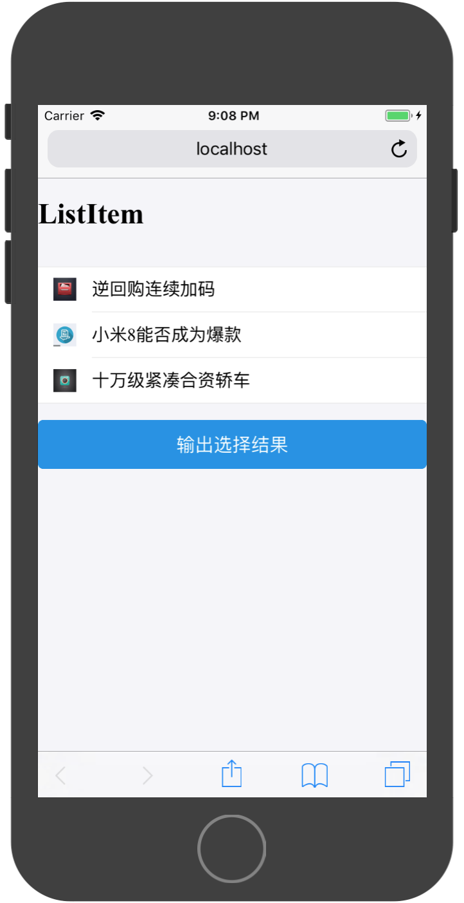
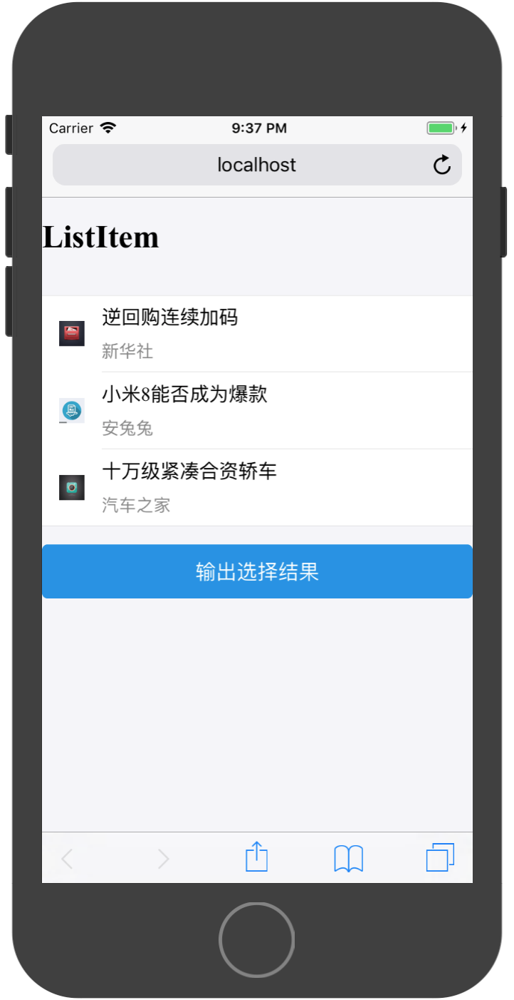
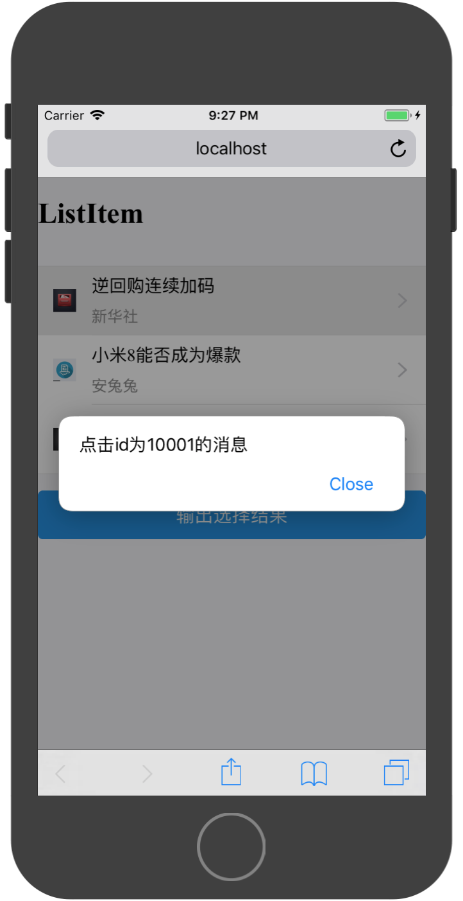
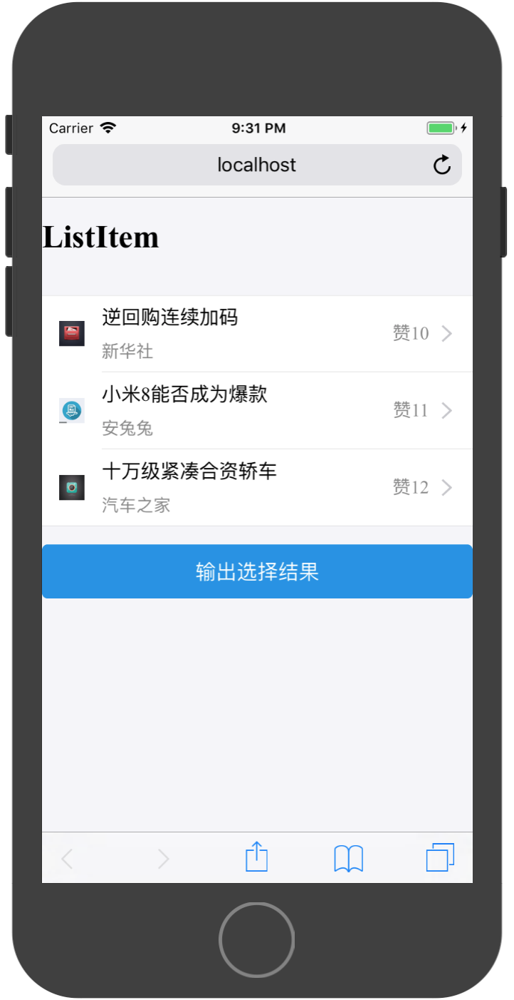
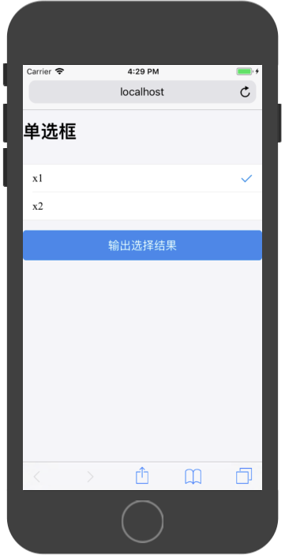
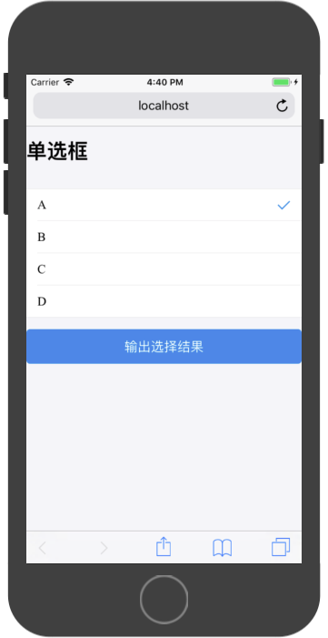
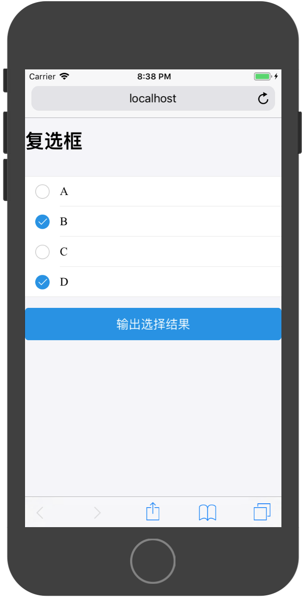

# Ant列表组件

在WebApp中，大部分的数据通过列表进行展示，并且可以上下滑动，例如联系人列表、朋友圈等。

### List 列表

`List`为一个容器，可以装载多种组件进行上下滑动显示。其默认装载组件为`List.Item`组件。

>此列表只能展示有限多数据，如数据无限多，应采用`ListView`

默认规则：

* 一般由主要信息、主要操作、次要信息、次要操作组成。
* 主要信息和主要操作放在列表的左边，次要信息和次要操作放在列表的右边。


`List`API只有两个属性：

|属性|说明|类型|默认值|
|:---|:---|:---|
|renderHeader|	list heder|	(): string|	无|
|renderFooter|	list footer|(): string|	无|

通过这两属性可以配置列表的头部和尾部的内容。

列表中的内容通过其装载的`Item`类组件提供，常用的`Item`类组件有：

* List.Item
* InputItem
* Radio.RadioItem
* Checkbox.CheckboxItem

###  List.Item


`List.Item`为`List`组件自带的内容显示组件，其提供了丰富的可配置API，可以展示多种信息：

|属性|说明|类型|默认值|
|:---|:---|:---|
|thumb	|缩略图(当为 string 类型时作为 img src)|	String/React.Element|	无|
|extra|	右边内容|	String/React.Element|	无|
|arrow|	箭头方向(右,上,下), 可选horizontal,up,down,empty，如果是empty则存在对应的dom,但是不显示|	String	|无|
|align	|子元素垂直对齐，可选top,middle,bottom|	String	|middle|
|onClick	|点击事件的回调函数|	(): void	|无|
|multipleLine|	多行	|Boolean|	false|
|wrap|	是否换行，默认情况下，文字超长会被隐藏|	Boolean	|false|
|activeStyle|	自定义active的样式|	Object	|无|
|platform|	设定组件的平台特有样式, 可选值为 android, ios， 默认为 cross， 即组件会自动检测设备 UA 应用不同平台的样式|	String|	'cross'|


基础用法：



实现代码为：

```
import React, { Component } from 'react';

import { Button,List} from 'antd-mobile';


//所需展示数据

const messages = [
  {
    id:10001,
    title:'逆回购连续加码',
    image:'http://suo.im/5bvA3t'
  },
  {
    id:10002,
    title:'小米8能否成为爆款',
    image:'http://suo.im/4AAWQa'
  },
  {
    id:10003,
    title:'十万级紧凑合资轿车',
    image:'http://suo.im/5qy03v'
  }
]

export default class App extends Component {


  render() {

    const listItems = [];
    for(let i=0;i<messages.length;i++){
      const message = messages[i];
      const listItem = (
        <List.Item
          key={message.id}
          thumb={message.image}
        >
          {message.title}
        </List.Item>
      )
      listItems.push(listItem);
    }

    return (
        <div>
          <h1>{'ListItem'}</h1>
          <br/>
          <List>
            {listItems}
          </List>
          <br/>
          <Button
            type={'primary'}
            onClick={()=>{
              //模拟登陆
              console.log(this.state.date)
            }}
          >输出选择结果</Button>
        </div>
    );
  }
}

```

通过``可以为Item添加子标题：



```
import React, { Component } from 'react';

import { Button,List} from 'antd-mobile';


//所需展示数据

const messages = [
  {
    id:10001,
    title:'逆回购连续加码',
    content:'5月30日，央行随着逆回购到期量的增多进一步加大了公开市场操作力度，当次共开展2700亿元逆回购操作，实现净投放700亿元，连续三日实施净投放。市场人士指出，企业所得税汇算清缴叠加月末效应等，致使短期流动性承压，也应看到，央行在加大资金投放力度的同时，丰富了逆回购期限组合，有助于满足不同机构的流动性需求，资金面紧张局势不是大幅恶化，预计跨月后将有所好转。',
    image:'http://suo.im/5bvA3t'
  },
  {
    id:10002,
    title:'小米8能否成为爆款',
    content:'这次的小米8采用四曲面“水滴弧形”设计，双面玻璃+金属材质中框，正面配备6.21英寸18.7：9的三星AMOLED异形全面屏，机身厚度为7.6mm，一共有白色、金色、亮蓝、黑色四种配色。',
    image:'http://suo.im/4AAWQa'
  },
  {
    id:10003,
    title:'十万级紧凑合资轿车',
    content:'外观方面，新车与现款车型完全一致，大尺寸进气格栅内部采用蜂窝式中网，FORD品牌标识镶嵌其中，冲击力十足。车身尺寸方面，新车长宽高分别为5910x2192x1992毫米，轴距达3708毫米，这样一个大块头再配上大尺寸黑色轮圈以及粗线条的轮眉，更加彰显狂野气息。',
    image:'http://suo.im/5qy03v'
  }
]

export default class App extends Component {


  render() {

    const listItems = [];
    for(let i=0;i<messages.length;i++){
      const message = messages[i];
      const listItem = (
        <List.Item
          key={message.id}
          thumb={message.image}
        >
          {message.title}
          <List.Item.Brief>
            {message.content}
          </List.Item.Brief>
        </List.Item>
      )
      listItems.push(listItem);
    }

    return (
        <div>
          <h1>{'ListItem'}</h1>
          <br/>
          <List>
            {listItems}
          </List>
          <br/>
          <Button
            type={'primary'}
            onClick={()=>{
              //模拟登陆
              console.log(this.state.date)
            }}
          >输出选择结果</Button>
        </div>
    );
  }
}

```

通过配置`arrow`属性可以在Item最右边添加一个箭头:


实现部分代码为：

```
<List.Item
    key={message.id}
    thumb={message.image}
    arrow={'horizontal'}
>
    {message.title}
    <List.Item.Brief>
    {message.content}
    </List.Item.Brief>
</List.Item>
```

通过配置`onClick`属性，可以响应该Item的点击事件：



部分实现代码为：

```
<List.Item
    key={message.id}
    thumb={message.image}
    arrow={'horizontal'}
    onClick={()=>{
    alert(`点击id为${message.id}的消息`);
    }}
>
    {message.title}
    <List.Item.Brief>
    {message.content}
    </List.Item.Brief>
</List.Item>
```

通过配置`extra`属性，可以在Item右边添加文字说明：



实现代码为：

```
import React, { Component } from 'react';

import { Button,List} from 'antd-mobile';


//所需展示数据

const messages = [
  {
    id:10001,
    title:'逆回购连续加码',
    content:'新华社',
    image:'http://suo.im/5bvA3t',
    like:10,
  },
  {
    id:10002,
    title:'小米8能否成为爆款',
    content:'安兔兔',
    image:'http://suo.im/4AAWQa',
    like:11,
  },
  {
    id:10003,
    title:'十万级紧凑合资轿车',
    content:'汽车之家',
    image:'http://suo.im/5qy03v',
    like:12,
  }
]

export default class App extends Component {


  render() {

    const listItems = [];
    for(let i=0;i<messages.length;i++){
      const message = messages[i];
      const listItem = (
        <List.Item
          key={message.id}
          thumb={message.image}
          arrow={'horizontal'}
          onClick={()=>{
            alert(`点击id为${message.id}的消息`);
          }}
          extra={`赞${message.like}`}
        >
          {message.title}
          <List.Item.Brief>
            {message.content}
          </List.Item.Brief>
        </List.Item>
      )
      listItems.push(listItem);
    }
    

    return (
        <div>
          <h1>{'ListItem'}</h1>
          <br/>
          <List>
            {listItems}
          </List>
          <br/>
          <Button
            type={'primary'}
            onClick={()=>{
              //模拟登陆
              console.log(this.state.date)
            }}
          >输出选择结果</Button>
        </div>
    );
  }
}

```

### Radio 单选框

WebApp中的单选框和传统Web中的样式不一样，因WebApp中主要使用手指进行触控操作，而传统Web中是使用鼠标进行操作。所以传统Web中的小圆点不在适用于WebApp。

一个简单的多选页面如下：



AntDesign框架采用 `RadioItem`组件实现单选操作，其组件API如下：

|属性|说明|类型|默认值|
|:---|:---|:---|
|name	|name|	String|	无|
|checked|	指定当前是否选中|	Boolean	|无|
|onChange	|change |事件触发的回调函数|	(e: Object): void	|无|


```
import React, { Component } from 'react';

import { Button,Radio,List} from 'antd-mobile';

const RadioItem = Radio.RadioItem;

export default class App extends Component {

  constructor(props) {
    super(props)
  
    this.state = {
      checked:0
    }
  }
  


  render() {
    return (
        <div>
          <h1>单选框</h1>
          <br/>
          <List>
            <RadioItem
              key={0}
              checked={0===this.state.checked}
              onChange={()=>{this.setState({checked:0})}}
            >x1</RadioItem>
            <RadioItem
              key={1}
              checked={1===this.state.checked}
              onChange={()=>{this.setState({checked:1})}}
            >x2</RadioItem>
          </List>
          <br/>
          <Button
            type={'primary'}
            onClick={()=>{
              //模拟登陆
              console.log(this.state.checked)
            }}
          >输出选择结果</Button>
        </div>
    );
  }
}
```

对于动态单选框，可以参考如下代码进行实现：

```
import React, { Component } from 'react';

import { Button,Radio,List} from 'antd-mobile';

const RadioItem = Radio.RadioItem;

//单选选项数据
const radioDatas = [
  {
    id:0,
    title:'A'
  },
  {
    id:1,
    title:'B'
  },
  {
    id:2,
    title:'C'
  },
  {
    id:3,
    title:'D'
  },
]

export default class App extends Component {

  constructor(props) {
    super(props)
  
    this.state = {
      checked:0
    }
  }
  


  render() {

    //通过循环使用单选数据构造RadioItem数组
    const radioItems = [];
    for(let i = 0;i<radioDatas.length;i++){
      const radioData = radioDatas[i];
      const radioItem = (
        <RadioItem
          key={radioData.id}
          checked={radioData.id === this.state.checked}
          onChange={()=>{this.setState({checked:radioData.id})}}
        >
          {radioData.title}
        </RadioItem>
      )
      radioItems.push(radioItem);
    }

    return (
        <div>
          <h1>单选框</h1>
          <br/>
          <List>
            {radioItems}
          </List>
          <br/>
          <Button
            type={'primary'}
            onClick={()=>{
              //模拟登陆
              console.log(this.state.checked)
            }}
          >输出选择结果</Button>
        </div>
    );
  }
}
```

运行结果为：



### Checkbox 复选框

在WebApp中，多选框也是独立的页面进行操作。



代码实现与单选框类似，但需要注意处理多选的记录情况：

```
import React, { Component } from 'react';

import { Button,Radio,List,Checkbox} from 'antd-mobile';

const CheckboxItem = Checkbox.CheckboxItem;

//选项数据
const radioDatas = [
  {
    id:0,
    title:'A'
  },
  {
    id:1,
    title:'B'
  },
  {
    id:2,
    title:'C'
  },
  {
    id:3,
    title:'D'
  },
]

export default class App extends Component {

  constructor(props) {
    super(props)
  
    this.state = {
      checkeds:[]
    }
  }
  


  render() {

    //通过循环使用单选数据构造RadioItem数组
    const radioItems = [];
    for(let i = 0;i<radioDatas.length;i++){
      const radioData = radioDatas[i];
      const radioItem = (
        <CheckboxItem
          key={radioData.id}
          checked={this.state.checkeds[i]}
          onChange={()=>{
            this.setState((preState)=>{
              const checkeds = preState.checkeds;
              checkeds[i] = !checkeds[i];
              return {
                checkeds
              }
            })
          }}
        >
          {radioData.title}
        </CheckboxItem>
      )
      radioItems.push(radioItem);
    }

    return (
        <div>
          <h1>单选框</h1>
          <br/>
          <List>
            {radioItems}
          </List>
          <br/>
          <Button
            type={'primary'}
            onClick={()=>{
              //模拟登陆
              console.log(this.state.checkeds)
            }}
          >输出选择结果</Button>
        </div>
    );
  }
}

```