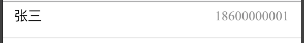
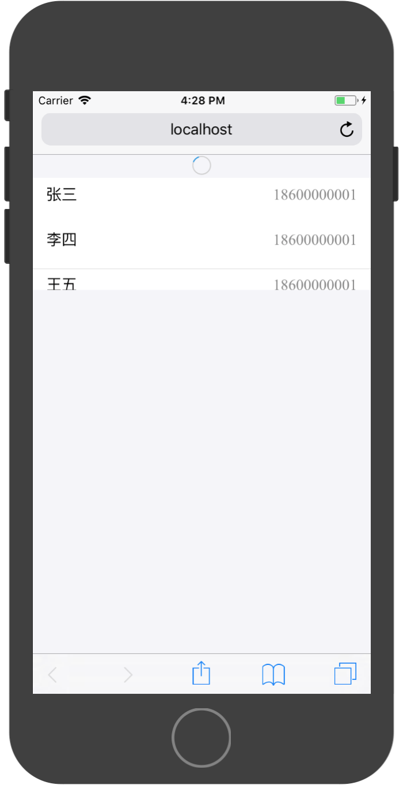
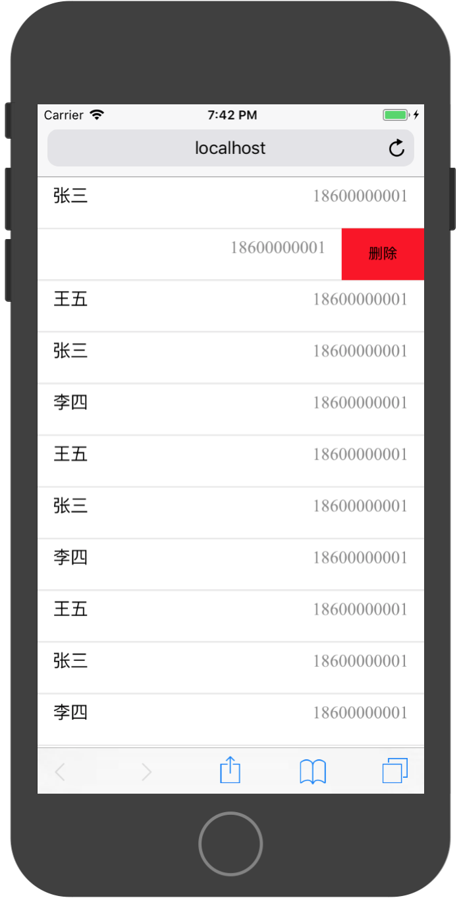

# Ant长列表

在WebApp中，经常需要渲染一些条目未知的列表页面，例如微信通讯录、微博或淘宝商品类别。在渲染这些条目未知的且具有刷新和分页功能的列表时，需要使用`ListView`组件。

>在渲染条目已知的类别页面时，推荐使用`List`。

在使用`ListView`组件时需要完成以下步骤：

* 明确元数据结构
* 依照美工设计，构造渲染元数据的`Item`组件
* 初始化`dataSource`对象
* 使用`dataSource`对象装载数据
* 构造`renderRow()`函数，在该函数中负责使用`Item`组件渲染元数据

### 元数据

渲染长列表时，首先要确定被渲染的数据单元格式，然后依据数据单元格式构建渲染数据单元的Item组件。

构造测试数据：

```
const data = [
    {
        id:1,
        name:'张三',
        tel:'18600000001'
    },
    {
        id:1,
        name:'李四',
        tel:'18600000001'
    },
    {
        id:1,
        name:'王五',
        tel:'18600000001'
    },
]
```

其数组中的每一个对象即为元数据：

```
{
    id:1,
    name:'王五',
    tel:'18600000001'
}
```
一组元数据应具有相同的数据结构，即键名一致。

### Item组件

通过对元数据分析，构造展示元数据的Item组件。Item组件的功能就是安装设计要求渲染元数据中的字段。

例如我们构造一个非常简单的Item组件，其渲染效果为：



实现代码为：

```
import React, { Component } from 'react'

import {Card} from 'antd-mobile';

import './Item.css';

export default class Item extends Component {
    
  render() {
    return (
      <Card full={true}>
        <Card.Header
          title={this.props.name}
          extra={this.props.tel}
        />
      </Card>
    )
  }
}

```
样式调整代码为：

```
.am-card {
    min-height: 40px;
}
```

在Item组件的实现过程中，可以通过其`this.props`属性直接使用元数据中的字段内容。我们会在`renderRow()`函数中确保将这些数据传入组件内部。


### 数据源 `DataSource`

在使用`ListView`之前，还需要通过`ListView.DataSource`对数据进行处理。因`ListView`经常会有部分数据需要变化和刷新，`ListView.DataSource`对象主要功能为判定数据是否发生变化，然后通知`ListView`只对变化的部分进行刷新，从而对渲染效率进行优化，避免每次因一个数据变化而全部数据都需要刷新的情况。


`ListView.DataSource`需要在`constructor()`函数中进行初始化操作，在初始化的时候需要配置一个数据判定规则`rowHasChanged`默认为` (row1, row2) => row1 !== row2`，表示两个对象不相等即更新该条目数据。

数据源对象初始化代码：

```
  constructor(props) {
    super(props)

    const dataSource = new ListView.DataSource({
      rowHasChanged: (row1, row2) => row1 !== row2
    });
  
    this.state = {
      dataSource
    }
  }
```

在数据发送变化时，通过调用其`cloneWithRows()`更新数据，此时`ListView.DataSource`会将新旧数据进行对比，然后通知`ListView`更新相应的数据。一般我们在`componentDidMount()`中从API请数据，然后在将请求结果通过`cloneWithRows()`方法将数据进行更新：

```
async componentDidMount(){
    const res = await fetch('http://localhost:5000/api/allUsers');
    const result = await res.json();

    this.setState((preState)=>{
      return{
        dataSource:preState.dataSource.cloneWithRows(result.data)
      }
    })

}
```

### `ListView`基本使用

`ListView`基本使用方法需要配置两个属性：

* `dataSource`
* `renderRow`

`renderRow`的类型是一个回调函数，其携带一个参数，参数中为一个元数据。我们需要在方法中返回对该数据渲染的元素。使用之前构建的`Item`组件对该元数据进行渲染。`ListView`会根据当前屏幕的可视区域变化来决定哪些元数据需要渲染，所以该函数会不定时的执行多次。

```
renderRow = (user)=>{
    return <Item {...user} />
}
```

完整代码：

```
import React, { Component } from 'react';
import ReactDOM from 'react-dom';

import {ListView} from 'antd-mobile';

import Item from './Item';


export default class App extends Component {

  constructor(props) {
    super(props)

    const dataSource = new ListView.DataSource({
      rowHasChanged: (row1, row2) => row1 !== row2
    });
  
    this.state = {
      dataSource,
    }
  }

  async componentDidMount(){
    const res = await fetch('http://localhost:5000/api/allUsers');
    const result = await res.json();

    this.setState((preState)=>{
      return{
        dataSource:preState.dataSource.cloneWithRows(result.data),
      }  
    })

  }

  renderRow = (user)=>{
    return <Item {...user} />
  }


  render() {

    return (
        <div>
          <ListView
            useBodyScroll={true}
            dataSource={this.state.dataSource}
            renderRow={this.renderRow}
          />
        </div>
    );
  }
}

```

在使用`ListView`时需要注意一点，因为`ListView`可以滚动，其滚动区域有两种选择：

* 整个承载`ListView`的页面一起滚动
* 页面中定义单独的滚动区域，其他区域不做滚动

我们在这个案例中选择整个页面一起滚动，所以需要添加`useBodyScroll={true}`的属性，如这个属性没有添加且没有定义固定的滚动区域，则列表中的内容将不会显示。

### 下拉刷新

在WebApp中，通常使用下拉的方式对数据进行更新操作。AntDesign提供了`PullToRefresh`组件提供下拉刷新的功能支持。

其API为:

|属性|说明|类型|默认值|
|:---|:---|:---|
|direction|	拉动方向，可以是 up 或 down|	String|	down|
|distanceToRefresh|	刷新距离|	number	|25|
|refreshing|	是否显示刷新状态|	bool|	false|
|onRefresh|	必选, 刷新回调函数|	() => void|	-|
|indicator|	指示器配置 |{ activate: ReactNode, deactivate: ReactNode, release: ReactNode, finish: ReactNode }	|Object|	-|
|damping|	拉动距离限制, 建议小于 200|	number|	100|

`PullToRefresh`提供了一个默认的展示外观，我们只需配置其`refreshing`和`onRefresh`即可快速使用。

`refreshing`指示其当前是否再刷新状态，且在状态切换过程中该组件会提供过渡动画，我们只需根据实际情况配置其值即可。

`onRefresh`是当下拉刷新开始时的回调函数，在该回调函数内进行刷新操作，并维护`refreshing`状态。




实现代码为：

```
import React, { Component } from 'react';
import ReactDOM from 'react-dom';

import {ListView,PullToRefresh,WhiteSpace} from 'antd-mobile';

import Item from './Item';


export default class App extends Component {

  constructor(props) {
    super(props)

    const dataSource = new ListView.DataSource({
      rowHasChanged: (row1, row2) => row1 !== row2
    });
  
    this.state = {
      dataSource,
      refreshing:false,
    }
  }

  async componentDidMount(){
    const res = await fetch('http://localhost:5000/api/allUsers');
    const result = await res.json();
    console.log(result)

    this.setState((preState)=>{
      return{
        dataSource:preState.dataSource.cloneWithRows(result.data),
      }  
    })

  }

  

  renderRow = (user)=>{
    return <Item {...user} />
  }

  onRefresh = async ()=>{
    this.setState({
      refreshing:true
    })
    
    const res = await fetch('http://localhost:5000/api/allUsers');
    const result = await res.json();

    this.setState((preState)=>{
      return{
        refreshing:false,
        dataSource:preState.dataSource.cloneWithRows(result.data),
      }  
    })
  }

  render() {

    return (
        <div>
          <ListView
            useBodyScroll={true}
            dataSource={this.state.dataSource}
            renderRow={this.renderRow}
            pullToRefresh={(
              <PullToRefresh
                refreshing={this.state.refreshing}
                onRefresh={this.onRefresh}
              />
            )}
          />
        </div>
    );
  }
}

```

### 底部加载

在列表展示数据时，通过会使用分页技术将多条数据分页进行展示。在移动WebApp中，用户通常将列表拉到最下端时，App会自动加载下一页的数据。

在`ListView`组件中，可以通过配置`onEndReachedThreshold`和`onEndReached`两个属性实现此功能。

* `onEndReachedThreshold`为调用`onEndReached`之前的临界值，单位是像素
* `onEndReached`的触发条件为：当所有的数据都已经渲染过，并且列表被滚动到距离最底部不足`onEndReachedThreshold`个像素的距离时

同时，为了防止`onEndReached`在加载数据过程中在次被触发，需要手动维护一个加载状态。


实现参考代码：

```
import React, { Component } from 'react';
import ReactDOM from 'react-dom';

import {ListView,PullToRefresh,WhiteSpace} from 'antd-mobile';

import Item from './Item';


export default class App extends Component {

  constructor(props) {
    super(props)

    const dataSource = new ListView.DataSource({
      rowHasChanged: (row1, row2) => row1 !== row2
    });
  
    this.state = {
      dataSource,
      refreshing:false,
      isLoading:false,
    }
  }

  async componentDidMount(){
    const res = await fetch('http://192.168.31.170:5000/api/allUsers');
    const result = await res.json();
    console.log(result)

    this.setState((preState)=>{
      return{
        dataSource:preState.dataSource.cloneWithRows(result.data),
      }  
    })

  }

  

  renderRow = (user)=>{
    return <Item {...user} />
  }

  onRefresh = async ()=>{
    this.setState({
      refreshing:true
    })
    
    const res = await fetch('http://localhost:5000/api/allUsers');
    const result = await res.json();

    this.setState((preState)=>{
      return{
        refreshing:false,
        dataSource:preState.dataSource.cloneWithRows(result.data),
      }  
    })
  }

  onEndReached = ()=>{

    if(this.state.isLoading){
      return;
    }
    this.setState({
      isLoading:true
    })

    setTimeout(()=>{
      this.setState({
        isLoading:false
      })
    },3000)
  }


  render() {

    return (
        <div>
          <ListView
            initialListSize={18}
            useBodyScroll={true}
            dataSource={this.state.dataSource}
            renderRow={this.renderRow}
            pullToRefresh={(
              <PullToRefresh
                refreshing={this.state.refreshing}
                onRefresh={this.onRefresh}
              />
            )}
            renderFooter={()=>{
              return (
                <div style={{ padding: 30, textAlign: 'center' }}>
                  {this.state.isLoading ? 'Loading...' : 'Loaded'}
                </div>
              )
            }} 
            onEndReached={this.onEndReached}
            onEndReachedThreshold={50}
          />
        </div>
    );
  }
}
```
代码中的`onEndReached`响应函数中并没有做真实的数据加载操作，因数据加载操作需要API支持，同时需要数据管理，真实的操作在后续章节中设计，这里仅对事件进行讲解。


### Item滑动按钮



在列表操作中，Item可以滑动添加操作，通过使用`SwipeAction`组件实现此功能。

实训代码：

```
import React, { Component } from 'react'

import {Card,SwipeAction} from 'antd-mobile';

import './Item.css';

export default class Item extends Component {
    
  render() {
    return (
      <SwipeAction
        right={[
          {
            text:'删除',
            style:{
              backgroundColor:'red',
              width:'80px'
            },
            onPress:()=>{
              console.log('删除')
            }
          }
        ]}
        autoClose
      >
        <Card full={true}>
          <Card.Header
            title={this.props.name}
            extra={this.props.tel}
          />
        </Card>
      </SwipeAction>
    )
  }
}

```

