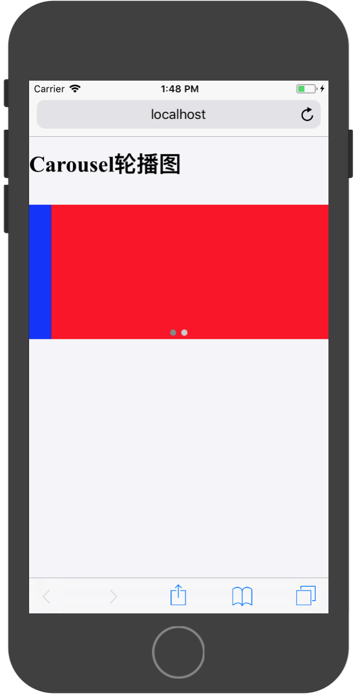
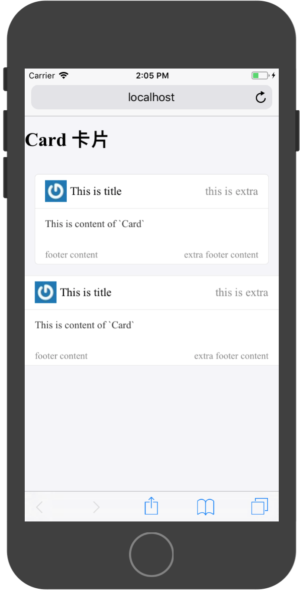
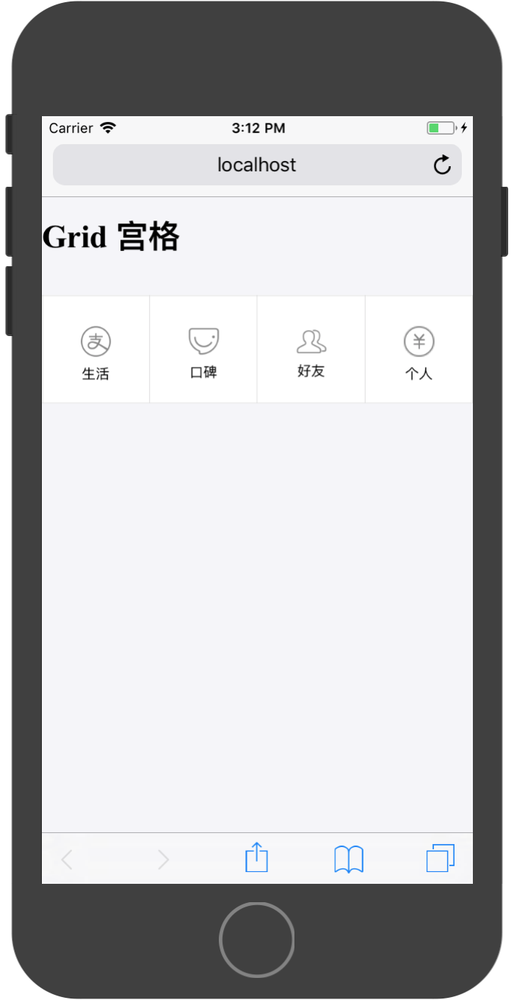
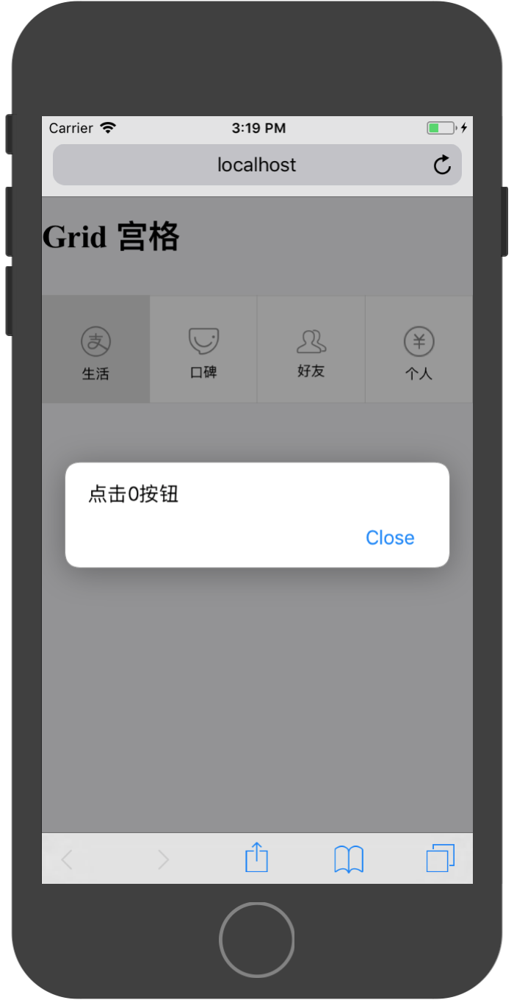
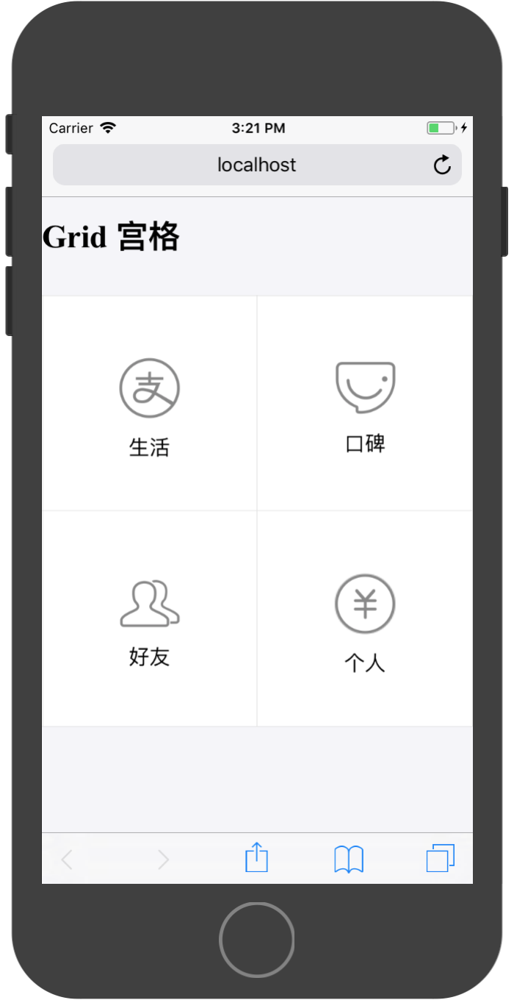
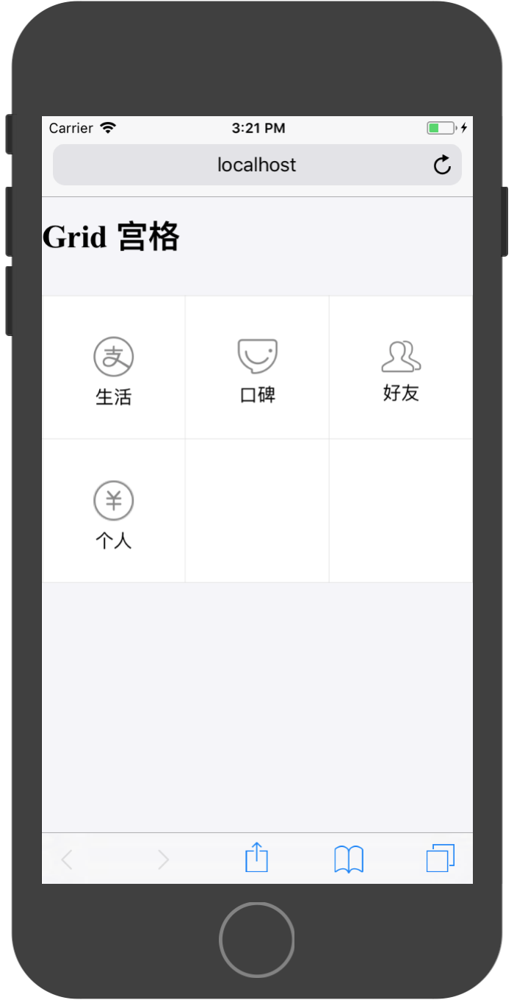
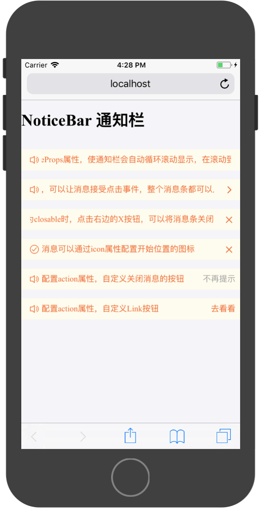
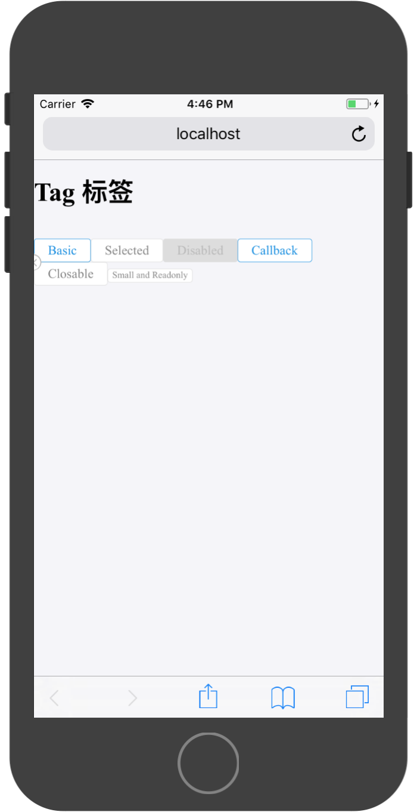

# Ant标准展示组件

在AntDesign框架中，提供了一些列标准的移动端内容展示组件。使用这些组件可以简化页面构建过程。

### Carousel 轮播图



使用轮播图组件可以可以将多个图片或其他内容在屏幕上进行水平滚动切换。

组件常用API：

|属性|说明|类型|默认值|
|:---|:---|:---|:---|
|autoplay	|是否自动切换|	Boolean	false|
|autoplayInterval|	自动切换的时间间隔	|Number	|3000|
|infinite	|是否循环播放	|Boolean|	false|

案例实现代码：

```
import React, { Component } from 'react';

import { Button,List,Carousel} from 'antd-mobile';


export default class App extends Component {

  render() {

    return (
        <div>
          <h1>{'Carousel轮播图'}</h1>
          <br/>
          <Carousel
            autoplay={true}
            infinite={true}
          >
            <div
              style={{
                background:'red',
                width:'100%',
                height:168,
              }}
            >
            </div>
            <div
              style={{
                background:'blue',
                width:'100%',
                height:168,
              }}
            >
            </div>
          </Carousel>
        </div>
    );
  }
}

```

>在用轮播图展示图片是，需要图片具有相同的长宽比。

### Card 卡片

用于组织信息和操作，通常也作为详细信息的入口。

默认规则：

* 形状为矩形。
* 可包含多种类型的元素，eg：图片、文字、按钮等。



`Card`组件为一个容器整体，容器内分为三个部分：

* `Card.Header`
* `Card.Body`
* `Card.Footer`

`Card`容器有两种展示样式：

* 两翼留白
* 通栏模式

通过配置其API：

|属性|说明|类型|默认值|
|:---|:---|:---|:---|
|full|是否通栏|	boolean	|false|


`Card.Header`部分可以展示标题、缩略图和辅助内容。并且可以配置缩略图样式。API为：

|属性|说明|类型|默认值|
|:---|:---|:---|:---|
|title|	卡片标题|	React.Element、String	||
|thumb|	卡片标题图片|	String、React.Element||	
|thumbStyle|	标题图片样式|	Object|	{}|
|extra|	卡片标题辅助内容|	React.Element、String||	

`Card.Body`为一个基础容器，没有内置的属性需要配置。

`Card.Footer`API:

|属性|说明|类型|默认值|
|:---|:---|:---|:---|
|content|尾部内容|React.Element、String||	
|extra|	尾部辅助内容|	React.Element、String	||

实现代码为：

```
import React, { Component } from 'react';

import { Button,List,Carousel,Card,WingBlank} from 'antd-mobile';


export default class App extends Component {

  render() {

    return (
        <div>
          <h1>{'Card 卡片'}</h1>
          <br/>
          <WingBlank>
            <Card>
              <Card.Header
                title="This is title"
                thumb="https://gw.alipayobjects.com/zos/rmsportal/MRhHctKOineMbKAZslML.jpg"
                extra={<span>this is extra</span>}
              />
              <Card.Body>
                <div>This is content of `Card`</div>
              </Card.Body>
              <Card.Footer content="footer content" extra={<div>extra footer content</div>} />
            </Card>
          </WingBlank>
          <br/>
          <Card full>
            <Card.Header
              title="This is title"
              thumb="https://gw.alipayobjects.com/zos/rmsportal/MRhHctKOineMbKAZslML.jpg"
              extra={<span>this is extra</span>}
            />
            <Card.Body>
              <div>This is content of `Card`</div>
            </Card.Body>
            <Card.Footer content="footer content" extra={<div>extra footer content</div>} />
          </Card>
        </div>
    );
  }
}

```


### Grid 宫格

在水平和垂直方向，将布局切分成若干等大的区块。通常用于展示功能按钮或图片。

默认规则：

* 区块中的内容应该是同类元素，eg：都是图片，或者都是图标+文字。



`Grid`组件的使用非常简单，只需要构造标准的数据集合组件便可以自动进行解析显示。

`Grid`的`data`属性接收一个数组，其元素为对象，且具有`text`和`icon`两个属性。

例如，测试数据为：

```
const buttons = [
  {
    text:'生活',
    icon:'https://zos.alipayobjects.com/rmsportal/sifuoDUQdAFKAVcFGROC.svg'
  },
  {
    text:'口碑',
    icon:'https://gw.alipayobjects.com/zos/rmsportal/BTSsmHkPsQSPTktcXyTV.svg'
  },
  {
    text:'好友',
    icon:'https://zos.alipayobjects.com/rmsportal/psUFoAMjkCcjqtUCNPxB.svg'
  },
  {
    text:'个人',
    icon:'https://zos.alipayobjects.com/rmsportal/asJMfBrNqpMMlVpeInPQ.svg'
  },
]
```

使用测试数据生成宫格带实习代码为：

```
import React, { Component } from 'react';

import { Button,List,Carousel,Card,WingBlank,Grid} from 'antd-mobile';

const buttons = [
  {
    text:'生活',
    icon:'https://zos.alipayobjects.com/rmsportal/sifuoDUQdAFKAVcFGROC.svg'
  },
  {
    text:'口碑',
    icon:'https://gw.alipayobjects.com/zos/rmsportal/BTSsmHkPsQSPTktcXyTV.svg'
  },
  {
    text:'好友',
    icon:'https://zos.alipayobjects.com/rmsportal/psUFoAMjkCcjqtUCNPxB.svg'
  },
  {
    text:'个人',
    icon:'https://zos.alipayobjects.com/rmsportal/asJMfBrNqpMMlVpeInPQ.svg'
  },
]

export default class App extends Component {

  render() {

    return (
        <div>
          <h1>{'Grid 宫格'}</h1>
          <br/>
          <Grid
            data={buttons}
          />
        </div>
    );
  }
}

```

运行效果为上图所示。在默认情况下，每个宫格为正方形。

通过配置其`onClick`属性，可以响应宫格的点击事件，事件携带组件对象本身和点击宫格的索引值。

```
(el: Object, index: number): void
```



实现代码为：

```
import React, { Component } from 'react';

import { Button,List,Carousel,Card,WingBlank,Grid} from 'antd-mobile';

const buttons = [
  {
    text:'生活',
    icon:'https://zos.alipayobjects.com/rmsportal/sifuoDUQdAFKAVcFGROC.svg'
  },
  {
    text:'口碑',
    icon:'https://gw.alipayobjects.com/zos/rmsportal/BTSsmHkPsQSPTktcXyTV.svg'
  },
  {
    text:'好友',
    icon:'https://zos.alipayobjects.com/rmsportal/psUFoAMjkCcjqtUCNPxB.svg'
  },
  {
    text:'个人',
    icon:'https://zos.alipayobjects.com/rmsportal/asJMfBrNqpMMlVpeInPQ.svg'
  },
]

export default class App extends Component {

  render() {

    return (
        <div>
          <h1>{'Grid 宫格'}</h1>
          <br/>
          <Grid
            data={buttons}
            onClick={(e,index)=>{
              alert('点击'+index+'按钮')
            }}
          />
        </div>
    );
  }
}

```

通过配置其`columnNum`属性，可以确定每行的列数，例如每行两列或三列：






实现代码为：

```
import React, { Component } from 'react';

import { Button,List,Carousel,Card,WingBlank,Grid} from 'antd-mobile';

const buttons = [
  {
    text:'生活',
    icon:'https://zos.alipayobjects.com/rmsportal/sifuoDUQdAFKAVcFGROC.svg'
  },
  {
    text:'口碑',
    icon:'https://gw.alipayobjects.com/zos/rmsportal/BTSsmHkPsQSPTktcXyTV.svg'
  },
  {
    text:'好友',
    icon:'https://zos.alipayobjects.com/rmsportal/psUFoAMjkCcjqtUCNPxB.svg'
  },
  {
    text:'个人',
    icon:'https://zos.alipayobjects.com/rmsportal/asJMfBrNqpMMlVpeInPQ.svg'
  },
]

export default class App extends Component {

  render() {

    return (
        <div>
          <h1>{'Grid 宫格'}</h1>
          <br/>
          <Grid
            data={buttons}
            onClick={(e,index)=>{
              alert('点击'+index+'按钮')
            }}
            columnNum={3}
          />
        </div>
    );
  }
}

```

还可以通过其他API属性配置宫格样式：

|属性|说明|类型|默认值|
|:---|:---|:---|:---|
|hasLine|	是否有边框	|boolean	|true|
|square |	每个格子是否固定为正方形|	boolean|	true|
|itemStyle	|每个格子自定义样式|	object|	{}|
|activeStyle|	点击反馈的自定义样式 (设为 false 时表示禁止点击反馈)|	{}/false|	{}|


### NoticeBar 通告栏

在导航栏下方，一般用作系统提醒、活动提醒等通知。

默认规则：

* 需要引起用户关注时使用，重要级别低于 Modal ，高于 Toast。



组件API：

|属性|说明|类型|默认值|
|:---|:---|:---|:---|
|mode	|提示类型，可选 closable,link|	String|	''|
|icon|	在开始位置设置图标|	ReactNode	<Icon type={require('./trips.svg')} size="xxs" /> onClick	点击关闭或者操作区域的回调函数	|(): void||	
|marqueeProps|	marquee 参数|	Object|	{loop: false, leading: 500, trailing: 800, fps: 40, style: {}}|
|action	|用于替换操作 icon 的文案|	ReactElement	||

实现参考代码：

```
import React, { Component } from 'react';

import { Icon,WhiteSpace,Button,List,Carousel,Card,WingBlank,Grid,NoticeBar} from 'antd-mobile';


export default class App extends Component {

  render() {

    return (
        <div>
          <h1>{'NoticeBar 通知栏'}</h1>
          <WhiteSpace size="lg" />
          <NoticeBar marqueeProps={{ loop: true, style: { padding: '0 7.5px' } }}>
            通知内容较长时，可以配置marqueeProps属性，使通知栏会自动循环滚动显示，在滚动到尾部是做短暂停留后返回首部，重新显示。
          </NoticeBar>
          <WhiteSpace size="lg" />
          <NoticeBar mode="link" onClick={() => alert('1')}>
            配置NoticeBar的mode和onClick属性，可以让消息接受点击事件，整个消息条都可以点击，不只是右边的箭头。
          </NoticeBar>
          <WhiteSpace size="lg" />
          <NoticeBar mode="closable" icon={null}>
            消息条的mode属性为closable时，点击右边的X按钮，可以将消息条关闭
          </NoticeBar>
          <WhiteSpace size="lg" />
          <NoticeBar mode="closable" icon={<Icon type="check-circle-o" size="xxs" />}>
            消息可以通过icon属性配置开始位置的图标
          </NoticeBar>
          <WhiteSpace size="lg" />
          <NoticeBar mode="closable" action={<span style={{ color: '#a1a1a1' }}>不再提示</span>}>
            配置action属性，自定义关闭消息的按钮
          </NoticeBar>
          <WhiteSpace size="lg" />
          <NoticeBar mode="link" action={<span>去看看</span>}>
          配置action属性，自定义Link按钮
          </NoticeBar>
        </div>
    );
  }
}

```

### Tag 标签

进行标记和分类的小标签，用于标记事物的属性和维度，以及进行分类。

Tag 分为两种类型：`selectable` / `readonly`, 后者是无交互的，尺寸更小，通常用于内容展示。



组件API：

|属性|说明|类型|默认值|
|:---|:---|:---|:---|
|small|	小号标签|	Boolean	|false|
|disabled	|是否不可用|	Boolean|	false|
|closable|	是否关闭（非 disabled small 状态）	|Boolean	|false|
|selected	|是否默认选中	|Boolean|	false|
|onChange|	切换选中回调函数|	(selected: bool): void|	无|
|onClose|	点关闭时的回调函数|	(): void	|无|
|afterClose|	关闭后的回调|	(): void|	无|


实现代码参考：

```
import React, { Component } from 'react';

import { Icon,WhiteSpace,Button,List,Carousel,Card,WingBlank,Grid,NoticeBar,Tag} from 'antd-mobile';


export default class App extends Component {

  render() {

    return (
        <div>
          <h1>{'Tag 标签'}</h1>
          <WhiteSpace size="lg" />
          <Tag data-seed="logId">Basic</Tag>
          <Tag selected>Selected</Tag>
          <Tag disabled>Disabled</Tag>
          <Tag 
            onChange={()=>{
              alert('Callback')
            }}
          >Callback</Tag>
          <Tag closable
            onClose={() => {
              console.log('onClose');
            }}
            afterClose={() => {
              console.log('afterClose');
            }}
          >
            Closable
          </Tag>
          <Tag small>Small and Readonly</Tag>
        </div>
    );
  }
}

```
