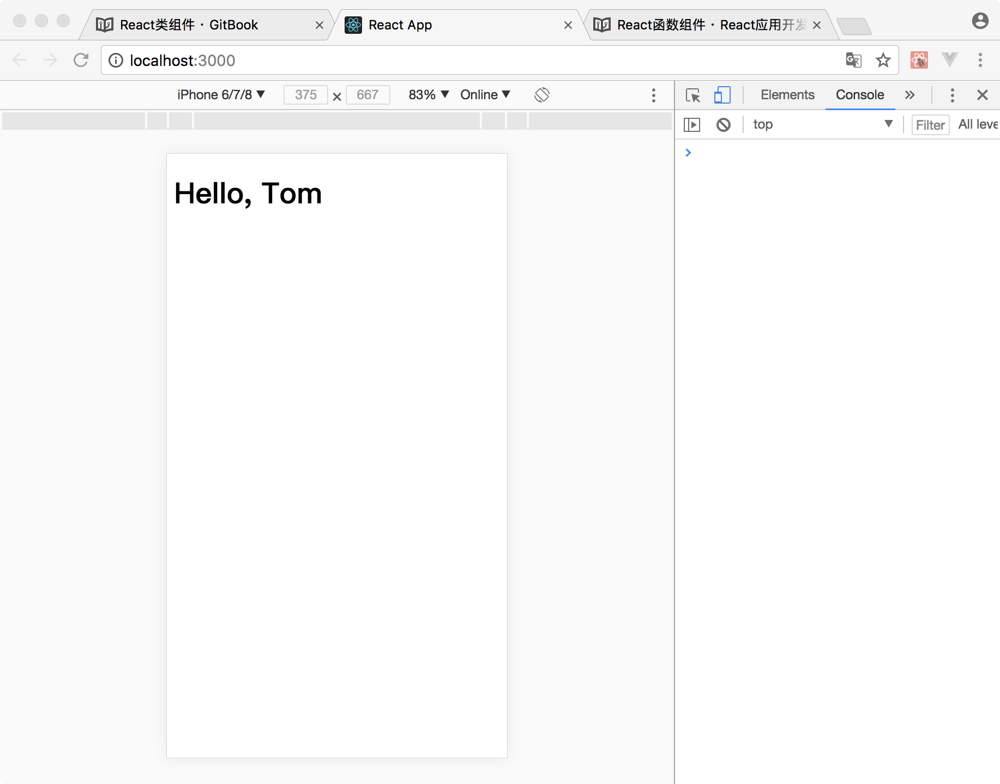
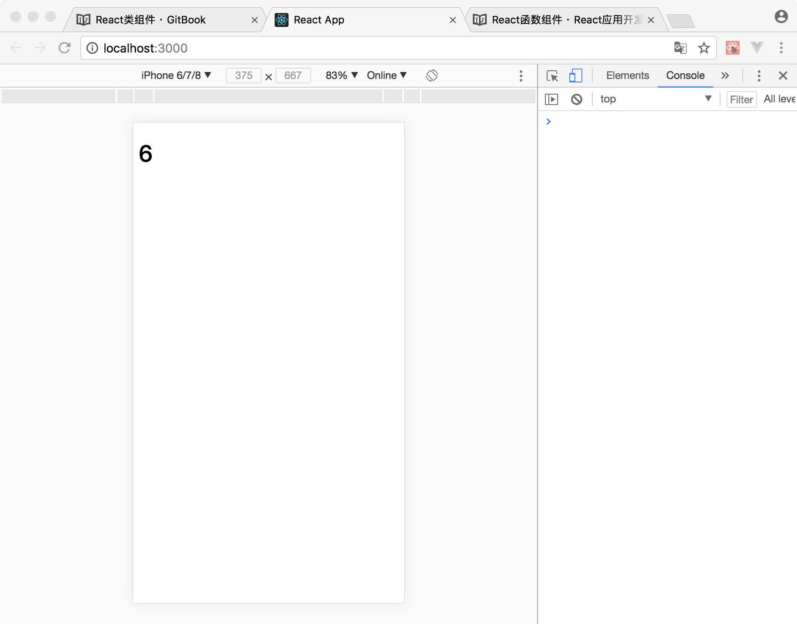

# React类组件

React类组件的概念与函数组件一致，但类组件可以提供`state`机制。通过`state`机制组件可以动态更新视图内容。在类组件中还可以使用声明周期函数，对组件使用的资源做更加精细的控制。

### 定义类组件

在React中，使用ES6的Class语法定义一个类组件。

```
//引入React框架
import React from 'react'

//类组件是由继承与React.Component基类构建
class Welcome extends React.Component {

    //通过类中的render方法，返回一个React元素
    render(){
        return(
            <h1>{'Hello'}</h1>
        )
    }
}
```

类组件的渲染与函数组件一样：

```
const e = <Welcome />
```

类组件在定义是，同样可以使用属性：

```
//引入React框架
import React from 'react'

//类组件是由继承与React.Component基类构建
class Welcome extends React.Component {

    //通过类中的render方法，返回一个React元素
    render(){
        return(
            <h1>{`Hello, ${this.props.name}`}</h1>
        )
    }
}
```

在类组件中，通过`this`对象访问其自身`props`属性对象。

通过类组件构造React元素时，也可以为其指定属性赋值：

```
const e = <Welcome name={'Tom'} />
```

完整代码如下：

```
//引入React框架
import React from 'react';

//引入ReactDOM框架
import ReactDOM from 'react-dom';

//使用JavaScriptDOM操作函数，通过id获取容器div
const div = document.getElementById('root');

//类组件是由继承与React.Component基类构建
class Welcome extends React.Component {
    
    //通过类中的render方法，返回一个React元素
    render(){
        return(
            <h1>{`Hello, ${this.props.name}`}</h1>
        )
    }
}

const e = <Welcome name={'Tom'} />

ReactDOM.render(e,div);
```

运行效果：



### 组件状态

在类组件定义中，可以为组件添加一个状态对象，通过对状态的操作，可以动态更新页面内容。

对于状态有以下三种操作：

* 初始化状态
* 使用状态
* 动态维护状态

React规定所有需要动态更新的内容，都需要给定一个初始值，即为状态初始化操作。状态初始化操作在类的构造方法内进行。使用`React.Component`基类提供的`state`属性，将状态初值以键值对的方式存入该属性中。

```
constructor(props){
    super(props);

    //状态初始化
    this.state = {
        a:0,
    }
}
```
在构造React元素时，可以直接使用初始化后的状态值，该值从`this.state`属性中获取。

```
render(){
    return(
        <h1>{this.state.a}</h1>
    )
}
```
当`a`有一个新值需要在页面上显示时，需要使用`this.setState()`方法对`state`中的`a`值进行修改。

```
onSomeEvnet(){

    //构建一个新的对象，储存状态的新值
    const newState = {
        a:1,
    }
    //使用this.setState()更新state值
    this.setState(newState);
}
```

注意不能直接修改`state`的值，因在React框架中，无法直接监控`state`属性值的变化，需要使用组件的`setState`API告知框架，`state`值发生变化。在框架得知状态发生变化之后，会重新调用此组件的`render()`方法，生成新的React元素，并用新的React元素替换掉旧元素，以实现页面内容的刷新。

所以下面的错误代码是**不会**触发视图刷新操作：

```
onSomeEvnet(){
    //错误操作！！！
    this.state.a = 1;
}
```

在更新状态值时，通常会遇到一类场景，即更新值是基于上一次状态的值的内容。

例如状态值自增一操作。在更新状态值时，需要获知上一次状态的具体内容。在此种情况下，React为我们提供了一个异步更新的机制：为`setState()`提供一个函数参数，该函数参数携带上一次状态值的对象，通过此函数参数返回新的状态对象即可。

```
onSomeEvnet(){

    this.setState((preState)=>{
        a:preState.a+1,
    })
}
```
以上代码即可完成基于上一次状态值的更新操作。


接下来我们使用一个自动计数器来讲解`state`的使用方法。这个自动计数器可以每一秒钟自动实施+1操作，初始值为0.

使用`state`时，首先需要在`constructor()`方法中，声明`state`对象属性。将需要动态更新的字段初值以键值对方式放入该对象中。

```
class AutoCounter extends React.Component{

    //props是React.Component内置的属性，在React.Component子类中实现constructor()方法时，必须定义此形参
    constructor(props){
        //需要使用super将props对象传入父类进行初始化操作
        super(props);

        //声明state属性，其值为对象，通过键值对方式存储需要动态更新的内容
        this.state = {
            count:0,
        }
    }

    render(){

        //在render()中，使用this.state中的值构建React元素，以实现动态刷新内容
        return(
            <h1>{this.state.count}<h1>
        )
    }

}
```

此时通过`AutoCounter`构建的React元素还无法进行自动增加，只是一个静态元素。我们使用定时器来实现计数器的自增功能。

在`constructor()`方法中初始化一个定时器，让其每一秒钟将`state`中的`count`值+1。

class AutoCounter extends React.Component{

    //props是React.Component内置的属性，在React.Component子类中实现constructor()方法时，必须定义此形参
    constructor(props){
        //需要使用super将props对象传入父类进行初始化操作
        super(props);

        //声明state属性，其值为对象，通过键值对方式存储需要动态更新的内容
        this.state = {
            count:0,
        }

        //配置定时器，触发时间间隔为1000毫秒
        setInterval(()=>{
            //触发操作为state.count+1
            this.setState((preState)=>{
                return {
                    count:preState.count+1,
                }
            })
        },1000)
    }

    render(){

        //在render()中，使用this.state中的值构建React元素，以实现动态刷新内容
        return(
            <h1>{this.state.count}</h1>
        )
    }

}


完整代码：

```
//引入React框架
import React from 'react';

//引入ReactDOM框架
import ReactDOM from 'react-dom';

//使用JavaScriptDOM操作函数，通过id获取容器div
const div = document.getElementById('root');

class AutoCounter extends React.Component{
    
        //props是React.Component内置的属性，在React.Component子类中实现constructor()方法时，必须定义此形参
        constructor(props){
            //需要使用super将props对象传入父类进行初始化操作
            super(props);
    
            //声明state属性，其值为对象，通过键值对方式存储需要动态更新的内容
            this.state = {
                count:0,
            }
    
            //配置定时器，触发时间间隔为1000毫秒
            setInterval(()=>{
                //触发操作为state.count+1
                this.setState((preState)=>{
                    return {
                        count:preState.count+1,
                    }
                })
            },1000)
        }
    
        render(){
    
            //在render()中，使用this.state中的值构建React元素，以实现动态刷新内容
            return(
                <h1>{this.state.count}</h1>
            )
        }
    
    }

ReactDOM.render(<AutoCounter/>,div);
```

运行结果：



### 生命周期函数

在具有许多组件的应用程序中，在销毁时释放组件所占用的资源非常重要。上一小节中使用的定时器资源应该按照需求申请，在不再使用时进行释放操作。

对资源进行精细化管理需要一个准确的声明周期，告诉我们当前组件的状态。

常用的声明周期函数有4个：

* constructor()
* componentDidMount()
* render()
* componentWillUnmount()

组件在内存中进行初始化操作时，`constructor()`会被调用。在此方法中首先需要调用`super(props)`对父类实例进行构造。然后对状态进行初始化操作。在此方法中，一般不会申请系统资源。因此方法被调用时，通过该组件构造的元素只在内存中存在，还没有显示在页面上，此时调用响应的资源，用户并不会看到响应的效果，但CPU的占用率仍然会提高。

通过该组件构造的元素已经挂载到屏幕上时，`componentDidMount()`方法会被调用。当元素被从屏幕上卸载时`componentWillUnmount()`方法会被调用。一个元素可能会被挂载和卸载多次重复，所以，这两个方法可能会被调用多次。我们通过在`componentDidMount()`方法中申请系统资源，例如Timer等，在`componentWillUnmount()`方法释放资源，以实现对资源的精细化管理。

`render()`方法会在元素挂载的屏幕上之前调用，通过在`state`或`props`的值发生变化时也会被触发，生成一个新的元素。

现在我们使用声明周期对上小节中的自动计数器进行改造，以实现对定时器资源的精细化管理。

首先我们在`componentDidMount()`方法中申请一个定时器资源，并通过属性保存其资源ID，为销毁做准备

```
componentDidMount(){
    this.timerID = setInterval(()=>{},1000)
}
```

然后在`componentWillUnmount()`方法释放定时器资源：

```
componentWillUnmount(){
    clearInterval(this.timerID)
}
```

这样便可以在该元素不在屏幕上显示时释放相应资源。

完整代码：

```
//引入React框架
import React from 'react';

//引入ReactDOM框架
import ReactDOM from 'react-dom';

//使用JavaScriptDOM操作函数，通过id获取容器div
const div = document.getElementById('root');

class AutoCounter extends React.Component {

    //props是React.Component内置的属性，在React.Component子类中实现constructor()方法时，必须定义此形参
    constructor(props) {
        //需要使用super将props对象传入父类进行初始化操作
        super(props);

        //声明state属性，其值为对象，通过键值对方式存储需要动态更新的内容
        this.state = {
            count: 0,
        }


    }

    render() {

        //在render()中，使用this.state中的值构建React元素，以实现动态刷新内容
        return (
            <h1>{this.state.count}</h1>
        )
    }

    componentDidMount() {
        this.timerID = setInterval(() => {
            //触发操作为state.count+1
            this.setState((preState) => {
                return {
                    count: preState.count + 1,
                }
            })
        }, 1000)
    }

    componentWillUnmount() {
        clearInterval(this.timerID)
    }

}

ReactDOM.render(<AutoCounter />, div);
```

### 属性验证

在定义React组件时，需要使用外界注入的属性值来构建本身的Reac元素。React框架提供了一个属性检查的机制，该机制在开发模式下，可以对外界注入的属性进行动态检查，以避免出现bug。

`PropTypes` 包含一整套验证器，可用于确保你接收的数据是有效的。以下代码演示了`PropTypes`基本使用方法：

```
//引入PropTypes
import PropTypes from 'prop-types';

class Welcome extends React.Component {
  render() {
    return (
      <h1>Hello, {this.props.name}</h1>
    );
  }
}

//通过对Welcome的静态属性propTypes赋值，开启属性检查功能个
Welcome.propTypes = {
  name: PropTypes.string
};
```

`PropTypes`提供了以下可以直接使用的验证器：

```
import PropTypes from 'prop-types';

MyComponent.propTypes = {
  // 你可以将属性声明为以下 JS 原生类型
  optionalArray: PropTypes.array,
  optionalBool: PropTypes.bool,
  optionalFunc: PropTypes.func,
  optionalNumber: PropTypes.number,
  optionalObject: PropTypes.object,
  optionalString: PropTypes.string,
  optionalSymbol: PropTypes.symbol,

  // 任何可被渲染的元素（包括数字、字符串、子元素或数组）。
  optionalNode: PropTypes.node,

  // 一个 React 元素
  optionalElement: PropTypes.element,

  // 你也可以声明属性为某个类的实例，这里使用 JS 的
  // instanceof 操作符实现。
  optionalMessage: PropTypes.instanceOf(Message),

  // 你也可以限制你的属性值是某个特定值之一
  optionalEnum: PropTypes.oneOf(['News', 'Photos']),

  // 限制它为列举类型之一的对象
  optionalUnion: PropTypes.oneOfType([
    PropTypes.string,
    PropTypes.number,
    PropTypes.instanceOf(Message)
  ]),

  // 一个指定元素类型的数组
  optionalArrayOf: PropTypes.arrayOf(PropTypes.number),

  // 一个指定类型的对象
  optionalObjectOf: PropTypes.objectOf(PropTypes.number),

  // 一个指定属性及其类型的对象
  optionalObjectWithShape: PropTypes.shape({
    color: PropTypes.string,
    fontSize: PropTypes.number
  }),

  // 你也可以在任何 PropTypes 属性后面加上 `isRequired` 
  // 后缀，这样如果这个属性父组件没有提供时，会打印警告信息
  requiredFunc: PropTypes.func.isRequired,

  // 任意类型的数据
  requiredAny: PropTypes.any.isRequired,

};
```
`PropTypes`也提供自定义验证器的能力：

```
// 你也可以指定一个自定义验证器。它应该在验证失败时返回
  // 一个 Error 对象而不是 `console.warn` 或抛出异常。
  // 不过在 `oneOfType` 中它不起作用。
  customProp: function(props, propName, componentName) {
    if (!/matchme/.test(props[propName])) {
      return new Error(
        'Invalid prop `' + propName + '` supplied to' +
        ' `' + componentName + '`. Validation failed.'
      );
    }
  },

  // 不过你可以提供一个自定义的 `arrayOf` 或 `objectOf` 
  // 验证器，它应该在验证失败时返回一个 Error 对象。 它被用
  // 于验证数组或对象的每个值。验证器前两个参数的第一个是数组
  // 或对象本身，第二个是它们对应的键。
  customArrayProp: PropTypes.arrayOf(function(propValue, key, componentName, location, propFullName) {
    if (!/matchme/.test(propValue[key])) {
      return new Error(
        'Invalid prop `' + propFullName + '` supplied to' +
        ' `' + componentName + '`. Validation failed.'
      );
    }
  })
```

同时可以通过配置 `defaultProps` 为 `props`定义默认值：

```
class Welcome extends React.Component {
  render() {
    return (
      <h1>Hello, {this.props.name}</h1>
    );
  }
}

// 为属性指定默认值:
Welcome.defaultProps = {
  name: 'Stranger'
};

// 渲染 "Hello, Stranger":
ReactDOM.render(
  <Welcome />,
  document.getElementById('example')
);
```