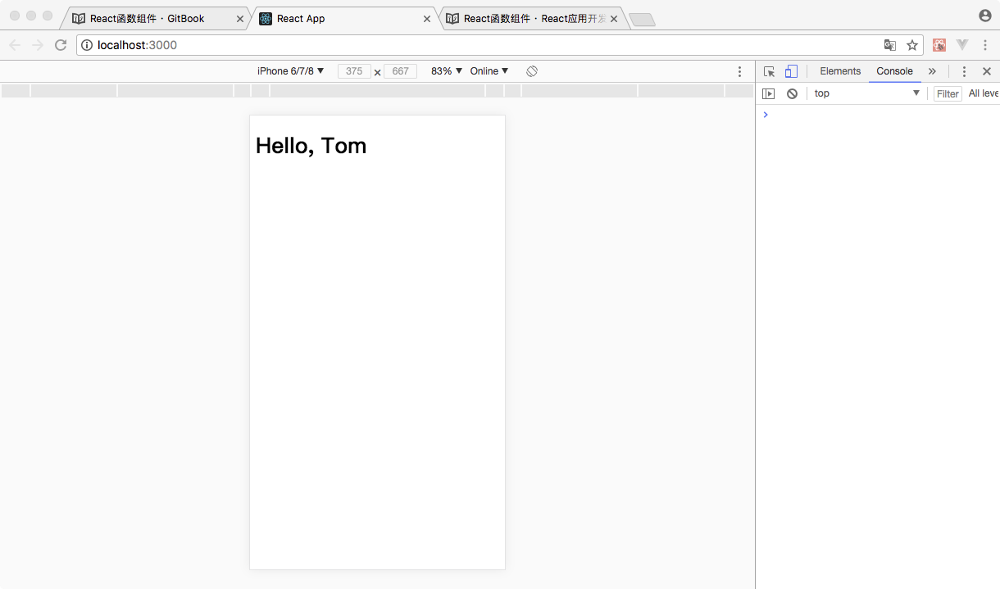
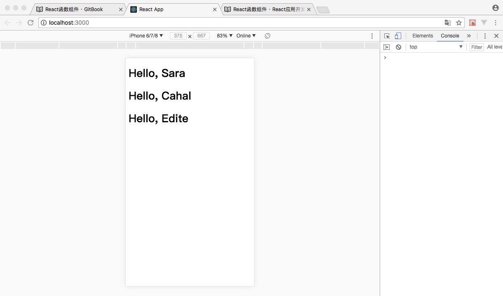
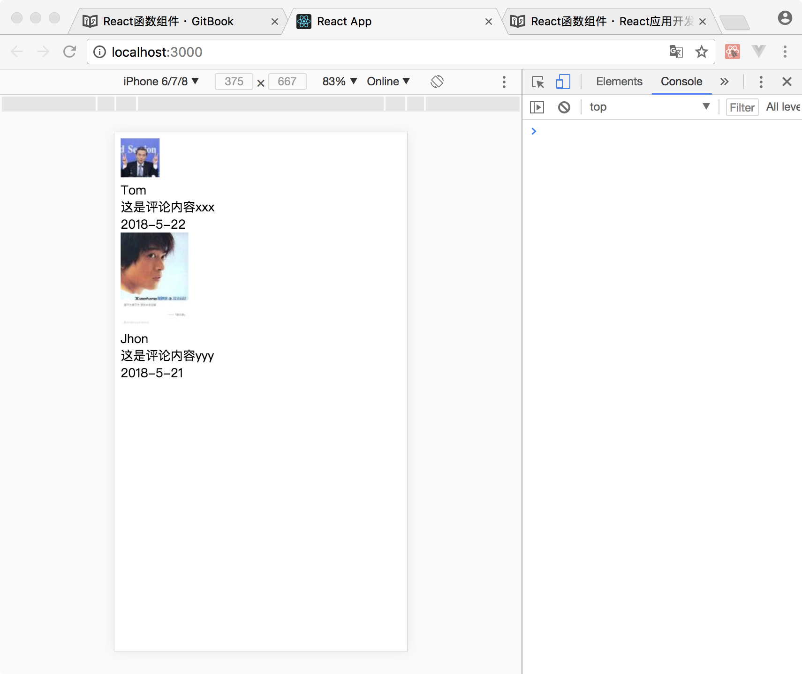
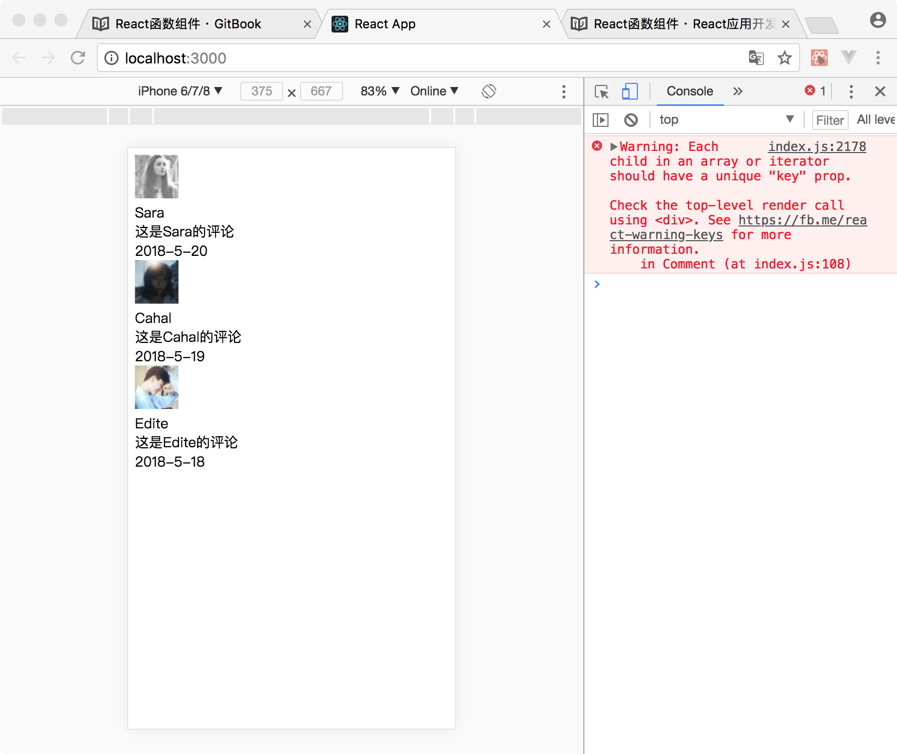

# React函数组件

组件可以将UI切分成一些的独立的、可复用的部件，这样你就只需专注于构建每一个单独的部件。组件从概念上看就像是函数，它可以接收任意的输入值（称之为“props”），并返回一个需要在页面上展示的React元素。

### 函数定义组件

定义一个组件最简单的方式是使用JavaScript函数：

```
function Welcome() {
  return <h1>Hello</h1>;
}
```

该函数返回一个JSX语法构建的React元素，我们对可以返回React元素的函数称为React函数组件。

>需要注意，该函数名首字母必须大写，这是React框架的规定。如使用小写字母会发生解析错误。

使用组件进行React应用的开发时非常重要的一个思想转变。在此之前，我们通常使用HTML标签构建一个页面，全部页面都是用HTML基本标签进行实现，无法进行封装和复用。而且整个页面需要作为一个整体无法进行拆分。但使用组件，我们可以把一个页面切分成功若干个组件，通过组件构建React元素，然后组成整个页面。这样在构建组件时，只需要关注本组件的实现既可，实现了编程中封装的基本原则：高内聚，低耦合。


<!-- 该函数是一个有效的React组件，它接收一个单一的“props”对象并返回了一个React元素。我们之所以称这种类型的组件为函数定义组件，是因为从字面上来看，它就是一个JavaScript函数。

在此函数内部，可以使用输入参数`props`对象中的数据构造一个React元素。从而对元素构造过程进行封装，实现代码的复用。在展示相同结构数据时，便无需重新构造React元素。 -->


### 组件渲染

在前面，我们遇到的React元素都只HTML标签构建的：

```
const element = <div />;
```

这里React元素也可以通过函数组件进行构建：

```
const element = <Welcome />;
```

当然也可以写成如下形式：

```
const element = <Welcome></Welcome>;
```

但这样写是错误的：

```
const element = Welcome();
```

这里需要注意，虽然`Welcome`为一个函数定义，但在构建React元素时，我们并不调用此函数获得返回值，而是将函数名作为标签名，通过一对尖括号来构建React元素。

### 组件属性

在React中，可以为函数组件添加一个输入参数，使其复用性增强。

例如我们上面封装的`Welcome`组件，只能显示静态的`Hello`。但现在我们需要在Hello后面添加一个用户姓名，成为一个可以针对不同姓名进行复用的React组件。

为了完成上述复用性提升的要求，在函数组件定义时，可以添加一个单一的参数名为props的函数形参对象。该形参的值由使用该组件的代码决定。在定义组件时，我们可以附加一个参数说明来高职使用该组件的开发者提供正确的参数内容。在此函数内部，可以使用输入参数`props`对象中的数据构造一个React元素。从而对元素构造过程进行封装，实现代码的复用。在展示相同结构数据时，便无需重新构造React元素。

```
//使用此组件是，需要输入一个字符串类型的name属性值
function Welcome(props) {
  return <h1>Hello, {props.name}</h1>;
}
```

在定义此函数组件时，我们并不知道`name`值具体是多少，但是通过参数说明，我们告知使用此组件的开发者，需要输入一个字符串类型的name值。那么我们便可以认为`props.name`是一个字符串，在内部构建React元素时，便可以使用此数据。

在使用有输入参数的函数组件构建React元素时，需要为其输入参数赋值。输入参数赋值语法和HTML标签属性赋值一致：

```
const element = <Welcome name="Tom" />;
```

通过属性语法，可以将`{name:'Tom'}`这个键值对写入函数组件的`props`对象中。在函数组件内部，通过`props.name`获取的值为`Tom`

例如,这段代码会在页面上渲染出”Hello,Tom:

```
//引入React框架
import React from 'react';

//引入ReactDOM框架
import ReactDOM from 'react-dom';

//使用JavaScriptDOM操作函数，通过id获取容器div
const div = document.getElementById('root');


//定义一个带有输入参数的函数组件
function Welcome(props) {
  return <h1>Hello, {props.name}</h1>;
}


//使用函数组件构建React元素
const element = <Welcome name="Tom" />;


//使用ReactDOM渲染React元素
ReactDOM.render(element, div);
```



**Props的只读性**

使用函数来声明一个组件，它决不能修改它自己的props。来看这个sum函数：

```
function sum(a, b) {
  return a + b;
}

```

类似于上面的这种函数称为“纯函数”，它没有改变它自己的输入值，当传入的值相同时，总是会返回相同的结果。
与之相对的是非纯函数，它会改变它自身的输入值：

```
function withdraw(account, amount) {
  account.total -= amount;
}
```

React是非常灵活的，但它也有一个严格的规则：

**所有的React组件必须像纯函数那样使用它们的props。**

当然，应用的界面是随时间动态变化的，我们将在下一节介绍一种称为“state”的新概念，State可以在不违反上述规则的情况下，根据用户操作、网络响应、或者其他状态变化，使组件动态的响应并改变组件的输出。


**属性展开赋值**

在构建React元素时，会遇到一次需要赋值多个属性的情况。

例如：

```
const e = <Test a={1} b={2} c={3} d={4} />
```

在遇到这样赋值场景时，我们可以使用React中的属性展开操作对多个属性一次赋值：

```
//先将属性值以键值对方式放入一个对象中
const props = {
    a:1,
    b:2,
    c:3,
    d:4
}

//在构建React元素时，通过展开语法进行一次性赋值
const e = <Test {...props}/>
```

使用属性展开赋值方式，可以让代码更加整洁。

### 组合组件

组件可以在它的输出中引用其它组件，这就可以让我们用同一组件来抽象出任意层次的细节。在React应用中，按钮、表单、对话框、整个屏幕的内容等，这些通常都被表示为组件。

例如，我们可以创建一个App组件，用来多次渲染Welcome组件：

```
//引入React框架
import React from 'react';

//引入ReactDOM框架
import ReactDOM from 'react-dom';

//使用JavaScriptDOM操作函数，通过id获取容器div
const div = document.getElementById('root');

function Welcome(props) {
  return <h1>Hello, {props.name}</h1>;
}

//创建一个App组件
function App() {
  //在App组件内使用Welcome组件构建React元素
  return (
    <div>
      <Welcome name="Sara" />
      <Welcome name="Cahal" />
      <Welcome name="Edite" />
    </div>
  );
}

//使用App组件构建React元素
const app = <App/>

//将React元素渲染到div中
ReactDOM.render(app,div);
```

运行结果：



### 组件化开发

本小节通过一个简单的案例来演示一下组件化开发和传统开发的区别。

我们以用户评论模块为例子。在传统HTML页面中，代码如下：

```
    <div className="Comment">
      <div className="UserInfo">
        
        <div className="UserInfo-name">
          Tom
        </div>
      </div>
      <div className="Comment-text">
        这是评论内容
      </div>
      <div className="Comment-date">
        '2018-5-22'
      </div>
    </div>
```

整个评论模块是一个整体，阅读性和维护性都不好，也无法做任务切分，只能有一个开发人员独立进行开发。如果需要显示多条评论，则需要编写相同的代码。

```
<div className="CommentList">
    <div className="Comment">
      <div className="UserInfo">
        
        <div className="UserInfo-name">
          Tom
        </div>
      </div>
      <div className="Comment-text">
        这是评论内容xxx
      </div>
      <div className="Comment-date">
        2018-5-22
      </div>
    </div>
    <div className="Comment">
      <div className="UserInfo">
        
        <div className="UserInfo-name">
          Jhon
        </div>
      </div>
      <div className="Comment-text">
        这是评论内容yyy
      </div>
      <div className="Comment-date">
        2018-5-21
      </div>
    </div>
</div>
```



但如果我们使用组件化进行开发，在显示效果完全一样的前提下，代码会更加清晰。

在使用组件化开发模式时，首先需要确定组件的结构，一般来说，显示同一类的数据的页面结构封装为一个组件。在这样原则下，我们可以将用户头像和用户姓名封装为一个`UserInfo`组件，将评论内容和评论时间封装为一个`Content`组件。然后在使用这两个组件封装一个`Comment`组件。


封装`UserInfo`组件

```
function UserInfo(props){
    return(
        <div>
            
            <div className="UserInfo-name">
            {props.name}
            </div>
        </div>
    )
}
```

封装`Content`组件

```
function Content(props){
    return(
        <div>
            <div className="Comment-text">
                {props.text}
            </div>
            <div className="Comment-date">
                {props.date}
            </div>
        </div>
    )  
}
```

封装`Comment`组件

```
function Comment(props){
    return(
        <div>
            <UserInfo 
                name={props.name} 
                avatarUrl={props.avatarUrl}
            />
            <Content 
                text={props.text} 
                date={props.date} 
            />
        </div>
    )
}
```

封装过程结束，接下来便可以使用封装的组件构造React元素并渲染显示：

```
<div className="CommentList">
    <Comment name={'Tom'} avatarUrl={'http://t.cn/R3dIR5P'} text={'这是一条评论xxx'} date={'2018-5-22'}/>
    <Comment name={'Jhon'} avatarUrl={'http://t.cn/R3dM7xC'} text={'这是一条评论yyy'} date={'2018-5-21'}/>
</div>
```

运行效果和非组件化开发一样：


通过代码对比，我们可以发现，使用组件化进行开发时，可将任务进行分解，逐个模块独立开发，在进行上层整合。这样可以将一个大项目分解为若干个基础组件的开发任务，增强了任务的并行处理能力。又因为各个组件直接相互独立，在代码维护性和阅读性上比整体开发要好很多。


### 数据驱动

组件的核心意义是为了显示数据。通过组件的复用，可以简化对相同数据结构的数据显示操作步骤。在React应用中，构建React元素是在JavaScript代码中进行操作，所以我们同样可以借助编程语言的能力对数据进行处理和显示。

例如我们现在有如下评论数据需要显示：

```
const comments = [
    {
        name:'Sara',
        avatarUrl:'http://t.cn/R3de2Ix',
        text:'这是Sara的评论',
        date:'2018-5-20'
    },
    {
        name:'Cahal',
        avatarUrl:'http://t.cn/R3detpE',
        text:'这是Cahal的评论',
        date:'2018-5-19'
    },
    {
        name:'Edite',
        avatarUrl:'http://t.cn/R3de6DE',
        text:'这是Edite的评论',
        date:'2018-5-18'
    }
]
```
此时，可以通过编程的方式动态构建React元素：

```
//声明一个空数组，用来装载通过编程方式动态构建的React元素
const commentItems = [];

//使用for循环对数据进行遍历
for(let i=0;i<comments.length;i++){
    //获取数组中每一个数据对象
    const commentData = comments[i];

    //在循环内，动态创建React元素
    const commentItem = (
        <Comment 
            name={commentData.name} 
            avatarUrl={commentData.avatarUrl} 
            text={commentData.text} 
            date={commentData.date}
        />
    )

    //将动态创建的React元素放入commentItems数组中
    commentItems.push(commentItem)
}

```
`commentItems`数组中储存这所有数据显示对应的React元素。在React开发中，装载React元素的数组可以直接渲染在一个React元素中。

```
<div>
    {commentItems}
</div>
```
通过上述代码，便可以将commentItemsReact元素全部渲染出来。

完整代码：

```
//引入React框架
import React from 'react';

//引入ReactDOM框架
import ReactDOM from 'react-dom';

//使用JavaScriptDOM操作函数，通过id获取容器div
const div = document.getElementById('root');

function UserInfo(props){
    return(
        <div>
            
            <div className="UserInfo-name">
            {props.name}
            </div>
        </div>
    )
}

function Content(props){
    return(
        <div>
            <div className="Comment-text">
                {props.text}
            </div>
            <div className="Comment-date">
                {props.date}
            </div>
        </div>
    )  
}

function Comment(props){
    return(
        <div>
            <UserInfo 
                name={props.name} 
                avatarUrl={props.avatarUrl}
            />
            <Content 
                text={props.text} 
                date={props.date} 
            />
        </div>
    )
}

const comments = [
    {
        name:'Sara',
        avatarUrl:'http://t.cn/R3de2Ix',
        text:'这是Sara的评论',
        date:'2018-5-20'
    },
    {
        name:'Cahal',
        avatarUrl:'http://t.cn/R3detpE',
        text:'这是Cahal的评论',
        date:'2018-5-19'
    },
    {
        name:'Edite',
        avatarUrl:'http://t.cn/R3de6DE',
        text:'这是Edite的评论',
        date:'2018-5-18'
    }
]

//声明一个空数组，用来装载通过编程方式动态构建的React元素
const commentItems = [];

//使用for循环对数据进行遍历
for(let i=0;i<comments.length;i++){
    //获取数组中每一个数据对象
    const commentData = comments[i];

    //在循环内，动态创建React元素
    const commentItem = <Comment name={commentData.name} avatarUrl={commentData.avatarUrl} text={commentData.text} date={commentData.date}/>

    //将动态创建的React元素放入commentItems数组中
    commentItems.push(commentItem)
}


ReactDOM.render(
  (
    <div>
        {commentItems}
    </div>
  ),
  div
);
```

代码运行效果：



>调试窗口中有一个警告：
>`Warning: Each child in an array or iterator should have a unique "key" prop.`
>暂且忽略此警告，在后面的表单章节中，在解决这个问题。