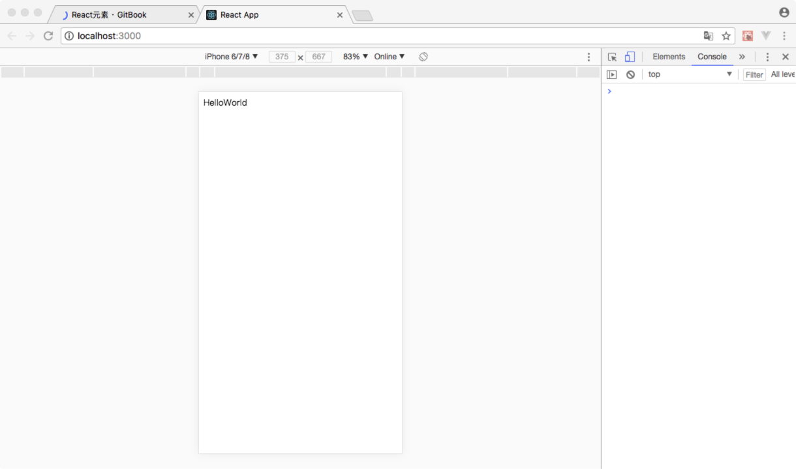

# React元素

React元素是构成 React 应用的最小单位。使用React元素用来描述你在屏幕上看到的内容。

```
const element = <h1>Hello, world</h1>;
```

>与浏览器的 DOM 元素不同，React 当中的元素事实上是普通的对象，React DOM 可以确保 浏览器 DOM 的数据内容与 React 元素保持一致。

React元素与HTML标签相似，也具有属性和子节点。在处理复杂显示需求时，需要使用React元素的多层嵌套模式。

React元素和HTML标签的本质区别为：React元素是JavaScript程序中的一个对象变量，可以在编程中随时修改其内容。而HTML标签为固定的DOM节点，渲染完成之后，不能直接更改某一个HTML标签的属性或其他数据。只能操作DOM进行修改。

React元素可在程序中随时修改内容的特性，使前端的页面构造和操作更加方便简洁。不在需要类似jQuary的DOM操作库进行页面动态维护。而转变为直接修改JavaScript中的变量既可以在页面上更新数据。这种开发模式更接近与业务系统编程，所以在React应用开发中，对于编程能力的要求比传统网页开发高很多。

### 构建React元素

在React应用开发中，我们可以使用HTML标签构建React元素，并用React元素在页面上展示数据内容。React框架API中提供了一个创建React元素的方法`createElement()`。使用此方法可以通过HTML标签创建React元素。


```
React.createElement(
  type,
  [props],
  [...children]
)
```
参数说明：
* `type`是html标签名(例如`div`或`span`)
* `props`为可选参数，类型为一个对象。通过对象中的键值对为该React元素属性赋值。(例如`{id:'root'}`)
* `children`是可变参数，类型为任意。作用是配置该元素的子元素

使用参考：

```
const reactDiv = React.createElement('div',{id:'root'},'HelloWorld');
```
以上代码创建了一个React元素变量，名为`reactDiv`；此元素有一个id属性，值为`root`；同时有一个文字子节点，内容为：`HelloWorld`。该元素可以显示在页面上，可视内容为`HelloWorld`。


### 渲染React元素

在React应用程序中，使用ReactDOM框架的`render()`函数，可以将React元素渲染到一个HTML页面中的`div`容器中。

```
ReactDOM.render(
  element,
  container,
  [callback]
)
```

参数说明：

* `element`：所需渲染的React元素
* `container`：展示React元素的HTML容器
* `callback`：回调函数是可选的。如果你提供了，程序会在渲染或更新之后执行这个函数。

>如果这个React元素之前已经被渲染到container里去了，这段代码就会进行一次更新，并且只会改变那些反映元素最新状态所必须的DOM元素。

使用参考：

在React工程`react-app1/public/index.html`文件中定义了一个`div`容器。

```
<!DOCTYPE html>
<html lang="en">
  <head>
    <meta charset="utf-8">
    <meta name="viewport" content="width=device-width, initial-scale=1, shrink-to-fit=no">
    <title>React App</title>
  </head>
  <body>
    <div id="root"></div>
  </body>
</html>

```
在项目的编程入口文件`react-app1/src/index.js`中，编程渲染React元素

```
//引入React框架
import React from 'react';

//引入ReactDOM框架
import ReactDOM from 'react-dom';

//使用JavaScriptDOM操作函数，通过id获取容器div
const div = document.getElementById('root');

//使用createElement()创建一个React元素
const reactDiv = React.createElement('div',{id:'root'},'HelloWorld');

//使用ReactDOM
ReactDOM.render(reactDiv, div);
```

运行结果：



### JSX语法

在处理复杂显示的问题时，通常需要对元素进行多层次的嵌套处理。例如我们将三个`p`段落放入一个`div`做统一的布局处理时，需要`div`包含三个`p`的子节点。

对应React开发中，我们也需要对React元素做多层嵌套处理。

```
//创建三个React元素显示一个段落文字
const reactP1 = React.createElement('p',{id:'p1'},'这是段落1');
const reactP2 = React.createElement('p',{id:'p2'},'这是段落2');
const reactP3 = React.createElement('p',{id:'p3'},'这是段落3');

//创建一个React元素，并将以上三个React元素作为其子元素
const reactDiv = React.createElement('div',{id:'root'},reactP1,reactP2,reactP3);
```

通过createElement()函数可以处理元素的嵌套关系，但编写代码不方便，也不直观。所以我们引入一个新语法来处理React元素创建和嵌套的操作——JSX语法。

我们来观察一下声明的这个变量：

```
const element = <h1>Hello, world!</h1>;
```

这种看起来可能有些奇怪的标签语法既不是字符串也不是 HTML。它被称为JSX，一种 JavaScript 的语法扩展。 我们推荐在 React 中使用 JSX 来描述用户界面。JSX 乍看起来可能比较像是模版语言，但事实上它完全是在 JavaScript 内部实现的。JSX 用来声明 React 当中的元素。接下来我们先来看看 JSX 的基本使用方法。

**在 JSX 中使用表达式**

你可以任意地在 JSX 当中使用 JavaScript 表达式，在 JSX 当中的表达式要包含在大括号里。

例如：

```
const e1 = <p>{1+2}</p>;

```

```
const name = 'tom'
const e2 = <p>{name}</p>;

```
```
function add(x,y){
    return x*y;
}
const e3 = <p>{add(1,2)}</p>;

```

在以上代码执行过程中，JSX语法会首先计算大括号中的表达式的值，然后将值进行渲染。

**JSX 本身其实也是一种表达式**

在编译之后，JSX会被转化为普通的 JavaScript 对象。

这也就意味着，你其实可以在 if 或者 for 语句里使用 JSX，将它赋值给变量，当作参数传入，作为返回值都可以。

```
const e1 = <p>{1+2}</p>
const e2 = <div>{e1}</div>
```

```
function user(name){
    if (name) {
        return <h1>Hello, {name}!</h1>;
    }
    return <h1>Hello, Stranger.</h1>;
}

const e3 = user('tom');

```

**JSX 属性**

你可以使用引号来定义以字符串为值的属性：

```
const element = <div tabIndex="0"></div>;
```

也可以使用大括号来定义以 JavaScript 表达式为值的属性：

```
const user = {
    name:'tom',
    avatarUrl:'http://www.images.com/1.png'
}
const element = </img>;
```
>**切记你使用了大括号包裹的 JavaScript 表达式时就不要再到外面套引号了。JSX 会将引号当中的内容识别为字符串而不是表达式。**

在通过JSX语法操作元素属性时，通过HTML标签构造的元素在使用其`class`属性是，应在JSX语法中使用`className`代替`class`。因为在ES6语法中，`class`作为语言关键字。

**JSX 嵌套**

如果 JSX 标签是闭合式的，那么你需要在结尾处用 />, 就好像 XML/HTML 一样：

```
const user = {
    name:'tom',
    avatarUrl:'http://www.images.com/1.png'
}

const element = ;
```

JSX 标签同样可以相互嵌套：

```
const element = (
  <div>
    <h1>Hello!</h1>
    <h2>Good to see you here.</h2>
  </div>
);
```

>因为 JSX 的特性更接近 JavaScript 而不是 HTML , 所以 React DOM 使用 camelCase 小驼峰命名 来定义属性的名称，而不是使用 HTML 的属性名称。例如 tabindex 则对应着 tabIndex。

**JSX 防注入攻击**

你可以放心地在 JSX 当中使用用户输入:

```
const title = response.userInputText;
// 直接使用是安全的：
const element = <h1>{title}</h1>;
```

React DOM 在渲染之前默认会 过滤 所有传入的值。它可以确保你的应用不会被注入攻击。所有的内容在渲染之前都被转换成了字符串。这样可以有效地防止 XSS(跨站脚本) 攻击。

**JSX 代表 Objects**

Babel 转译器会把 JSX 转换成一个名为 `React.createElement()` 的方法调用。
下面两种代码的作用是完全相同的：

```
const element = (
  <h1 className="greeting">
    Hello, world!
  </h1>
);
```

```
const element = React.createElement(
  'h1',
  {className: 'greeting'},
  'Hello, world!'
);
```

React.createElement() 这个方法首先会进行一些避免bug的检查，之后会返回一个类似下面例子的对象：

```
// 注意: 以下示例是简化过的（不代表在 React 源码中是这样）
const element = {
  type: 'h1',
  props: {
    className: 'greeting',
    children: 'Hello, world'
  }
};

```
这样的对象被称为 “React 元素”。它代表所有你在屏幕上看到的东西。React 通过读取这些对象来构建 DOM 并保持数据内容一致。