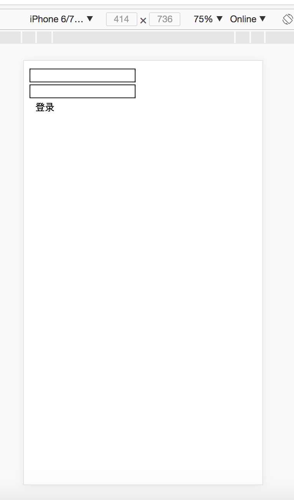
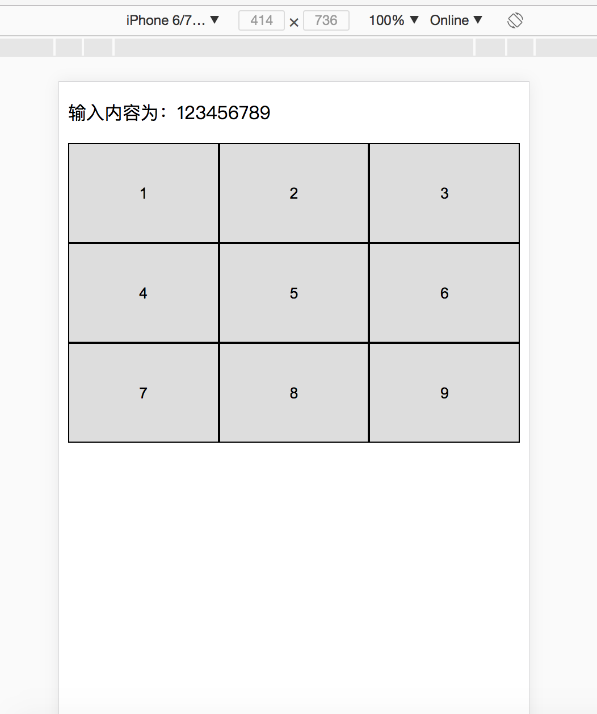
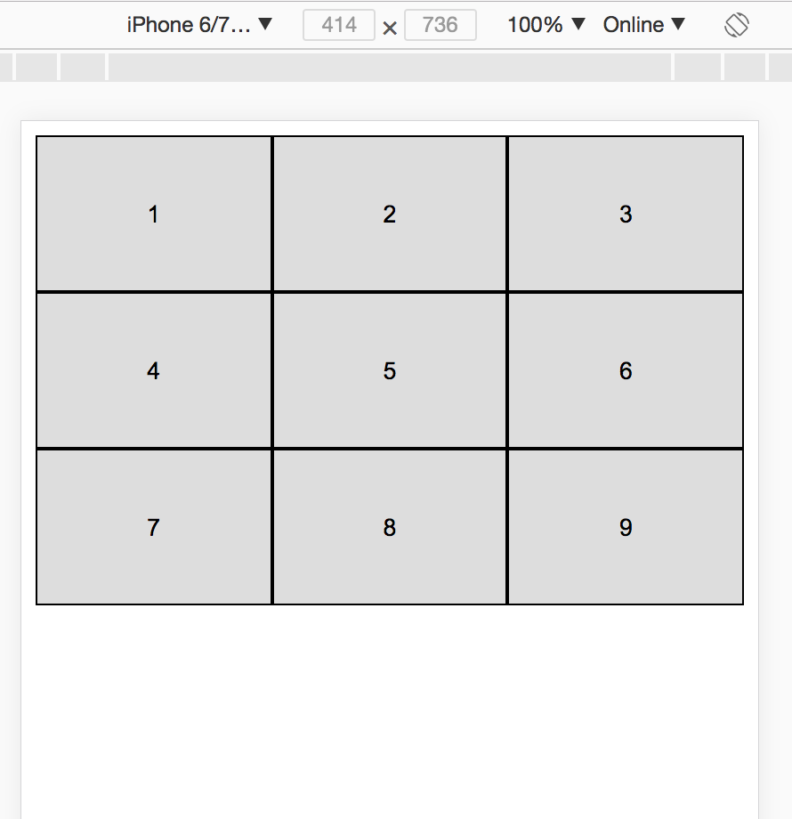

# React MVC

MVC开发模式是为解决复杂WebApp实现时的一种开发方式。

在该模式下，将App分为一下三部分：

* Model，数据服务层
* View，数据展示层
* Controller,逻辑控制层

我们这里通过分别用传统方式和MVC方式实现一个登录模块，在对比的过程中，初步认识MVC概念。

在登录模块中，首先需要一个后台登录API支持，API文档如下：

|参数名|参数描述|
|:---|:---|
|username|登录用户名|
|password|登录密码|


实现代码为：

```
import React, { Component } from 'react';

export default class App extends Component {

  constructor(props) {
    super(props)
  
    this.state = {
       username:'',
       password:''
    }
  }

  usernameInput = (e)=>{
    const username = e.target.value;
    this.setState({username})
  }

  passwordInput = (e)=>{
    const password = e.target.value;
    this.setState({password})
  }

  sendButton = async ()=>{
    const user = {
      username:this.state.username,
      password:this.state.password
    }

    console.log(user);

    const res = await fetch('http://localhost:3001/api/login',{
      method:'POST',
      headers:{
        'Accept':'application/json',
        'Content-Type':'application/json'
      },
      body:JSON.stringify(user)
    })

    const result = await res.json();

    console.log(result)

  }
  

  render() {
    return (
        <div>
          <input 
            className={'textinput'}
            onChange={this.usernameInput} 
          />
          <br/>
          <input 
            className={'textinput'}
            onChange={this.passwordInput} 
          />
          <br/>
          <button 
            type="button"
            onClick={this.sendButton}
          >
            登录
          </button>
        </div>
    );
  }
}
```

CSS样式：

```
.textinput{
  border-width: 1px;
  border-color:black;
}
```

运行结果为：



上述App组件中，包含了所有业务的代码，这些代码基本分为三个部分：

* 视图构建
* 事件响应&状态维护
* 数据请求和处理

现在我们将其各个部分拆分出来。

视图构建部分：

```
render() {
    return (
        <div>
          <input className={'textinput'} />
          <br/>
          <input className={'textinput'} />
          <br/>
          <button type="button">
            登录
          </button>
        </div>
    );
  }
```

```
.textinput{
  border-width: 1px;
  border-color:black;
}
```

事件响应部分：

```
constructor(props) {
    super(props)
  
    this.state = {
       username:'',
       password:''
    }
  }

  usernameInput = (e)=>{
    const username = e.target.value;
    this.setState({username})
  }

  passwordInput = (e)=>{
    const password = e.target.value;
    this.setState({password})
  }

  sendButton =  ()=>{

  }

```

//数据请求和处理

```
async ()=>{
    const user = {
      username:this.state.username,
      password:this.state.password
    }

    console.log(user);

    const res = await fetch('http://localhost:3001/api/login',{
      method:'POST',
      headers:{
        'Accept':'application/json',
        'Content-Type':'application/json'
      },
      body:JSON.stringify(user)
    })

    const result = await res.json();

    console.log(result)

}
```

在简单的业务需求中，把这三个部分的代码写在一个组件中是没问题的。但随着业务复杂的增加，这三个部分的代码会大量增加，如果那时候仍然将三部分代码都写在组件中，组件代码的可维护性和可阅读性会下降很多，造成项目开发越来越困难。所以在解决复杂需求时，需要引入MVC开发模式。

在MVC开发模式下，会将以上三个部分进行拆分，然后通过规定统一的函数调用接口进行数据交互。


### 数据服务层

在针对复杂业务实现时，需要引入数据服务层对数据请求和数据处理进行分离。我们将数据请求和处理过程进行封装，装在此业务的对象我们称之为数据服务对象，一个应用中可以存在多个数据服务对象，不同数据服务对象处理不同的业务数据。

我们通过一个JavaScript Class对数据请求和处理过程进行封装。数据服务对象通常命名为`XXXManager`。但我们并不直接对外暴露这个类供外界进行使用，因为在数据服务中，有一个核心原则需要在编码中遵守：**数据同步**。即在任何地方获取同一个数据返回结果因为一样。

为了解决数据服务对象的数据同步问题，我们在这里引入一个开发模式的概念：**单例模式**。即用单例模式定义一个对象，该对象在代码中任何位置获取都时唯一一个。单例模式的实现在JavaScript中非常简单，即在JavaScript模块中对外暴露一个创建好的对象即可。


定义一个单例对象

```
//DemoManager.js

class DemoManager{

}

export default new DemoManager();
```


在使用DemoManager单例时，无需在对该引入的模块进行`new`操作，直接使用即可。

```
import demoManager from './DemoManager';

demoManager.name = 'Tom';

console.log(demoManager.name)
```


这里登录功能输入用户业务中的一个功能，所以这个数据管理对象命名为`UserManager`。

在该单例中封装一个`login`的方法，在实现该方法前，需要对该方法进行设计。该方法的设计需要满足上层组件的业务要求。设计部分需要明确一下内容：

* 方法输入输出数据
* 方法是同步还是异步操作

我们根据登录业务的过程确定以上内容：

* 方法输入为用户名和密码
* 输出为登录状态，成功或失败
* 在登录过程中需要使用网络请求，网络请求为异步操作，所以该方法为异步方法

>异步函数在定义是需要用`async`进行修饰，在调用时，需要`await`修饰。

```
class UserManager{
    async login(username,password){
        try{
            const user = {
            username:this.state.username,
            password:this.state.password
            }

            console.log(user);

            const res = await fetch('http://localhost:3001/api/login',{
            method:'POST',
            headers:{
                'Accept':'application/json',
                'Content-Type':'application/json'
            },
            body:JSON.stringify(user)
            })

            const result = await res.json();

            return result.success;

        } catch(error){
            //log记录
            return null;
        }
    }
}

export default new UserManager();
```

以上代码即为对`login`业务的封装，在封装之后，遍可以在组件中使用数据服务对象提供的方法进行登录操作:

```

import React, { Component } from 'react';

import userManager from './DataServer/UserManager';

export default class App extends Component {

  constructor(props) {
    super(props)
  
    this.state = {
       username:'',
       password:''
    }
  }

  usernameInput = (e)=>{
    const username = e.target.value;
    this.setState({username})
  }

  passwordInput = (e)=>{
    const password = e.target.value;
    this.setState({password})
  }

  sendButton = async ()=>{
    
    const loginState = await userManager.login(this.state.username,this.state.password);

    console.log(loginState);

  }
  

  render() {
    return (
        <div>
          <input 
            onChange={this.usernameInput} 
          />
          <br/>
          <input 
            onChange={this.passwordInput} 
          />
          <br/>
          <button 
            type="button"
            onClick={this.sendButton}
          >
            登录
          </button>
        </div>
    );
  }
}

```


对比按钮响应的事件处理代码：

```
//没有使用MVC模式：

sendButton = async ()=>{
    const user = {
      username:this.state.username,
      password:this.state.password
    }

    console.log(user);

    const res = await fetch('http://localhost:3001/api/login',{
      method:'POST',
      headers:{
        'Accept':'application/json',
        'Content-Type':'application/json'
      },
      body:JSON.stringify(user)
    })

    const result = await res.json();

    console.log(result)

  }

```

```
//使用MVC数据服务对象封装数据操作

 sendButton = async ()=>{
    
    const loginState = await userManager.login(this.state.username,this.state.password);

    console.log(loginState);

  }

```

可以看出，代码在使用MVC模式之后，代码得到了极大的简化，阅读性和维护下都有所提高。


### 数据展示层

在处理复杂视图显示时，如果所有的页面元素全部在组件中进行构建，也会使代码的维护性和阅读性下降。所以在遇到复杂视图展示时，我们引入数据展示层对复杂展示业务进行分离。

这里使用一个键盘展示功能进行讲解数据展示层的演示讲解。



这里的键盘是一个整体，但在实现代码中，需要在控制器中完整实现：

```
import React, { Component } from 'react';

import  './App.css';

export default class App extends Component {

  constructor(props) {
    super(props)
  
    this.state = {
       number:'',
    }
  }
  

  onButtonClick = (e)=>{
    const index = e.target.id;
    console.log(index);

    this.setState((preState)=>{
      return{
        number:preState.number+index,
      }
    })
  }

  render() {
    return (
        <div>
          <p>{`输入内容为：${this.state.number}`}</p>
          <div className={'rowContainer'}>
            <button 
              className={'button'} 
              id={'1'}
              onClick={this.onButtonClick}
            >
              {'1'}
            </button>
            <button 
              className={'button'} 
              id={'2'}
              onClick={this.onButtonClick}
            >
              {'2'}
            </button>
            <button 
              className={'button'} 
              id={'3'}
              onClick={this.onButtonClick}
            >
              {'3'}
            </button>
          </div>
          <div className={'rowContainer'}>
            <button 
              className={'button'} 
              id={'4'}
              onClick={this.onButtonClick}
            >
              {'4'}
            </button>
            <button 
              className={'button'} 
              id={'5'}
              onClick={this.onButtonClick}
            >
              {'5'}
            </button>
            <button 
              className={'button'} 
              id={'6'}
              onClick={this.onButtonClick}
            >
              {'6'}
            </button>
          </div>
          <div className={'rowContainer'}>
            <button 
              className={'button'} 
              id={'7'}
              onClick={this.onButtonClick}
            >
              {'7'}
            </button>
            <button 
              className={'button'} 
              id={'8'}
              onClick={this.onButtonClick}
            >
              {'8'}
            </button>
            <button 
              className={'button'} 
              id={'9'}
              onClick={this.onButtonClick}
            >
              {'9'}
            </button>
          </div>
        </div>
    );
  }
}


```


```
.rowContainer{
  display: flex;
}

.button{
  flex: 1;
  height: 88px;
  border-width: 1px;
  border-color:black;
}
```

这里可以发现，虽然键盘的功能相对单一，但是代码的数量却很多，但是实现键盘的代码并不是该组件的核心功能，所以我们可以引入MVC开发模式中，封装视图的概念，对视图进行组件化封装。

将键盘展示功能封装为一个组件，然后在控制器中直接使用该组件即可，无需关注其底层的具体实现。

首先创建一个空的React类组件：

```
import React, { Component } from 'react'

export default class KeyBoard extends Component {
  render() {
    return (
      <div>
        
      </div>
    )
  }
}
```

在该组件中单独实现键盘的布局：

```
import React, { Component } from 'react'

export default class KeyBoard extends Component {
  render() {
    return (
        <div>
          <p>{`输入内容为：${this.state.number}`}</p>
          <div className={'rowContainer'}>
            <button 
              className={'button'} 
              id={'1'}
            >
              {'1'}
            </button>
            <button 
              className={'button'} 
              id={'2'}
            >
              {'2'}
            </button>
            <button 
              className={'button'} 
              id={'3'}
            >
              {'3'}
            </button>
          </div>
          <div className={'rowContainer'}>
            <button 
              className={'button'} 
              id={'4'}
            >
              {'4'}
            </button>
            <button 
              className={'button'} 
              id={'5'}
            >
              {'5'}
            </button>
            <button 
              className={'button'} 
              id={'6'}
            >
              {'6'}
            </button>
          </div>
          <div className={'rowContainer'}>
            <button 
              className={'button'} 
              id={'7'}
            >
              {'7'}
            </button>
            <button 
              className={'button'} 
              id={'8'}
            >
              {'8'}
            </button>
            <button 
              className={'button'} 
              id={'9'}
            >
              {'9'}
            </button>
          </div>
        </div>
    );
  }
}
```
配置样式：

```
.rowContainer{
  display: flex;
}

.button{
  flex: 1;
  height: 88px;
  border-width: 1px;
  border-color:black;
}
```

在组件内添加响应事件函数：

```
onButtonClick = (e)=>{
        const index = e.target.id;
        console.log(index);
}
```
配置组件内元素，添加制定事件响应函数

```
<button 
    className={'button'} 
    id={'1'}
    onClick={this.onButtonClick}
>
    {'1'}
</button>
```

完整代码：

```
import React, { Component } from 'react'

export default class KeyBoard extends Component {

    onButtonClick = (e)=>{
        const index = e.target.id;
        console.log(index);
    }

  render() {
    return (
        <div> 
            <div className={'rowContainer'}>
                <button 
                    className={'button'} 
                    id={'1'}
                    onClick={this.onButtonClick}
                >
                    {'1'}
                </button>
                <button 
                    className={'button'} 
                    id={'2'}
                    onClick={this.onButtonClick}
                >
                    {'2'}
                </button>
                <button 
                    className={'button'} 
                    id={'3'}
                    onClick={this.onButtonClick}
                >
                    {'3'}
                </button>
            </div>
            <div className={'rowContainer'}>
                <button 
                    className={'button'} 
                    id={'4'}
                    onClick={this.onButtonClick}
                >
                    {'4'}
                </button>
                <button 
                    className={'button'} 
                    id={'5'}
                    onClick={this.onButtonClick}
                >
                    {'5'}
                </button>
                <button 
                    className={'button'} 
                    id={'6'}
                    onClick={this.onButtonClick}
                >
                    {'6'}
                </button>
            </div>
            <div className={'rowContainer'}>
                <button 
                    className={'button'} 
                    id={'7'}
                    onClick={this.onButtonClick}
                >
                    {'7'}
                </button>
                <button 
                    className={'button'} 
                    id={'8'}
                    onClick={this.onButtonClick}
                >
                    {'8'}
                </button>
                <button 
                    className={'button'} 
                    id={'9'}
                    onClick={this.onButtonClick}
                >
                    {'9'}
                </button>
            </div>
        </div> 
    );
  }
}
```

封装好的组件可以在其他组件内直接使用：

```
import React, { Component } from 'react';

import KeyBoard from './KeyBoard';

export default class App extends Component {

  render() {
    return (
        <div>
          <KeyBoard/>
        </div>
    );
  }
}

```

运行效果为：



但是到此，我们并没有完成全部的工作，只是将显示部分进行封装。但一个键盘除了显示部分，还有其事件部分。下面我们进行事件接口的定义。

组件的事件接口本质为一个函数类型的属性，在通过组件构建元素时，需要为其赋值。在组件内部可以直接调用该函数属性。因为需要组件内外配合使用，而组件开发者和组件使用者可能并不是同一个人，所以需要通过文档定义组件的事件接口和其事件所携带的参数。

|属性|类型|描述|
|:---|:---|:---|
|onKeyBoardClick|function|该函数携带一个index，表示点击按钮的索引值|

在组件内的事件响应函数中触发该事件接口：

```
onButtonClick = (e)=>{
    const index = e.target.id;
    console.log(index);
    if(this.props.onKeyBoardClick){
        this.props.onKeyBoardClick(index);
    }
}
```
>在触发该事件接口回调函数时，需要先使用if对其进行验证，该事件接口有值时，才可以进行调用。

完整代码：

```
import React, { Component } from 'react'

import './KeyBoard.css';

export default class KeyBoard extends Component {

    onButtonClick = (e)=>{
        const index = e.target.id;
        console.log(index);
        if(this.props.onKeyBoardClick){
            this.props.onKeyBoardClick(index);
        }
    }

  render() {
    return (
        <div> 
            <div className={'rowContainer'}>
                <button 
                    className={'button'} 
                    id={'1'}
                    onClick={this.onButtonClick}
                >
                    {'1'}
                </button>
                <button 
                    className={'button'} 
                    id={'2'}
                    onClick={this.onButtonClick}
                >
                    {'2'}
                </button>
                <button 
                    className={'button'} 
                    id={'3'}
                    onClick={this.onButtonClick}
                >
                    {'3'}
                </button>
            </div>
            <div className={'rowContainer'}>
                <button 
                    className={'button'} 
                    id={'4'}
                    onClick={this.onButtonClick}
                >
                    {'4'}
                </button>
                <button 
                    className={'button'} 
                    id={'5'}
                    onClick={this.onButtonClick}
                >
                    {'5'}
                </button>
                <button 
                    className={'button'} 
                    id={'6'}
                    onClick={this.onButtonClick}
                >
                    {'6'}
                </button>
            </div>
            <div className={'rowContainer'}>
                <button 
                    className={'button'} 
                    id={'7'}
                    onClick={this.onButtonClick}
                >
                    {'7'}
                </button>
                <button 
                    className={'button'} 
                    id={'8'}
                    onClick={this.onButtonClick}
                >
                    {'8'}
                </button>
                <button 
                    className={'button'} 
                    id={'9'}
                    onClick={this.onButtonClick}
                >
                    {'9'}
                </button>
            </div>
        </div> 
    );
  }
}
```

添加事件接口之后，该组件即封装完成，使用该组件实现最初的功能如下：

```
import React, { Component } from 'react';


import KeyBoard from './KeyBoard';

export default class App extends Component {

  constructor(props) {
    super(props)
  
    this.state = {
       number:'',
    }
  }
  

  onKeyBoardClick = (index)=>{
    console.log(index);
    this.setState((preState)=>{
      return{
        number:preState.number+index,
      }
    })
  }

  render() {
    return (
        <div>
          <p>{`输入内容为：${this.state.number}`}</p>
          <KeyBoard 
            onKeyBoardClick={this.onKeyBoardClick}
          />
        </div>
    );
  }
}
```

此代码可与最初代码进行对比，可读性和维护性都有提升。在遇到复杂展示需求是，通过MVC中的展示层封装可以简化开发难度，提升代码质量。

### 逻辑控制层

在使用MVC模式封装实现数据服务层和视图展示层之后，App的应用逻辑需要通过逻辑控制层对象进行实现。

//TODO