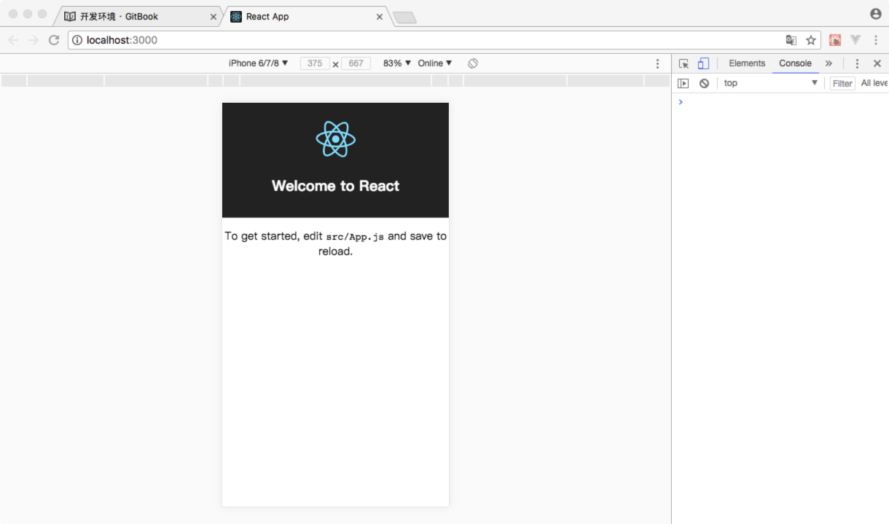

# 开发环境

在进行React应用开发之前首先需要配置开发环境。

安装如下工具:

* chrome浏览器
* node环境
* yarn工具
* create-react-app工具

安装方法：

1，在[https://www.google.cn/chrome/](https://www.google.cn/chrome/)下载最新的Chrome浏览器安装包，然后双击进行安装。

2，在[http://nodejs.cn/download/](http://nodejs.cn/download/)下载最新的node安装包，然后进行双击安装。
>安装过程中需要关闭杀毒软件和安全工具。

3，在[https://yarn.bootcss.com/docs/install.html#windows-tab](https://yarn.bootcss.com/docs/install.html#windows-tab)下载最新的yarn安装包，然后进行双击安装。

4，通过npm工具全局安装`create-react-app`工具。
>npm工具再安装node时会自动安装

```
npm install -g create-react-app
```


开发环境搭建成功之后，便可以创建工程。

按照如下步骤创建React工程：

1，在桌面上创建一个Projects文件夹

2，使用终端进入该文件夹

3，使用`create-react-app`工具创建工程

```
create-react-app react-app1
```

4，使用终端进入`react-app1`文件夹

5，启动工程，Chrome会自动运行，并访问`http://localhose:3000`

```
yarn start
```

浏览器显示如下界面，即启动成功：




