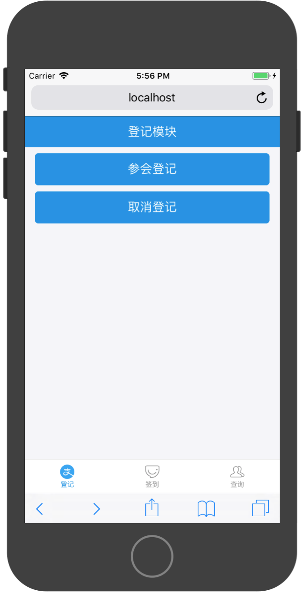

# 综合实战-会场登记App

### 产品原型

TabBar页面有三个标签：

* 登记
* 签到
* 查询




登记模块中分为参会登记和取消登记两个功能。

以下为参加登记功能演示：


以下为取消登记功能演示：


签到模块演示：


查询模块分为以下功能：

* 查询统计信息
* 查询已签到名单
* 查询未签到名单
* 查询个人签到状态


### API接口

**元数据**

|字段名|类型|描述|
|:---|:---|:---|
|id|int|唯一且自增，由数据库维护，作为参会登记号|
|name|string|参会者姓名|
|tel|string|参数者电话|
|isCheck|int|是否签到。0-未签到，1-已签到，默认未签到|


**错误列表**

|错误编号|描述|
|:---|:---|
|10001|数据库错误|
|10002|rid无效|

```
{
    success:false,
    errorCode:10001,
    errorMessage:'数据库错误'
}
```


**参会登记**

请求路径： `http://ip:port/api/register`

请求方式：`POST`

请求参数：

|字段名|类型|描述|
|:---|:---|:---|
|name|string|参会者姓名|
|tel|string|参数者电话|


返回值：

```
{
    success:true,
    data:{
        id:1,
        name:'xx',
        tel:'123',
        isCheck:0
    }
}
```

**取消登记**

请求路径： `http://ip:port/api/unRegister`

请求方式：`POST`

请求参数：

|字段名|类型|描述|
|:---|:---|:---|
|rid|string|参会者登记号|


返回值：

```
{
    success:true,
}
```

**签到**

请求路径： `http://ip:port/api/check`

请求方式：`POST`

请求参数：

|字段名|类型|描述|
|:---|:---|:---|
|rid|string|参会者登记号|


返回值：

```
{
    success:true,
}
```

**查询统计信息**

请求路径： `http://ip:port/api/tongji`

请求方式：`GET`

请求参数：无


返回值：

```
{
    success:true,
    data:{
        total:10,
        checked:3,
        unCheck:7,
    }
}
```

**查询已签到名单**

请求路径： `http://ip:port/api/yiqiandao`

请求方式：`GET`

请求参数：无


返回值：

```
{
    success:true,
    data:[
        {
            id:1,
            name:'xx',
            tel:'123',
            isCheck:1
        },
        ...
    ]
}
```


**查询未签到名单**

请求路径： `http://ip:port/api/weiqiandao`

请求方式：`GET`

请求参数：无


返回值：

```
{
    success:true,
    data:[
        {
            id:1,
            name:'xx',
            tel:'123',
            isCheck:0
        },
        ...
    ]
}
```

**查询个人签到状态**

请求路径： `http://ip:port/api/checkPerson`

请求方式：`POST`

请求参数：

|字段名|类型|描述|
|:---|:---|:---|
|rid|string|参会者登记号|


返回值：

```
{
    success:true,
    data:{
        id:1,
        name:'xx',
        tel:'123',
        isCheck:0
    }
}
```

### 登记 RegisterScreen

参会登记页面主要提供两个功能导航按钮，点击按钮跳转到相应的Screen。

参考实现代码：

```
import React, { Component } from 'react'

import { 
    Button,
    WingBlank, 
    WhiteSpace,
    NavBar 
 } from 'antd-mobile';

export default class RegisterScreen extends Component {
  render() {
    return (
      <div>
        <NavBar
            mode="dark"
        >
            登记模块
        </NavBar>
        <WhiteSpace/>
        <WingBlank>
            <Button
                type='primary'
                onClick={()=>{
                    //跳转到参会登记Screen
                    this.props.history.push('/RegisterMeetingScreen');
                }}
            >
                参会登记
            </Button>
            <WhiteSpace/>
            <Button
                type='primary'
                onClick={()=>{
                    //跳转到取消登记登记Screen
                    this.props.history.push('/UnRegisterMeetingScreen');
                }}
            >
                取消登记
            </Button>
        </WingBlank>
      </div>
    )
  }
}
```

### 签到页面 CheckInScreen

在该页面，允许用户输入一个登记号，点击提交按钮之后，将此登记号发送到服务器进行签到，服务器返回签到结果，在页面通过弹框展现相应提示内容。

参考实现代码：

```
import React, { Component } from 'react'

import { 
    Button,
    WingBlank, 
    WhiteSpace,
    NavBar,
    List,
    InputItem ,
    Modal
 } from 'antd-mobile';

 const checkURL = 'http://localhost:5000/api/check';

export default class CheckInScreen extends Component {

    constructor(props) {
      super(props)
    
      this.state = {
         rid:''
      }
    }
    
  render() {
    return (
      <div>
        <NavBar
            mode="dark"
        >
            签到模块
        </NavBar>
        <WhiteSpace/>
        <List>
            <InputItem 
                value={this.state.rid}
                onChange={(rid)=>{ this.setState({rid})}}
            >
                登记号：
            </InputItem >
        </List>
        <WhiteSpace/>
        <WingBlank>
            <Button
                type='primary'
                onClick={async()=>{
                    //请求API服务进行签到功能
                    try {
                        //请求API服务进行登记功能
                        const person = {
                            rid:this.state.rid
                        }

                        const res = await fetch(checkURL,{
                            method:'POST',
                            headers:{
                                'Accept':'application/json',
                                'Content-Type':'application/json'
                            },
                            body:JSON.stringify(person)
                        })

                        const result = await res.json();

                        if (result.success == false) {
                            
                            Modal.alert('错误',result.errorMessage)

                            return;
                        }

                        Modal.alert('签到成功');


                    } catch (error) {
                        alert(error)
                    }

                    console.log(this.state.rid)
                }}
            >
                签到
            </Button>
        </WingBlank>
      </div>
    )
  }
}

```

### 查询页面 QuaryScreen

查询页面为功能导航页面，提供四个按钮，点击按钮进入相应功能页面。

参考实现代码：

```
import React, { Component } from 'react'

import { 
    Button,
    WingBlank, 
    WhiteSpace,
    NavBar 
 } from 'antd-mobile';

export default class QuaryScreen extends Component {
  render() {
    return (
      <div>
        <NavBar
            mode="dark"
        >
            查询模块
        </NavBar>
        <WhiteSpace/>
        <WingBlank>
            <Button
                type='primary'
                onClick={()=>{
                    //跳转到查询统计信息Screen
                    this.props.history.push('/QuaryTotalScreen');
                }}
            >
                查询统计信息
            </Button>
            <WhiteSpace/>
            <Button
                type='primary'
                onClick={()=>{
                    //跳转到已签到名单Screen  
                    this.props.history.push('/CheckPersonListScreen');
                }}
            >
                查询已签到名单
            </Button>
            <WhiteSpace/>
            <Button
                type='primary'
                onClick={()=>{
                    //跳转到未签到名单Screen  
                    this.props.history.push('/UnCheckPersonListScreen');
                }}
            >
                查询未签到名单
            </Button>
            <WhiteSpace/>
            <Button
                type='primary'
                onClick={()=>{
                    //跳转到个人签到状态Screen  QuaryPersonStateScreen
                    this.props.history.push('/QuaryPersonStateScreen');
                }}
            >
                查询个人签到状态
            </Button>
        </WingBlank>
      </div>
    )
  }
}
```

### App根视图 TabBarScreen 

TabBarScreen通过`TabBar`和`TabBar.Item`对登记、签到和查询视图进行管理。

在该Screen中使用`localStorage`对`TabBar`的选择进行保存，以免在刷新视图时无法保持上次状态。

参考实现代码：

```
import React, { Component } from 'react';

import { 
  Button,
  WingBlank, 
  WhiteSpace,
  NavBar ,
  TabBar 
} from 'antd-mobile';


import RegisterScreen from './RegisterScreen';
import CheckInScreen from './CheckInScreen';
import QuaryScreen from './QuaryScreen';

export default class TabbarScreen extends Component {

  componentDidMount(){
    if(localStorage.selected){
      this.setState({selected:localStorage.selected})
    }
  }

  constructor(props) {
    super(props)
  
    this.state = {
      selected:'RegisterScreen'
    }
  }
  

  render() {
    return (
        <div style={{ position: 'fixed', height: '100%', width: '100%', top: 0 }}>
          <TabBar>
            <TabBar.Item
              key='RegisterScreen'
              title='登记'
              selected={'RegisterScreen' === this.state.selected }
              onPress={()=>{
                this.setState({selected:'RegisterScreen'})
                localStorage.selected = 'RegisterScreen';
              }}
              icon={{uri:'https://zos.alipayobjects.com/rmsportal/sifuoDUQdAFKAVcFGROC.svg'}}
              selectedIcon={{uri:'https://zos.alipayobjects.com/rmsportal/iSrlOTqrKddqbOmlvUfq.svg'}}
            >
              <RegisterScreen {...this.props}/>
            </TabBar.Item>
            <TabBar.Item
              key='CheckInScreen'
              title='签到'
              selected={'CheckInScreen' === this.state.selected }
              onPress={()=>{
                this.setState({selected:'CheckInScreen'})
                localStorage.selected = 'CheckInScreen';
              }}
              icon={{uri:'https://gw.alipayobjects.com/zos/rmsportal/BTSsmHkPsQSPTktcXyTV.svg'}}
              selectedIcon={{uri:'https://gw.alipayobjects.com/zos/rmsportal/ekLecvKBnRazVLXbWOnE.svg'}}
            >
              <CheckInScreen {...this.props} />
            </TabBar.Item>
            <TabBar.Item
              key='QuaryScreen'
              title='查询'
              selected={'QuaryScreen' === this.state.selected }
              onPress={()=>{
                this.setState({selected:'QuaryScreen'})
                localStorage.selected = 'QuaryScreen';
              }}
              icon={{uri:'https://zos.alipayobjects.com/rmsportal/psUFoAMjkCcjqtUCNPxB.svg'}}
              selectedIcon={{uri:'https://zos.alipayobjects.com/rmsportal/IIRLrXXrFAhXVdhMWgUI.svg'}}
            >
              <QuaryScreen {...this.props}/>
            </TabBar.Item>
          </TabBar>  
        </div>
    );
  }
}
```


### 参会登记 RegisterMeetingScreen

在此页面中，允许用户输入名字和电话，然后点击提交登记按钮将信息发送到服务器进行登记，然后返回此用户对应的登记号。

```
import React, { Component } from 'react'

import { 
    Button,
    WingBlank, 
    WhiteSpace,
    NavBar,
    List,
    InputItem ,
    Icon,
    Modal,
 } from 'antd-mobile';

 const registerURL = 'http://localhost:5000/api/register';

export default class RegisterMeetingScreen extends Component {
t
    constructor(props) {
      super(props)
    
      this.state = {
         name:'',
         tel:''
      }
    }
    
  render() {
    return (
      <div>
        <NavBar
            mode="dark"
            icon={<Icon type="left" />}
            onLeftClick={() =>{
                this.props.history.goBack();
            }}
        >
            参会登记
        </NavBar>
        <WhiteSpace/>
        <List>
            <InputItem 
                value={this.state.name}
                onChange={(name)=>{ this.setState({name})}}
            >
                参会者姓名：
            </InputItem >
            <WhiteSpace/>
            <InputItem 
                value={this.state.tel}
                onChange={(tel)=>{ this.setState({tel})}}
            >
                参会者电话：
            </InputItem >
        </List>
        <WhiteSpace/>
        <WingBlank>
            <Button
                type='primary'
                onClick={async()=>{
                    try {
                        //请求API服务进行登记功能
                        const person = {
                            name:this.state.name,
                            tel:this.state.tel
                        }

                        const res = await fetch(registerURL,{
                            method:'POST',
                            headers:{
                                'Accept':'application/json',
                                'Content-Type':'application/json'
                            },
                            body:JSON.stringify(person)
                        })

                        const result = await res.json();

                        if (result.success == false) {
                            Modal.alert('错误',result.errorMessage)
                            return;
                        }
                        Modal.alert('登记成功','登记号为：'+result.data.id)


                    } catch (error) {
                        Modal.alert('错误',error)
                    }
                    

                }}
            >
                提交登记
            </Button>
        </WingBlank>
      </div>
    )
  }
}
```

### 取消登记  UnRegisterMeetingScreen

该页面允许用户输入一个登记号，点击取消登记按钮之后，将登记号提交服务器做删除处理。

```
import React, { Component } from 'react'

import { 
    Button,
    WingBlank, 
    WhiteSpace,
    NavBar,
    List,
    InputItem ,
    Icon,
    Modal
 } from 'antd-mobile';

 const unRegisterURL = 'http://localhost:5000/api/unRegister'

export default class UnRegisterMeetingScreen extends Component {

    constructor(props) {
      super(props)
    
      this.state = {
         rid:''
      }
    }
    
  render() {
    return (
      <div>
        <NavBar
            mode="dark"
            icon={<Icon type="left" />}
            onLeftClick={() =>{
                this.props.history.goBack();
            }}
        >
            取消参会登记
        </NavBar>
        <WhiteSpace/>
        <List>
            <InputItem 
                value={this.state.rid}
                onChange={(rid)=>{ this.setState({rid})}}
            >
                登记号：
            </InputItem >
        </List>
        <WhiteSpace/>
        <WingBlank>
            <Button
                type='primary'
                onClick={async()=>{
                    //请求API服务进行取消登记

                     try {
                        //请求API服务进行登记功能
                        const person = {
                            rid:this.state.rid
                        }

                        const res = await fetch(unRegisterURL,{
                            method:'POST',
                            headers:{
                                'Accept':'application/json',
                                'Content-Type':'application/json'
                            },
                            body:JSON.stringify(person)
                        })

                        const result = await res.json();

                        if (result.success == false) {
                            
                            Modal.alert('错误',result.errorMessage)

                            return;
                        }

                        Modal.alert('取消登记成功')


                    } catch (error) {
                        Modal.alert('错误',error)
                    }


                }}
            >
                取消登记
            </Button>
        </WingBlank>
      </div>
    )
  }
}
```

### 查询统计信息 QuaryTotalScreen

该页面通过请求API获取统计数据并展示。

```
import React, { Component } from 'react'

import { 
    Button,
    WingBlank, 
    WhiteSpace,
    NavBar,
    List,
    InputItem ,
    Icon,
    Modal
 } from 'antd-mobile';

 const chaxuTongjiURL = 'http://localhost:5000/api/tongji';

export default class QuaryTotalScreen extends Component {

    constructor(props) {
      super(props)
    
      this.state = {
         total:'',
         unChecked:'',
         checked:''
      }
    }

    async componentDidMount(){
        //通过fetch向API请求数据
        try {
            //请求API服务进行登记功能


            const res = await fetch(chaxuTongjiURL)

            const result = await res.json();

            if (result.success == false) {
                
                Modal.alert('错误',result.errorMessage)

                return;
            }

            this.setState(result.data)


        } catch (error) {
            Modal.alert('错误',error)
        }

    }
    

  render() {
    return (
      <div>
        <NavBar
            mode="dark"
            icon={<Icon type="left" />}
            onLeftClick={() =>{
                this.props.history.goBack();
            }}
        >
            登记统计信息
        </NavBar>
        <List>
            <List.Item>
                {`总登记人数为：${this.state.total}`}
            </List.Item>
            <List.Item>
                {`已签到人数为：${this.state.checked}`}
            </List.Item>
            <List.Item>
                {`未签到人数为：${this.state.unChecked}`}
            </List.Item>
        </List>
      </div>
    )
  }
}

```


### 已签到名单  CheckPersonListScreen

该页面在加载时从API请求已签到名单数据并通过列表进行显示。

```
import React, { Component } from 'react'

import { 
    Button,
    WingBlank, 
    WhiteSpace,
    NavBar,
    List,
    InputItem ,
    Icon,
    ListView,
    Modal
 } from 'antd-mobile';

const url = 'http://localhost:5000/api/yiqiandao';

export default class CheckPersonListScreen extends Component {

    constructor(props) {
      super(props)

      //使用ListView显示数据时，首先需要构造ListView的数据源服务对象dataSource
      //构建方式如下
      const dataSource  = new ListView.DataSource({rowHasChanged: (r1, r2) => r1 !== r2});
      //将DataSource对象放入state中
      this.state = {
        dataSource,
      };


    }

    async componentDidMount(){
        //在次处理需要显示数据

        try {
            //请求API服务进行登记功能


            const res = await fetch(url)

            const result = await res.json();

            if (result.success == false) {
                
                Modal.alert('错误',result.errorMessage)

                return;
            }


            //1,通过state获取DataSource对象
            const dataSource = this.state.dataSource;
            //2,调用dataSource的clone方法，对数据信息写入，并更新state
            this.setState({
                dataSource:dataSource.cloneWithRows(result.data),
            })


        } catch (error) {
            Modal.alert('错误',`${error}`);
        }


        
    }
    

  render() {
    return (
      <div>
        <NavBar
            mode="dark"
            icon={<Icon type="left" />}
            onLeftClick={() =>{
                this.props.history.goBack();
            }}
        >
            已签到名单
        </NavBar>
        <ListView
            useBodyScroll
            dataSource={this.state.dataSource}
            renderRow={(person)=>{
                console.log(person)
                return(
                    <List.Item
                        extra={'ID:'+person.id}
                    >
                        {'姓名：'+person.name}
                        <List.Item.Brief> 
                            {'电话：'+person.tel} 
                        </List.Item.Brief>   
                    </List.Item>
                )
            }}
        />
      </div>
    )
  }
}

```

### 未签到名单 UnCheckPersonListScreen

该页面在加载时从API请求未签到名单数据并通过列表进行显示。

```
import React, { Component } from 'react'

import { 
    Button,
    WingBlank, 
    WhiteSpace,
    NavBar,
    List,
    InputItem ,
    Icon,
    ListView,
    Modal 
 } from 'antd-mobile';


const url = 'http://localhost:5000/api/weiqiandao';

export default class UnCheckPersonListScreen extends Component {

    constructor(props) {
      super(props)

      //使用ListView显示数据时，首先需要构造ListView的数据源服务对象dataSource
      //构建方式如下
      const dataSource  = new ListView.DataSource({rowHasChanged: (r1, r2) => r1 !== r2});
      //将DataSource对象放入state中
      this.state = {
        dataSource,
      };


    }

    async componentDidMount(){
        //在次处理需要显示数据

        try {
            //请求API服务进行登记功能


            const res = await fetch(url)

            const result = await res.json();

            if (result.success == false) {
                
                Modal.alert('错误',result.errorMessage)

                return;
            }


            //1,通过state获取DataSource对象
            const dataSource = this.state.dataSource;
            //2,调用dataSource的clone方法，对数据信息写入，并更新state
            this.setState({
                dataSource:dataSource.cloneWithRows(result.data),
            })


        } catch (error) {
            Modal.alert('错误',`${error}`);
        }


        
    }
    

  render() {
    return (
      <div>
        <NavBar
            mode="dark"
            icon={<Icon type="left" />}
            onLeftClick={() =>{
                this.props.history.goBack();
            }}
        >
            未签到名单
        </NavBar>
        <ListView
            useBodyScroll
            dataSource={this.state.dataSource}
            renderRow={(person)=>{
                console.log(person)
                return(
                    <List.Item
                        extra={'ID:'+person.id}
                    >
                        {'姓名：'+person.name}
                        <List.Item.Brief> 
                            {'电话：'+person.tel} 
                        </List.Item.Brief>   
                    </List.Item>

                )
            }}
        />
      </div>
    )
  }
}

```

### 查询个人签到状态  QuaryPersonStateScreen

该页面允许用户输入一个签到号，点击查询按钮后，将此签到号发送到服务器，查询与此签到号对应的签到状态。

```
import React, { Component } from 'react'

import { 
    Button,
    WingBlank, 
    WhiteSpace,
    NavBar,
    List,
    InputItem ,
    Icon,
    Modal
 } from 'antd-mobile';

 const url = 'http://localhost:5000/api/checkPerson'

export default class QuaryPersonStateScreen extends Component {

    constructor(props) {
      super(props)
    
      this.state = {
         rid:''
      }
    }
    
  render() {
    return (
      <div>
        <NavBar
            mode="dark"
            icon={<Icon type="left" />}
            onLeftClick={() =>{
                this.props.history.goBack();
            }}
        >
            个人签到状态
        </NavBar>
        <WhiteSpace/>
        <List>
            <InputItem 
                value={this.state.rid}
                onChange={(rid)=>{ this.setState({rid})}}
            >
                登记号：
            </InputItem >
        </List>
        <WhiteSpace/>
        <WingBlank>
            <Button
                type='primary'
                onClick={async()=>{
                    //请求API服务进行签到功能
                    try {
                        const person = {
                            rid:this.state.rid
                        }

                        const res = await fetch(url,{
                            method:'POST',
                            headers:{
                                'Accept':'application/json',
                                'Content-Type':'application/json'
                            },
                            body:JSON.stringify(person)
                        })

                        const result = await res.json();

                        if(result.success == false){

                            Modal.alert('错误',result.errorMessage)

                            return;
                        }

                        if(result.data.isCheck == 0){
                            Modal.alert('该用户未签到');
                        } else {
                            Modal.alert('该用户已签到');
                        }

                    } catch (error) {
                        Modal.alert('错误',`${error}`);
                    }

                    console.log(this.state.rid)
                }}
            >
                查询
            </Button>
        </WingBlank>
      </div>
    )
  }
}

```