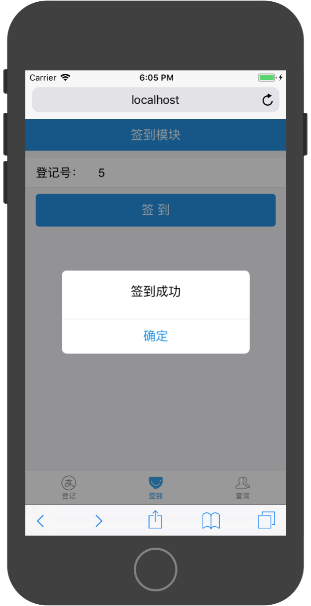

# 综合实战-会场登记App

### 产品原型

TabBar页面有三个标签：

* 登记
* 签到
* 查询


登记模块中分为参会登记和取消登记两个功能。

以下为参加登记功能演示：


以下为取消登记功能演示：


签到模块演示：




查询模块分为以下功能：

* 查询统计信息
* 查询已签到名单
* 查询未签到名单
* 查询个人签到状态


### API接口

**元数据**

|字段名|类型|描述|
|:---|:---|:---|
|id|int|唯一且自增，由数据库维护，作为参会登记号|
|name|string|参会者姓名|
|tel|string|参数者电话|
|isCheck|int|是否签到。0-未签到，1-已签到，默认未签到|


**错误列表**

|错误编号|描述|
|:---|:---|
|10001|数据库错误|
|10002|rid无效|

```
{
    success:false,
    errorCode:10001,
    errorMessage:'数据库错误'
}
```


**参会登记**

请求路径： `http://ip:port/api/register`

请求方式：`POST`

请求参数：

|字段名|类型|描述|
|:---|:---|:---|
|name|string|参会者姓名|
|tel|string|参数者电话|


返回值：

```
{
    success:true,
    data:{
        id:1,
        name:'xx',
        tel:'123',
        isCheck:0
    }
}
```

**取消登记**

请求路径： `http://ip:port/api/unRegister`

请求方式：`POST`

请求参数：

|字段名|类型|描述|
|:---|:---|:---|
|rid|string|参会者登记号|


返回值：

```
{
    success:true,
}
```

**签到**

请求路径： `http://ip:port/api/check`

请求方式：`POST`

请求参数：

|字段名|类型|描述|
|:---|:---|:---|
|rid|string|参会者登记号|


返回值：

```
{
    success:true,
}
```

**查询统计信息**

请求路径： `http://ip:port/api/tongji`

请求方式：`GET`

请求参数：无


返回值：

```
{
    success:true,
    data:{
        total:10,
        checked:3,
        unCheck:7,
    }
}
```

**查询已签到名单**

请求路径： `http://ip:port/api/yiqiandao`

请求方式：`GET`

请求参数：无


返回值：

```
{
    success:true,
    data:[
        {
            id:1,
            name:'xx',
            tel:'123',
            isCheck:1
        },
        ...
    ]
}
```


**查询未签到名单**

请求路径： `http://ip:port/api/weiqiandao`

请求方式：`GET`

请求参数：无


返回值：

```
{
    success:true,
    data:[
        {
            id:1,
            name:'xx',
            tel:'123',
            isCheck:0
        },
        ...
    ]
}
```

**查询个人签到状态**

请求路径： `http://ip:port/api/checkPerson`

请求方式：`POST`

请求参数：

|字段名|类型|描述|
|:---|:---|:---|
|rid|string|参会者登记号|


返回值：

```
{
    success:true,
    data:{
        id:1,
        name:'xx',
        tel:'123',
        isCheck:0
    }
}
```

### 数据服务层构建

构造一个`MeetingManager`数据服务对象对上层Screen对象支撑数据操作。该数据服务对象具有如下功能：

* 参会登记
* 取消登记
* 签到
* 查询统计信息
* 查询已签到名单
* 查询未签到名单
* 查询个人签到状态

1，构造`URLConfig.js`文件

```
const host = 'http://60.205.141.116:';
const port = 60001;

const registerURL = host + port + '/api/register';
const unRegisterURL = host + port + '/api/unRegister';
const checkURL = host + port + '/api/check';
const chaxuTongjiURL = host + port + '/api/tongji';
const yiqiandaoURL = host + port + '/api/yiqiandao';
const weiqiandaoURL = host + port + '/api/weiqiandao';
const checkPersonURL = host + port + '/api/checkPerson'

export {
    registerURL,
    unRegisterURL,
    checkURL,
    chaxuTongjiURL,
    yiqiandaoURL,
    weiqiandaoURL,
    checkPersonURL
}
```

2，构建MeetingManager对象：

```
import  {
    registerURL,
    unRegisterURL,
    checkURL,
    chaxuTongjiURL,
    yiqiandaoURL,
    weiqiandaoURL,
    checkPersonURL
} from './URLConfig';

class MeetingManager {

    async register(name,tel){
        try {
            const person = {
                name,
                tel
            }

            const res = await fetch(registerURL,{
                method:'POST',
                headers:{
                    'Accept':'application/json',
                    'Content-Type':'application/json'
                },
                body:JSON.stringify(person)
            })

            const result = await res.json();

            return result;
        } catch (error){
            return {
                success:false,
                errorCode:10001,
                errorMessage:`${error}`
            }
        }
    }

    async unRegister(rid){

         try {
            const params = {
                rid
            }

            const res = await fetch(unRegisterURL,{
                method:'POST',
                headers:{
                    'Accept':'application/json',
                    'Content-Type':'application/json'
                },
                body:JSON.stringify(params)
            })

            const result = await res.json();

            return result;

        } catch (error) {
            return {
                success:false,
                errorCode:10001,
                errorMessage:`${error}`
            }
        }
    }

    async check(rid){
         try {
            const person = {
                rid
            }

            const res = await fetch(checkURL,{
                method:'POST',
                headers:{
                    'Accept':'application/json',
                    'Content-Type':'application/json'
                },
                body:JSON.stringify(person)
            })

            const result = await res.json();
            return result;

        } catch (error) {
            return {
                success:false,
                errorCode:10001,
                errorMessage:`${error}`
            }
        }
    }

    async chaxuTongji(){
        try {
            const res = await fetch(chaxuTongjiURL)
            const result = await res.json();
           return result;

       } catch (error) {
           return {
               success:false,
               errorCode:10001,
               errorMessage:`${error}`
           }
       }
       
   }

    async yiqiandao (){
        try {
            const res = await fetch(yiqiandaoURL)
            const result = await res.json();
            return result;

        } catch (error) {
            return {
                success:false,
                errorCode:10001,
                errorMessage:`${error}`
            }
        }
    }

    async weiqiandao (){
        try {
            const res = await fetch(weiqiandaoURL)
            const result = await res.json();
            return result;

        } catch (error) {
            return {
                success:false,
                errorCode:10001,
                errorMessage:`${error}`
            }
        }
    }

    async checkPerson(rid){
        try {
            const person = {
                rid:this.state.rid
            }

            const res = await fetch(checkPersonURL,{
                method:'POST',
                headers:{
                    'Accept':'application/json',
                    'Content-Type':'application/json'
                },
                body:JSON.stringify(person)
            })

            const result = await res.json();

            return result;

        } catch (error) {
            return {
                success:false,
                errorCode:10001,
                errorMessage:`${error}`
            }
        }
    }
}

export default new MeetingManager;
```

### Screen导航路由配置

通过产品分析，该App共有9个独立Screen对象，分别命名为：

* `RegisterScreen`，登记功能页
* `CheckInScreen`，签到功能页
* `QuaryScreen`，查询功能页
* `RegisterMeetingScreen`，参会登记页
* `UnRegisterMeetingScreen`，取消登记页
* `QuaryTotalScreen`，查询统计信息
* `CheckPersonListScreen`，查询已签到名单
* `UnCheckPersonListScreen`，查询未签到名单
* `CheckPersonListScreen`，查询个人签到状态

其中`RegisterScreen`、`CheckInScreen`和`QuaryScreen`在首页通过TabBar进行导航控制。

构建TabBarScreen：

1，构建TabBarScreen文件模板，引入相关依赖及所管理的Screen组件

```
import React, { Component } from 'react';

import { 
  TabBar 
} from 'antd-mobile';


import RegisterScreen from './RegisterScreen';
import CheckInScreen from './CheckInScreen';
import QuaryScreen from './QuaryScreen';

export default class TabbarScreen extends Component {

  constructor(props) {
    super(props)
  
    this.state = {
      selected:'RegisterScreen'
    }
  }

    render(){

    }
}
```

2，构建TabBar路由数据对象，每个TabItem数据对象包含如下属性：

* `key`，该Item的键值，建议使用Screen组件名
* `itemComponent`，该Item对应显示的Screen组件
* `title`，该Item的标题
* `icon`，该Item未被选中的图标
* `selectedIcon`，该Item被选中时的图标

```
const tabDatas = [
  {
    key:'RegisterScreen',
    itemComponent:RegisterScreen,
    title:'登记',
    icon:{uri:'https://zos.alipayobjects.com/rmsportal/sifuoDUQdAFKAVcFGROC.svg'},
    selectedIcon:{uri:'https://zos.alipayobjects.com/rmsportal/iSrlOTqrKddqbOmlvUfq.svg'}
  },
  {
    key:'CheckInScreen',
    itemComponent:CheckInScreen,
    title:'签到',
    icon:{uri:'https://gw.alipayobjects.com/zos/rmsportal/BTSsmHkPsQSPTktcXyTV.svg'},
    selectedIcon:{uri:'https://gw.alipayobjects.com/zos/rmsportal/ekLecvKBnRazVLXbWOnE.svg'}
  },
  {
    key:'QuaryScreen',
    itemComponent:QuaryScreen,
    title:'查询',
    icon:{uri:'https://zos.alipayobjects.com/rmsportal/psUFoAMjkCcjqtUCNPxB.svg'},
    selectedIcon:{uri:'https://zos.alipayobjects.com/rmsportal/IIRLrXXrFAhXVdhMWgUI.svg'}
  },
]
```

3，构造tabItems：

```
const tabItems = tabDatas.map((item)=>{
      const Component = item.itemComponent;
      return(
        <TabBar.Item
          {...item}
          selected={item.key === this.state.selected }
          onPress={()=>{
            this.setState({selected:item.key})
            localStorage.selected = item.key;
          }}
        >
          <Component {...this.props} />
        </TabBar.Item>
      )
    })
```

4，配置TabBar容器及样式：

```
const styles = {
  container:{
    position: 'fixed', 
    height: '100%', 
    width: '100%', 
    top: 0
  }
}
```

```
<div style={styles.container}>
    <TabBar>
        {tabItems}
    </TabBar>  
</div>

```


5，添加选中状态初始加载：

```
componentDidMount(){
    if(localStorage.selected){
        this.setState({selected:localStorage.selected})
    }
}
```

完整参考代码：

```
import React, { Component } from 'react';

import { 
  TabBar 
} from 'antd-mobile';

import RegisterScreen from './RegisterScreen';
import CheckInScreen from './CheckInScreen';
import QuaryScreen from './QuaryScreen';

const tabDatas = [
  {
    key:'RegisterScreen',
    itemComponent:RegisterScreen,
    title:'登记',
    icon:{uri:'https://zos.alipayobjects.com/rmsportal/sifuoDUQdAFKAVcFGROC.svg'},
    selectedIcon:{uri:'https://zos.alipayobjects.com/rmsportal/iSrlOTqrKddqbOmlvUfq.svg'}
  },
  {
    key:'CheckInScreen',
    itemComponent:CheckInScreen,
    title:'签到',
    icon:{uri:'https://gw.alipayobjects.com/zos/rmsportal/BTSsmHkPsQSPTktcXyTV.svg'},
    selectedIcon:{uri:'https://gw.alipayobjects.com/zos/rmsportal/ekLecvKBnRazVLXbWOnE.svg'}
  },
  {
    key:'QuaryScreen',
    itemComponent:QuaryScreen,
    title:'查询',
    icon:{uri:'https://zos.alipayobjects.com/rmsportal/psUFoAMjkCcjqtUCNPxB.svg'},
    selectedIcon:{uri:'https://zos.alipayobjects.com/rmsportal/IIRLrXXrFAhXVdhMWgUI.svg'}
  },
]

export default class TabbarScreen extends Component {

  componentDidMount(){
    if(localStorage.selected){
      this.setState({selected:localStorage.selected})
    }
  }

  constructor(props) {
    super(props)
  
    this.state = {
      selected:'RegisterScreen'
    }
  }
  

  render() {

    const tabItems = tabDatas.map((item)=>{
      const Component = item.itemComponent;
      return(
        <TabBar.Item
          {...item}
          selected={item.key === this.state.selected }
          onPress={()=>{
            this.setState({selected:item.key})
            localStorage.selected = item.key;
          }}
        >
          <Component {...this.props} />
        </TabBar.Item>
      )
    })

    return (
        <div style={styles.container}>
          <TabBar>
            {tabItems}
          </TabBar>  
        </div>
    );
  }
}

const styles = {
  container:{
    position: 'fixed', 
    height: '100%', 
    width: '100%', 
    top: 0
  }
}
```

### Screen实现

**登记RegisterScreen**

参会登记页面主要提供两个功能导航按钮，点击按钮跳转到相应的Screen。

1，构建Screen文件模板，引入相关依赖

```
import React, { Component } from 'react'


import { 
    Button,
    WingBlank, 
    WhiteSpace,
    NavBar 
 } from 'antd-mobile';

 
 export default class RegisterScreen extends Component {
   render() {
     return (
       <div>
     
       </div>
     )
   }
 }
```

2，在`render()`函数中，使用组件对页面进行构建，页面内容为：

* NavBar导航Header
* 参会登记功能按钮
* 取消登记功能按钮

```
render() {
    return (
      <div>
        <NavBar
            mode="dark"
        >
            登记模块
        </NavBar>
        <WhiteSpace/>
        <WingBlank>
            <Button
                type='primary'
            >
                参会登记
            </Button>
            <WhiteSpace/>
            <Button
                type='primary'
            >
                取消登记
            </Button>
        </WingBlank>
      </div>
    )
  }
```

3，为页面添加交互事件，事件为：

* 点击参会登记按钮，跳转到`RegisterMeetingScreen`
* 点击取消登记按钮，跳转到`UnRegisterMeetingScreen`

```
<Button
    type='primary'
    onClick={()=>{
        //跳转到参会登记Screen
        this.props.history.push('/RegisterMeetingScreen');
    }}
>
    参会登记
</Button>
```

```
<Button
    type='primary'
    onClick={()=>{
        //跳转到取消登记登记Screen
        this.props.history.push('/UnRegisterMeetingScreen');
    }}
>
    取消登记
</Button>
```

完整实现代码：

```
import React, { Component } from 'react'

import { 
    Button,
    WingBlank, 
    WhiteSpace,
    NavBar 
 } from 'antd-mobile';

export default class RegisterScreen extends Component {
  render() {
    return (
      <div>
        <NavBar
            mode="dark"
        >
            登记模块
        </NavBar>
        <WhiteSpace/>
        <WingBlank>
            <Button
                type='primary'
                onClick={()=>{
                    //跳转到参会登记Screen
                    this.props.history.push('/RegisterMeetingScreen');
                }}
            >
                参会登记
            </Button>
            <WhiteSpace/>
            <Button
                type='primary'
                onClick={()=>{
                    //跳转到取消登记登记Screen
                    this.props.history.push('/UnRegisterMeetingScreen');
                }}
            >
                取消登记
            </Button>
        </WingBlank>
      </div>
    )
  }
}
```

**签到页面 CheckInScreen**

在该页面，允许用户输入一个登记号，点击提交按钮之后，使用MeetingManager进行登记，返回签到结果，在页面通过弹框展现相应提示内容。

1，构建文件模板，引入相关依赖，配置State初值

```
import React, { Component } from 'react'

import { 
    Button,
    WingBlank, 
    WhiteSpace,
    NavBar,
    List,
    InputItem ,
    Modal
 } from 'antd-mobile';

import meetingManager from '../DataServe/MeetingManager';

export default class CheckInScreen extends Component {

    constructor(props) {
      super(props)
    
      this.state = {
         rid:''
      }
    }

    render(){
        return(
            <div>
            </div>
        )
    }
}
```

2，在`render()`函数中构建页面：

* NavBar导航Header
* 登记号输入框
* 签到按钮

```
  render() {
    return (
      <div>
        <NavBar
            mode="dark"
        >
            签到模块
        </NavBar>
        <WhiteSpace/>
        <List>
            <InputItem>
                登记号：
            </InputItem >
        </List>
        <WhiteSpace/>
        <WingBlank>
            <Button
                type='primary'
            >
                签到
            </Button>
        </WingBlank>
      </div>
    )
  }
```

3，添加输入框受控组件机制:

```
<InputItem 
    value={this.state.rid}
    onChange={(rid)=>{ this.setState({rid})}}
>
    登记号：
</InputItem >
```

4，添加按钮响应事件，当点击按钮时，将用户输入的`rid`通过`meetingManager`对象进行登记操作，并对返回结果进行提示。

```
checkButton = async()=>{
    try { 
        const result = await meetingManager.check(this.state.rid);        
        if (result.success === false) {
            Modal.alert('错误',result.errorMessage)
            return;
        }
        Modal.alert('签到成功');
    } catch (error) {
        Modal.alert('错误',`${error}`);
    }        
}
```
并配置按钮的响应事件：

```
<Button
    type='primary'
    onClick={this.checkButton}
>
    签到
</Button>
```


参考实现代码：

```
import React, { Component } from 'react'

import { 
    Button,
    WingBlank, 
    WhiteSpace,
    NavBar,
    List,
    InputItem ,
    Modal
 } from 'antd-mobile';


 import meetingManager from '../DataServe/MeetingManager';

export default class CheckInScreen extends Component {

    constructor(props) {
      super(props)
    
      this.state = {
         rid:''
      }
    }
    
  render() {
    return (
      <div>
        <NavBar
            mode="dark"
        >
            签到模块
        </NavBar>
        <WhiteSpace/>
        <List>
            <InputItem 
                value={this.state.rid}
                onChange={(rid)=>{ this.setState({rid})}}
            >
                登记号：
            </InputItem >
        </List>
        <WhiteSpace/>
        <WingBlank>
            <Button
                type='primary'
                onClick={this.checkButton}
            >
                签到
            </Button>
        </WingBlank>
      </div>
    )
  }

    checkButton = async()=>{
        try { 
            const result = await meetingManager.check(this.state.rid);        
            if (result.success === false) {
                Modal.alert('错误',result.errorMessage)
                return;
            }
            Modal.alert('签到成功');
        } catch (error) {
            Modal.alert('错误',`${error}`);
        }        
    }
}
```

**查询页面 QuaryScreen**

查询页面为功能导航页面，提供四个按钮，点击按钮进入相应功能页面。


1，构造文件模板，引入相关依赖：

```
import React, { Component } from 'react'

import { 
    Button,
    WingBlank, 
    WhiteSpace,
    NavBar 
 } from 'antd-mobile';

export default class QuaryScreen extends Component {
    render(){
        return(
            <div>
            </div>
        )
    }
}
```

2，在`render()`函数中构建页面元素：

* NavBar导航Header
* 查询统计信息按钮
* 查询已签到名单按钮
* 查询未签到名单按钮
* 查询个人签到状态按钮

```
render() {
    return (
      <div>
        <NavBar
            mode="dark"
        >
            查询模块
        </NavBar>
        <WhiteSpace/>
        <WingBlank>
            <Button
                type='primary'
            >
                查询统计信息
            </Button>
            <WhiteSpace/>
            <Button
                type='primary'
            >
                查询已签到名单
            </Button>
            <WhiteSpace/>
            <Button
                type='primary'
            >
                查询未签到名单
            </Button>
            <WhiteSpace/>
            <Button
                type='primary'
            >
                查询个人签到状态
            </Button>
        </WingBlank>
      </div>
    )
  }
```

3，添加页面响应事件

* 点击查询统计信息，跳转到统计信息页面
* 点击查询已签到名单，跳转到已签到名单页面
* 点击查询未签到名单，跳转到未签到名单页面
* 点击查询个人签到状态，调整到查询个人状态页面

```
import React, { Component } from 'react'

import { 
    Button,
    WingBlank, 
    WhiteSpace,
    NavBar 
 } from 'antd-mobile';

export default class QuaryScreen extends Component {
  render() {
    return (
      <div>
        <NavBar
            mode="dark"
        >
            查询模块
        </NavBar>
        <WhiteSpace/>
        <WingBlank>
            <Button
                type='primary'
                onClick={()=>{
                    //跳转到查询统计信息Screen
                    this.props.history.push('/QuaryTotalScreen');
                }}
            >
                查询统计信息
            </Button>
            <WhiteSpace/>
            <Button
                type='primary'
                onClick={()=>{
                    //跳转到已签到名单Screen  
                    this.props.history.push('/CheckPersonListScreen');
                }}
            >
                查询已签到名单
            </Button>
            <WhiteSpace/>
            <Button
                type='primary'
                onClick={()=>{
                    //跳转到未签到名单Screen  
                    this.props.history.push('/UnCheckPersonListScreen');
                }}
            >
                查询未签到名单
            </Button>
            <WhiteSpace/>
            <Button
                type='primary'
                onClick={()=>{
                    //跳转到个人签到状态Screen  QuaryPersonStateScreen
                    this.props.history.push('/QuaryPersonStateScreen');
                }}
            >
                查询个人签到状态
            </Button>
        </WingBlank>
      </div>
    )
  }
}
```

**参会登记 RegisterMeetingScreen**

在此页面中，允许用户输入名字和电话，然后点击提交登记按钮将信息发送到服务器进行登记，然后返回此用户对应的登记号。

1，构建文件模板，引入相关依赖，配置state初始状态

```
import React, { Component } from 'react'

import { 
    Button,
    WingBlank, 
    WhiteSpace,
    NavBar,
    List,
    InputItem ,
    Icon,
    Modal,
 } from 'antd-mobile';


 import meetingManager from '../DataServe/MeetingManager';

export default class RegisterMeetingScreen extends Component {
    constructor(props) {
      super(props)
    
      this.state = {
         name:'',
         tel:''
      }
    }

    render(){

    }

}
```

2，在`render()`函数中构建页面元素

* NavBar导航Header
* 姓名输入框
* 电话输入框
* 提交登记按钮

```
render() {
    return (
      <div>
        <NavBar
            mode="dark"
            icon={<Icon type="left" />}
        >
            参会登记
        </NavBar>
        <WhiteSpace/>
        <List>
            <InputItem>
                参会者姓名：
            </InputItem >
            <WhiteSpace/>
            <InputItem>
                参会者电话：
            </InputItem >
        </List>
        <WhiteSpace/>
        <WingBlank>
            <Button
                type='primary'
            >
                提交登记
            </Button>
        </WingBlank>
      </div>
    )
  }
```

3，为受控组件配置受控状态

```
<InputItem 
    value={this.state.name}
    onChange={(name)=>{ this.setState({name})}}
>
    参会者姓名：
</InputItem >
```

```
<InputItem 
    value={this.state.tel}
    onChange={(tel)=>{ this.setState({tel})}}
>
    参会者电话：
</InputItem >
```

4，为页面添加响应事件

点击NavBar左边按钮，返回上一层页面

```
<NavBar
    mode="dark"
    icon={<Icon type="left" />}
    onLeftClick={() =>{
        this.props.history.goBack();
    }}
>
    参会登记
</NavBar>
```
点击提交登记按钮，使用数据服务对象操作提交数据

```
registerUser = async()=>{
    try {
        const result = await meetingManager.register(this.state.name,this.state.tel);
        if (result.success === false) {
            Modal.alert('错误',result.errorMessage)
            return;
        }
        Modal.alert('登记成功','登记号为：'+result.data.id)
    } catch (error) {
        Modal.alert('错误',`${error}`);
    }
  }
```

配置登记按钮事件：

```
<Button
    type='primary'
    onClick={this.registerUser}
>
    提交登记
</Button>
```


**取消登记  UnRegisterMeetingScreen**

该页面允许用户输入一个登记号，点击取消登记按钮之后，将登记号提交服务器做删除处理。

1，构建文件模板，引入相关依赖，配置state初始状态

```
import React, { Component } from 'react'

import { 
    Button,
    WingBlank, 
    WhiteSpace,
    NavBar,
    List,
    InputItem ,
    Icon,
    Modal
 } from 'antd-mobile';

 import meetingManager from '../DataServe/MeetingManager';

export default class UnRegisterMeetingScreen extends Component {

    constructor(props) {
      super(props)
    
      this.state = {
         rid:''
      }
    }

    render(){

    }
}
```

2，在`render()`函数中构建页面元素

* NavBar导航Header
* 登记号输入框
* 取消登记按钮

```
render() {
    return (
      <div>
        <NavBar
            mode="dark"
            icon={<Icon type="left" />}
        >
            取消参会登记
        </NavBar>
        <WhiteSpace/>
        <List>
            <InputItem>
                登记号：
            </InputItem >
        </List>
        <WhiteSpace/>
        <WingBlank>
            <Button
                type='primary'
            >
                取消登记
            </Button>
        </WingBlank>
      </div>
    )
  }
```

3，为受控组件配置受控状态

```
<InputItem 
    value={this.state.rid}
    onChange={(rid)=>{ this.setState({rid})}}
>
    登记号：
</InputItem >
```

4，为页面添加响应事件

点击NavBar左边按钮，返回上一层页面

```
<NavBar
    mode="dark"
    icon={<Icon type="left" />}
    onLeftClick={() =>{
        this.props.history.goBack();
    }}
>
    取消参会登记
</NavBar>
```

点击取消登记按钮，使用数据服务对象进行取消登记操作，并展示操作结果：

```
removeUser = async ()=>{
    try {
        const result = await meetingManager.unRegister(this.state.rid);
        if (result.success === false) {  
            Modal.alert('错误',result.errorMessage)
            return;
        }
        Modal.alert('取消登记成功')
    } catch (error) {
        Modal.alert('错误',`${error}`);
    }
}
```

配置取消登记按钮事件:

```
<Button
    type='primary'
    onClick={this.removeUser}
>
    取消登记
</Button>
```


**查询统计信息 QuaryTotalScreen**

该页面通过请求API获取统计数据并展示。

1，构建文件模板，引入相关依赖，配置state初始状态

```
import React, { Component } from 'react'

import { 
    NavBar,
    List,
    Icon,
    Modal
 } from 'antd-mobile';

 import meetingManager from '../DataServe/MeetingManager';

export default class QuaryTotalScreen extends Component {

    constructor(props) {
      super(props)
    
      this.state = {
         total:'',
         unChecked:'',
         checked:''
      }
    }

    render(){

    }
}
```

2，在`render()`函数中构建页面元素

* NavBar导航Header
* 总登记人数展示框
* 已签到人数展示框
* 为签到人数展示框

```
render() {
    return (
      <div>
        <NavBar
            mode="dark"
            icon={<Icon type="left" />}
        >
            登记统计信息
        </NavBar>
        <List>
            <List.Item>
                {`总登记人数为：${this.state.total}`}
            </List.Item>
            <List.Item>
                {`已签到人数为：${this.state.checked}`}
            </List.Item>
            <List.Item>
                {`未签到人数为：${this.state.unChecked}`}
            </List.Item>
        </List>
      </div>
    )
  }
```


3，为页面添加响应事件

点击NavBar左边按钮，返回上一层页面

```
<NavBar
    mode="dark"
    icon={<Icon type="left" />}
    onLeftClick={() =>{
        this.props.history.goBack();
    }}
>
    登记统计信息
</NavBar>
```

4，配置页面声明周期函数

在页面加载之后，需要通过数据服务对象请求数据并展示

```
async componentDidMount(){
    try {
        const result = await meetingManager.chaxuTongji();
        if (result.success === false) {   
            Modal.alert('错误',result.errorMessage)
            return;
        }
        this.setState(result.data)
    } catch (error) {
        Modal.alert('错误',`${error}`);
    }
}
```

//修改到这里！！！！

**已签到名单  CheckPersonListScreen**

该页面在加载时从API请求已签到名单数据并通过列表进行显示。

1，构建文件模板，引入相关依赖，配置state初始状态

2，在`render()`函数中构建页面元素

3，为受控组件配置受控状态

4，为页面添加响应事件

5，配置页面声明周期函数


**未签到名单 UnCheckPersonListScreen**

该页面在加载时从API请求未签到名单数据并通过列表进行显示。

1，构建文件模板，引入相关依赖，配置state初始状态

2，在`render()`函数中构建页面元素

3，为受控组件配置受控状态

4，为页面添加响应事件

5，配置页面声明周期函数


**查询个人签到状态  QuaryPersonStateScreen**

该页面允许用户输入一个签到号，点击查询按钮后，将此签到号发送到服务器，查询与此签到号对应的签到状态。

1，构建文件模板，引入相关依赖，配置state初始状态

2，在`render()`函数中构建页面元素

3，为受控组件配置受控状态

4，为页面添加响应事件

5，配置页面声明周期函数
