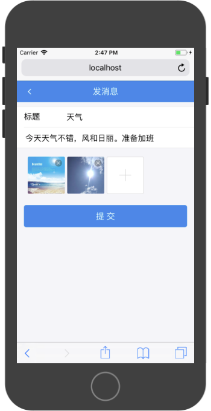
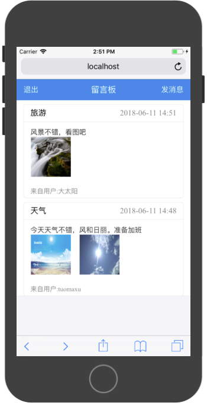
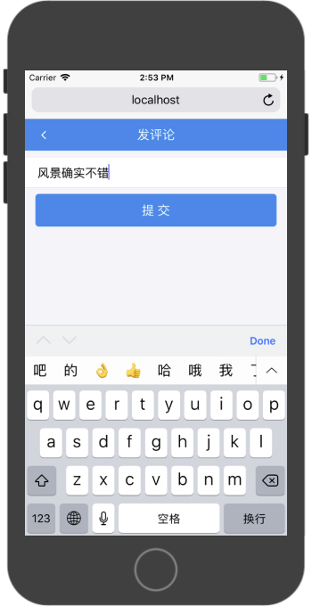
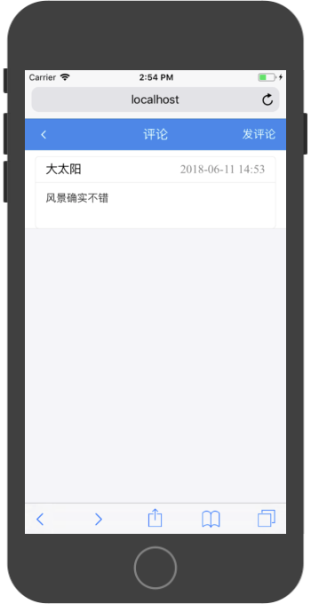

# 综合实战3-留言板App

### 产品原型

登录注册模块：

提供用户登录和注册功能


消息发布模块：

提供发布消息功能，消息具有标题、内容和最多9张图片



消息浏览模块：

提供浏览所有用户发布的消息：



消息评论模块:

用户可以针对某一天消息发布自己的评论



评论展示模块：

展示该消息下的所有评论内容




### API文档

**元数据**

账户

```
{
	"id": 1,
	"username": "tom1",
	"password": "1234",
	"access_token": "e1fa63bed5f5eff45c9147ff27fcef28",
	"updatedAt": "2018-06-07T05:08:04.452Z",
	"createdAt": "2018-06-07T05:08:04.452Z"
}
```

消息

```
{
	"id": 10,
	"title": "xxx3",
	"content": "yyy3",
	"createdAt": "2018-06-07T05:25:47.000Z",
	"updatedAt": "2018-06-07T05:25:47.000Z",
	"messageUserId": 1,
	"images": [],
	"message_user": {
		"id": 1,
		"username": "tom1"
	}
}
```

评论

```
{
	"id": 2,
	"content": "xxx",
	"createdAt": "2018-06-07T05:32:59.000Z",
	"updatedAt": "2018-06-07T05:32:59.000Z",
	"messageId": 10,
	"messageUserId": 1,
	"message": {
		"id": 10,
		"title": "xxx3"
	},
	"message_user": {
		"id": 1,
		"username": "tom1"
	}
}
```


**错误代码**

|错误代码|内容|
|:---|:---|
|10001|系统错误|
|10002|用户名错误|
|10003|密码错误|
|10004|access_token无效|
|10005|TodoID无效|
|10006|参数无效|
|10007|用户名已存在|
|10008|MessageID无效|

错误返回值：

```
{
    success:false,
    errorCode:10001,
    errorMessage:'系统错误'
}
```

**接口描述**

注册

请求链接：`/api/register`

请求方式：`POST`

|参数名称|参数描述|
|:---|:---|
|username|用户名|
|password|密码|

```
{
    "success": true,
    "data": {
        "id": 2,
        "username": "tom1",
        "password": "1234",
        "access_token": "16e088f3d62c4c132e8728ef79eaf353",
        "updatedAt": "2018-06-06T08:05:13.664Z",
        "createdAt": "2018-06-06T08:05:13.664Z"
    }
}
```

登录

请求链接：`/api/login`

请求方式：`POST`

|参数名称|参数描述|
|:---|:---|
|username|账户名|
|password|密码|

```
{
    "success": true,
    "data": {
        "id": 2,
        "username": "tom1",
        "password": "1234",
        "access_token": "8e58260409dc169009b87800dfe5128f",
        "createdAt": "2018-06-06T08:05:13.000Z",
        "updatedAt": "2018-06-06T08:11:18.442Z"
    }
}

```

发留言

请求链接：`/api/postMessage`

请求方式：`POST`

|参数名称|参数描述|
|:---|:---|
|access_token|登录令牌|
|title|消息标题|
|content|消息内容|
|image1-9|图片Base64链接|

返回值：

```
{
    "success": true,
    "data": {
        "id": 10,
        "title": "xxx3",
        "content": "yyy3",
        "createdAt": "2018-06-07T05:25:47.000Z",
        "updatedAt": "2018-06-07T05:25:47.000Z",
        "messageUserId": 1,
        "images": [],
        "message_user": {
            "id": 1,
            "username": "tom1"
        }
    }
}
```

发布对指定消息的评论

请求路径：`/api/postComment`

请求方式：`POST`

|参数名称|参数描述|
|:---|:---|
|access_token|登录令牌|
|messageID|消息ID|
|content|评论内容|

返回值：

```
{
    "success": true,
    "data": {
        "id": 2,
        "content": "xxx",
        "createdAt": "2018-06-07T05:32:59.000Z",
        "updatedAt": "2018-06-07T05:32:59.000Z",
        "messageId": 10,
        "messageUserId": 1,
        "message": {
            "id": 10,
            "title": "xxx3"
        },
        "message_user": {
            "id": 1,
            "username": "tom1"
        }
    }
}
```


获取全部消息

请求地址：`/api/allMessages`

请求方式：`POST`

|参数名称|参数描述|
|:---|:---|
|access_token|登录令牌|

返回值：

```
{
    "success": true,
    "data": [
        {
            "id": 3,
            "title": "xxx3",
            "content": "yyy3",
            "createdAt": "2018-06-07T05:08:55.000Z",
            "updatedAt": "2018-06-07T05:08:55.000Z",
            "messageUserId": 1,
            "images": [],
            "message_user": {
                "id": 1,
                "username": "tom1"
            }
        },
        {
            "id": 6,
            "title": "xxx3",
            "content": "yyy3",
            "createdAt": "2018-06-07T05:22:16.000Z",
            "updatedAt": "2018-06-07T05:22:16.000Z",
            "messageUserId": 1,
            "images": [],
            "message_user": {
                "id": 1,
                "username": "tom1"
            }
        },
        {
            "id": 7,
            "title": "xxx3",
            "content": "yyy3",
            "createdAt": "2018-06-07T05:22:46.000Z",
            "updatedAt": "2018-06-07T05:22:46.000Z",
            "messageUserId": 1,
            "images": [],
            "message_user": {
                "id": 1,
                "username": "tom1"
            }
        },
        {
            "id": 8,
            "title": "xxx3",
            "content": "yyy3",
            "createdAt": "2018-06-07T05:23:05.000Z",
            "updatedAt": "2018-06-07T05:23:05.000Z",
            "messageUserId": 1,
            "images": [],
            "message_user": {
                "id": 1,
                "username": "tom1"
            }
        },
        {
            "id": 9,
            "title": "xxx3",
            "content": "yyy3",
            "createdAt": "2018-06-07T05:23:43.000Z",
            "updatedAt": "2018-06-07T05:23:43.000Z",
            "messageUserId": 1,
            "images": [],
            "message_user": {
                "id": 1,
                "username": "tom1"
            }
        },
        {
            "id": 10,
            "title": "xxx3",
            "content": "yyy3",
            "createdAt": "2018-06-07T05:25:47.000Z",
            "updatedAt": "2018-06-07T05:25:47.000Z",
            "messageUserId": 1,
            "images": [],
            "message_user": {
                "id": 1,
                "username": "tom1"
            }
        },
        {
            "id": 4,
            "title": "xxx3",
            "content": "yyy3",
            "createdAt": "2018-06-07T05:09:57.000Z",
            "updatedAt": "2018-06-07T05:09:57.000Z",
            "messageUserId": null,
            "images": [],
            "message_user": null
        },
        {
            "id": 5,
            "title": "xxx3",
            "content": "yyy3",
            "createdAt": "2018-06-07T05:11:13.000Z",
            "updatedAt": "2018-06-07T05:11:13.000Z",
            "messageUserId": null,
            "images": [],
            "message_user": null
        }
    ]
}
```

获取指定消息的评论内容

请求地址：`/api/allComments`

请求方式：`POST`

|参数名称|参数描述|
|:---|:---|
|access_token|登录令牌|
|messageID|消息ID|

返回值：

```
{
    "success": true,
    "data": [
        {
            "id": 1,
            "content": "xxx",
            "createdAt": "2018-06-07T05:32:14.000Z",
            "updatedAt": "2018-06-07T05:32:15.000Z",
            "messageId": 10,
            "messageUserId": 1,
            "message_user": {
                "id": 1,
                "username": "tom1"
            }
        },
        {
            "id": 2,
            "content": "xxx",
            "createdAt": "2018-06-07T05:32:59.000Z",
            "updatedAt": "2018-06-07T05:32:59.000Z",
            "messageId": 10,
            "messageUserId": 1,
            "message_user": {
                "id": 1,
                "username": "tom1"
            }
        }
    ]
}
```

### 数据服务层构建

1，构建URLConfig文件

```
const host = 'http://localhost:';
const port = 5000;

const loginURL = host+port+'/api/login';
const registerURL = host+port+'/api/register';
const postMessageURL = host+port+'/api/postMessage';
const postCommentURL = host+port+'/api/postComment';
const allMessagesURL = host+port+'/api/allMessages';
const allCommentsURL = host+port+'/api/allComments';

const imageBaseURL = host+port+'/resource/image/';


export {
    loginURL,
    registerURL,
    postMessageURL,
    postCommentURL,
    allMessagesURL,
    allCommentsURL,
    imageBaseURL,
}
```

2，构建`UserManager`数据服务对象，对用户相关操作进行封装。该数据对象提供以下功能支撑：

* 用户注册（异步）
* 用户登录（异步）
* 保持登录信息
* 查询当前登录状态
* 登出操作（清空登录信息）

实现代码：

```
import { loginURL,registerURL } from './URLConfig';

class UserManager {
    
    async login(username,password){
        try {
            const user = {
                username,
                password
            }

            const res = await fetch(loginURL,{
                method:'POST',
                headers:{
                    'Accept':'application/json',
                    'Content-Type':'application/json'
                },
                body:JSON.stringify(user)
            });

            const result = await res.json();

            if(result.success === true){
                localStorage.access_token = result.data.access_token 
            }

            return result;

        } catch (error) {
            return {
                success:false,
                errorMessage:'网络错误'
            }
        }
    }

    logout(){
        localStorage.access_token = '';
    }

    isLogin(){
        if(localStorage.access_token === ''){
            return false;
        } else {
            return true;
        }
    }

    async register(username,password){
        try {
            const user = {
                username,
                password
            }

            const res = await fetch(registerURL,{
                method:'POST',
                headers:{
                    'Accept':'application/json',
                    'Content-Type':'application/json'
                },
                body:JSON.stringify(user)
            });

            const result = await res.json();

            if(result.success === true){
                localStorage.access_token = result.data.access_token 
            }

            return result;

        } catch (error) {
            return {
                success:false,
                errorMessage:'网络错误'
            }
        }
    }

}

export default new UserManager();
```


3，构建MessageManager数据服务对象，该对象封装了消息和评论的相关操作。

* 发布消息
* 发布消息评论
* 获取所有用户的消息
* 获取某一天消息的所有评论

```
import {
    postMessageURL,
    postCommentURL,
    allMessagesURL,
    allCommentsURL,
} from './URLConfig';

class MessageManager {

    async postMessage(title,content,images){
        try {
            
            const formData = new FormData();

            formData.append('access_token',localStorage.access_token);
            formData.append('title',title);
            formData.append('content',content);
            images.map((item,index)=>{
                return formData.append(`image${index}`,item.file);
            })  

            const res = await fetch(postMessageURL,{
                method:'POST',
                body:formData
            });

            const result = await res.json();

            console.log(result);

            return result;

        } catch (error) {
            return {
                success:false,
                errorMessage:'网络错误'
            }
        }
    }

    async postComment(messageID,content){
        try {
            const comment = {
                access_token:localStorage.access_token,
                messageID,
                content
            }

            const res = await fetch(postCommentURL,{
                method:'POST',
                headers:{
                    'Accept':'application/json',
                    'Content-Type':'application/json'
                },
                body:JSON.stringify(comment)
            });

            const result = await res.json();

            return result;

        } catch (error) {
            return {
                success:false,
                errorMessage:'网络错误'
            }
        }
    }

    async allMessages(){
        try {
            const message = {
                access_token:localStorage.access_token,
            }

            const res = await fetch(allMessagesURL,{
                method:'POST',
                headers:{
                    'Accept':'application/json',
                    'Content-Type':'application/json'
                },
                body:JSON.stringify(message)
            });

            const result = await res.json();

            return result;

        } catch (error) {
            return {
                success:false,
                errorMessage:'网络错误'
            }
        }
    }

    async allComments(messageID){
        try {
            const comment = {
                access_token:localStorage.access_token,
                messageID
            }

            const res = await fetch(allCommentsURL,{
                method:'POST',
                headers:{
                    'Accept':'application/json',
                    'Content-Type':'application/json'
                },
                body:JSON.stringify(comment)
            });

            const result = await res.json();

            return result;

        } catch (error) {
            return {
                success:false,
                errorMessage:'网络错误'
            }
        }
    }

    
}

export default new MessageManager();
```

### 构建Screen导航路径

根据产品原型构建Screen对象并在`App`组件中构建导航路径。

构造以下Screen对象：

* `LoginScreen`
* `RegisterScreen`
* `HomeScreen`
* `CreateMessageScreen`
* `CommentScreen`
* `CreateCommentScreen`

在`App.js`中引入上述Screen对象，并配置路由。应用的根路径为'/'，在配置根路径对应的Screen对象时，需要对`exact`的值设置为`true`，以保证该路径不和其他保护'/'的路径发生混淆。

```
import React, { Component } from 'react';

import { Route } from "react-router-dom";

import LoginScreen from './Screen/LoginScreen';
import RegisterScreen from './Screen/RegisterScreen';
import HomeScreen from './Screen/HomeScreen';
import CreateMessageScreen from './Screen/CreateMessageScreen';
import CommentScreen from './Screen/CommentScreen';
import CreateCommentScreen from './Screen/CreateCommentScreen';


class App extends Component {
  render() {
    return (
      <div>
        <Route exact path={'/'}  component={LoginScreen} />
        <Route path={'/RegisterScreen'} component={RegisterScreen} />
        <Route path={'/HomeScreen'} component={HomeScreen} />
        <Route path={'/CreateMessageScreen'} component={CreateMessageScreen} />
        <Route path={'/CommentScreen'} component={CommentScreen} />
        <Route path={'/CreateCommentScreen'} component={CreateCommentScreen} />
      </div>
    );
  }
}

export default App;
```

### 非登录授权访问拦截

在有登录或授权的机制中，通过浏览器地址栏中访问非授权页面是需要根据当前授权状态判断是否拦截。在本App中，登录注册Screen访问为非授权访问，可以通过地址栏进行直接跳转。但HomeScreen和CreateTodoScreen需要根据登录状态进行拦截操作。

拦截操作通过`this.props.history.replace('/')`，跳转到跟视图。拦截操作在声明周期函数的`componentDidMount()`中进行。

参考代码：

```
import React, { Component } from 'react'

import userManager from '../DataServer/UserManager';

export default class XXXScreen extends Component {

    componentDidMount(){

        if(!userManager.isLogin()){
            this.props.history.replace('/');
            return;
        }
    }
}
```


### 构建LoginScreen

1，定义组件基本语法结构，引入相关组件。

```
import React, { Component } from 'react'

import { 
    Button,
    Toast,
    NavBar,
    WingBlank, 
    WhiteSpace ,
    List,
    InputItem,
} from 'antd-mobile';

import userManager from '../DataServer/UserManager';

export default class LoginScreen extends Component {

    constructor(props) {
      super(props)
    
      this.state = {
         
      }
    }
    

  render() {
    return (
      <div>
        
      </div>
    )
  }
}
```

2，在`render()`中构建静态页面

```
render() {
    return (
      <div>
        <NavBar
            mode="dark"
        >登录</NavBar>
        <WhiteSpace/>
        <List>
            <InputItem
                type={'text'}
                placeholder={'请输入登录用户名'}
            >
                用户名
            </InputItem>
            <InputItem
                type={'password'}
                placeholder={'请输入登录密码'}
            >
                密码
            </InputItem>
        </List>
        <WhiteSpace/>
        <WingBlank>
            <Button
                type={'primary'}
            >
                登录
            </Button>
            <WhiteSpace/>
            <Button
                type={'primary'}
            >
                注册
            </Button>
        </WingBlank>
      </div>
    )
  }
```
3，为输入组件添加受控组件机制：

```
import React, { Component } from 'react'

import { 
    Button,
    Toast,
    NavBar,
    WingBlank, 
    WhiteSpace ,
    List,
    InputItem,
} from 'antd-mobile';

import userManager from '../DataServer/UserManager';


export default class LoginScreen extends Component {

    constructor(props) {
      super(props)
    
      this.state = {
         username:'',
         password:''
      }
    }
    

  render() {
    return (
      <div>
        <NavBar
            mode="dark"
        >登录</NavBar>
        <WhiteSpace/>
        <List>
            <InputItem
                type={'text'}
                value={this.state.username}
                onChange={(username)=>{this.setState({username})}}
                placeholder={'请输入登录用户名'}
            >
                用户名
            </InputItem>
            <InputItem
                type={'password'}
                value={this.state.password}
                onChange={(password)=>{this.setState({password})}}
                placeholder={'请输入登录密码'}
            >
                密码
            </InputItem>
        </List>
        <WhiteSpace/>
        <WingBlank>
            <Button
                type={'primary'}
            >
                登录
            </Button>
            <WhiteSpace/>
            <Button
                type={'primary'}
            >
                注册
            </Button>
        </WingBlank>
      </div>
    )
  }
}

```

4，响应按钮事件：

登录按钮

```
onLoginClick = async ()=>{
    const reslut = await userManager.login(this.state.username,this.state.password);
    console.log(reslut);
    if(reslut.success === false){
        Toast.fail(reslut.errorMessage);
        return;
    }
    this.props.history.replace('/HomeScreen');
}
```

注册按钮

```
onRegisterClick = ()=>{
    this.props.history.push('/RegisterScreen')
}
```

配置按钮点击事件`onClick`属性

```
<Button
    type={'primary'}
    onClick={this.onLoginClick}
>
    登录
</Button>
<WhiteSpace/>
<Button
    type={'primary'}
    onClick={this.onRegisterClick}
>
    注册
</Button>
```

完整参考代码：

```
import React, { Component } from 'react'

import { 
    Button,
    Toast,
    NavBar,
    WingBlank, 
    WhiteSpace ,
    List,
    InputItem,
} from 'antd-mobile';

import userManager from '../DataServer/UserManager';


export default class LoginScreen extends Component {

    constructor(props) {
      super(props)
    
      this.state = {
         username:'',
         password:''
      }
    } 

    render() {
        return (
            <div>
            <NavBar
                mode="dark"
            >登录</NavBar>
            <WhiteSpace/>
            <List>
                <InputItem
                    type={'text'}
                    value={this.state.username}
                    onChange={(username)=>{this.setState({username})}}
                    placeholder={'请输入登录用户名'}
                >
                    用户名
                </InputItem>
                <InputItem
                    type={'password'}
                    value={this.state.password}
                    onChange={(password)=>{this.setState({password})}}
                    placeholder={'请输入登录密码'}
                >
                    密码
                </InputItem>
            </List>
            <WhiteSpace/>
            <WingBlank>
                <Button
                    type={'primary'}
                    onClick={this.onLoginClick}
                >
                    登录
                </Button>
                <WhiteSpace/>
                <Button
                    type={'primary'}
                    onClick={this.onRegisterClick}
                >
                    注册
                </Button>
            </WingBlank>
            </div>
        )
    }

    onLoginClick = async ()=>{
        const reslut = await userManager.login(this.state.username,this.state.password);
        if(reslut.success === false){
            Toast.fail(reslut.errorMessage);
            return;
        }
        this.props.history.replace('/HomeScreen');
    }

    onRegisterClick = ()=>{
        this.props.history.push('/RegisterScreen')
    }
}

```

### 构建RegisterScreen

RegisterScreen和LoginScreen构建过程相似，唯一区别为点击按钮是调用`userManager`中的`register`方法。

参考代码：

```
import React, { Component } from 'react'

import { 
    Button,
    Toast,
    NavBar,
    WingBlank, 
    WhiteSpace ,
    List,
    InputItem,
    Icon
} from 'antd-mobile';

import userManager from '../DataServer/UserManager';

export default class RegisterScreen extends Component {


    constructor(props) {
      super(props)
    
      this.state = {
         username:'',
         password:''
      }
    }
    

  render() {
    return (
      <div>
        <NavBar
            mode="dark"
            icon={<Icon type="left" />}
            onLeftClick={() => {this.props.history.goBack()}}
        >注册</NavBar>
        <WhiteSpace/>
        <List>
            <InputItem
                type={'text'}
                value={this.state.username}
                onChange={(username)=>{this.setState({username})}}
                placeholder={'请输入注册用户名'}
            >
                用户名
            </InputItem>
            <InputItem
                type={'text'}
                value={this.state.password}
                onChange={(password)=>{this.setState({password})}}
                placeholder={'请输入注册密码'}
            >
                密码
            </InputItem>
        </List>
        <WhiteSpace/>
        <WingBlank>
            <Button
                type={'primary'}
                onClick={async()=>{
                    const reslut = await userManager.register(this.state.username,this.state.password);
                    console.log(reslut);
                    if(reslut.success === false){
                        Toast.fail(reslut.errorMessage);
                        return;
                    }
                    this.props.history.replace('/HomeScreen');
                    
                }}
            >
                提交注册
            </Button>
        </WingBlank>
      </div>
    )
  }
}
```

### 构建HomeScreen

HomeScreen承载消息展示功能。点击消息可以跳转到消息评论页面，NavBar左边是退出登录按钮，右边是发布消息功能。

1，首先构造基础语法模板，引入相关组件：

```
import React, { Component } from 'react'

import { 
    Toast,
    NavBar,
    ListView,
    PullToRefresh
} from 'antd-mobile';

import messageManager from '../DataServer/MessageManager';
import userManager from '../DataServer/UserManager';

export default class HomeScreen extends Component {
    render() {
        return (
            <div>
            </div>
        ) 
    }
} 
```

2，响应`componentDidMount()`声明周期函数。

该函数中首先对登录状态进行验证，对没有登录状态的请求进行拦截。在成功请求之后，调用数据服务对象请求消息数据。

```
async componentDidMount(){

    if(!userManager.isLogin()){
        this.props.history.replace('/');
        return;
    }

    const result = await messageManager.allMessages()
    if(result.success === false){
        Toast.fail(result.errorMessage);
        return;
    }
    this.setState((preState)=>{
        return{
            dataSource:preState.dataSource.cloneWithRows(result.data)
        }   
    })

}
```

3，使用`render()`方法构建页面,页面中包含NavBar和ListView

```
constructor(props) {
    super(props)

    const dataSource = new ListView.DataSource({
        rowHasChanged:(row1, row2) => row1 !== row2,
    })

    this.state = {
        dataSource,
        refreshing:false
    }
}
```

```
render() {
    return (
      <div>
        <NavBar
            mode="dark"
            leftContent={[
                <span
                    key={1}
                    onClick={()=>{
                        this.props.history.replace('/');
                        userManager.logout();
                    }}
                >退出</span>
            ]}
            rightContent={[
                <span
                    key={2}
                    onClick={()=>{
                        this.props.history.push('/CreateMessageScreen');
                    }}
                >发消息</span>
            ]}
        >留言板</NavBar>
        <ListView
            useBodyScroll={true}
            dataSource={this.state.dataSource}
            renderRow={(message)=>{
                return (
                    <p>{`${message.title}:${message.content}`}</p>
                )
            }}
        />
      </div>
    )
}
```

4，为ListView添加下拉刷新功能：

构造响应刷新事件函数

```
onRefresh = async()=>{
    try {
        this.setState({refreshing:true});
        const result = await messageManager.allMessages()
        if(result.success === false){
            Toast.fail(result.errorMessage);
            this.setState({refreshing:false});
            return;
        }
        this.setState((preState)=>{
            return{
                dataSource:preState.dataSource.cloneWithRows(result.data),
                refreshing:false
            }   
        })
    } catch (error) {
        Toast.fail(`${error}`);
        this.setState({refreshing:false});
    }

}
```

配置ListView下拉刷新组件

```
<ListView
    useBodyScroll={true}
    dataSource={this.state.dataSource}
    pullToRefresh={
        <PullToRefresh
            refreshing={this.state.refreshing}
            onRefresh={this.onRefresh}
        />
    }
    renderRow={(message)=>{
        return (
            <HomeListItem 
                {...message}
                onItemClick={()=>{
                    this.props.history.push('/CommentScreen',todo)
                }} 
            />
        )
    }}
/>
```

5，封装HomeListItem优化Message展示效果并提供点击事件接口：

```
import React, { Component } from 'react'

import moment from 'moment';

import {
    imageBaseURL
} from '../DataServer/URLConfig';

import './HomeListItem.css'

import { 
    WingBlank, 
    WhiteSpace ,
    Card,
    Grid
} from 'antd-mobile';

export default class HomeListItem extends Component {
  render() {

    const images = this.props.images.map((image)=>{
        return {
            icon:imageBaseURL+image.url
        }
    })

    return (
        <div
            onClick={()=>{
                if(this.props.onItemClick){
                    this.props.onItemClick();
                }   
            }}
        >
            <WingBlank>
                <WhiteSpace/>
                <Card>
                    <Card.Header
                        title={this.props.title}
                        extra={moment(this.props.createdAt).format('YYYY-MM-DD HH:mm')}
                    />
                    <Card.Body>
                        <span>
                        {this.props.content}
                        </span>
                        <Grid
                            data={images}
                            columnNum={3}
                            hasLine={false}
                            renderItem={(image)=>{
                                return (
                                    <div style={{
                                        width: '88px',
                                        height: '88px',
                                        background: `url(${image.icon}) center center /  86px 86px no-repeat` }}
                                    />
                                )
                                
                            }}
                        />
                    </Card.Body>
                    <Card.Footer
                        content={'来自用户:'+this.props.message_user.username}
                    />
                </Card>
            </WingBlank>
        </div>
    )
  }
}
```

```
span{
    word-break:normal;
    width:auto; 
    display:block; 
    white-space:pre-wrap;
    word-wrap : break-word ;
    overflow: hidden ;
}  
```

6，HomeScreen完整实现代码：

```
import React, { Component } from 'react'

import { 
    Toast,
    NavBar,
    ListView,
    PullToRefresh
} from 'antd-mobile';

import messageManager from '../DataServer/MessageManager';
import userManager from '../DataServer/UserManager';

import HomeListItem from '../ViewComponent/HomeListItem';


export default class HomeScreen extends Component {


    async componentDidMount(){

        if(!userManager.isLogin()){
            this.props.history.replace('/');
            return;
        }

        const result = await messageManager.allMessages()
        if(result.success === false){
            Toast.fail(result.errorMessage);
            return;
        }
        this.setState((preState)=>{
            return{
                dataSource:preState.dataSource.cloneWithRows(result.data)
            }   
        })

    }

    constructor(props) {
        super(props)

        const dataSource = new ListView.DataSource({
            rowHasChanged:(row1, row2) => row1 !== row2,
        })

        this.state = {
            dataSource,
            refreshing:false
        }
    }

    onRefresh = async()=>{
        try {
            this.setState({refreshing:true});
            const result = await messageManager.allMessages()
            if(result.success === false){
                Toast.fail(result.errorMessage);
                this.setState({refreshing:false});
                return;
            }
            this.setState((preState)=>{
                return{
                    dataSource:preState.dataSource.cloneWithRows(result.data),
                    refreshing:false
                }   
            })
        } catch (error) {
            Toast.fail(`${error}`);
            this.setState({refreshing:false});
        }

    }
    
    
  render() {
    return (
      <div>
        <NavBar
            mode="dark"
            leftContent={[
                <span
                    key={1}
                    onClick={()=>{
                        this.props.history.replace('/');
                        userManager.logout();
                    }}
                >退出</span>
            ]}
            rightContent={[
                <span
                    key={2}
                    onClick={()=>{
                        this.props.history.push('/CreateMessageScreen');
                    }}
                >发消息</span>
            ]}
        >留言板</NavBar>
        <ListView
            useBodyScroll={true}
            dataSource={this.state.dataSource}
            pullToRefresh={
                <PullToRefresh
                    refreshing={this.state.refreshing}
                    onRefresh={this.onRefresh}
                />
            }
            renderRow={(message)=>{
                return (
                    <HomeListItem 
                        {...message}
                        onItemClick={()=>{
                            this.props.history.push('/CommentScreen',message)
                        }} 
                    />
                )
            }}
        />
      </div>
    )
  }
}
```

### 构建CreateMessageScreen

发布消息功能提供添加图片功能，最多允许用户添加9张图片，使用Ant中的`ImagePicker`实现。

```
<ImagePicker
    files={this.state.files}
    onChange={(files)=>{this.setState({files})}}
    selectable={this.state.files.length <= 9}
/>
```

完整参考代码：

```
import React, { Component } from 'react'

import { 
    Button,
    Toast,
    NavBar,
    WingBlank, 
    WhiteSpace ,
    List,
    InputItem,
    Icon,
    TextareaItem,
    Modal,
    ImagePicker
} from 'antd-mobile';

import messageManager from '../DataServer/MessageManager';
import userManager from '../DataServer/UserManager';


export default class CreateMessageScreen extends Component {

    constructor(props) {
      super(props)
    
      this.state = {
         title:'',
         content:'',
         files:[]
      }
    }

    componentWillMount(){
        if(!userManager.isLogin()){
            this.props.history.replace('/');
        }
    }
    

  render() {
    return (
      <div>
        <NavBar
            mode="dark"
            icon={<Icon type="left" />}
            onLeftClick={() => {this.props.history.goBack()}}
        >发消息</NavBar>
        <WhiteSpace/>
        <List>
            <InputItem
                type={'text'}
                value={this.state.title}
                onChange={(title)=>{this.setState({title})}}
                placeholder={'请输入事项标题'}
            >
                标题
            </InputItem>
            <TextareaItem
                type={'text'}
                value={this.state.content}
                onChange={(content)=>{this.setState({content})}}
                placeholder={'请输入内容'}
                autoHeight={true}
            />
        </List>
        <WhiteSpace/>
        <WingBlank>
            <ImagePicker
                files={this.state.files}
                onChange={(files)=>{this.setState({files})}}
                selectable={this.state.files.length <= 9}
            />
            <WhiteSpace/>
            <Button
                type={'primary'}
                onClick={async()=>{
                    Toast.loading('内容上传中...',0);
                    const resutl = await messageManager.postMessage(this.state.title,this.state.content,this.state.files);
                    Toast.hide();
                    if(resutl.success === false){
                        Toast.fail(resutl.errorMessage);
                        return;
                    }
                    Modal.alert('提交成功','点击确认键返回',[{
                        text:'确认',
                        onPress:()=>{this.props.history.goBack()}
                    }])

                }}
            >
                提交
            </Button>
        </WingBlank>
      </div>
    )
  }
}
```

### 构建CommentScreen

1，构建CommentListItem组件：

```
import React, { Component } from 'react'

import moment from 'moment';

import './HomeListItem.css'

import { 
    WingBlank, 
    WhiteSpace ,
    Card,
} from 'antd-mobile';

export default class HomeListItem extends Component {
  render() {

    return (
        <div>
            <WingBlank>
                <WhiteSpace/>
                <Card>
                    <Card.Header
                        title={this.props.message_user.username}
                        extra={moment(this.props.createdAt).format('YYYY-MM-DD HH:mm')}
                    />
                    <Card.Body>
                        <span>
                            {this.props.content}
                        </span>
                    </Card.Body>
                </Card>
            </WingBlank>
        </div>
    )
  }
}

```

```
span{
    word-break:normal;
    width:auto; 
    display:block; 
    white-space:pre-wrap;
    word-wrap : break-word ;
    overflow: hidden ;
}  
```

2，参考实现代码：

```
import React, { Component } from 'react'

import { 
    Toast,
    NavBar,
    ListView,
    Icon,
    PullToRefresh
} from 'antd-mobile';

import messageManager from '../DataServer/MessageManager';
import userManager from '../DataServer/UserManager';

import CommentListItem from '../ViewComponent/CommentListItem';


export default class CommentScreen extends Component {


    async componentDidMount(){

        if(!userManager.isLogin()){
            this.props.history.replace('/');
            return;
        }

        const result = await messageManager.allComments(this.props.history.location.state.id)
        console.log(result)
        if(result.success === false){
            Toast.fail(result.errorMessage);
            return;
        }

        if(result.data.length === 0){
            Toast.info('无评论记录',1);
            return;
        }

        this.setState((preState)=>{
            return{
                dataSource:preState.dataSource.cloneWithRows(result.data)
            }   
        })

    }

    constructor(props) {
        super(props)

        const dataSource = new ListView.DataSource({
            rowHasChanged:(row1, row2) => row1 !== row2,
        })

        this.state = {
            dataSource,
            refreshing:false
        }
    }
    

    onRefresh = async()=>{
        try {
            this.setState({refreshing:true});
            const result = await messageManager.allComments(this.props.history.location.state.id);
            if(result.success === false){
                Toast.fail(result.errorMessage);
                this.setState({refreshing:false});
                return;
            }
            this.setState((preState)=>{
                return{
                    dataSource:preState.dataSource.cloneWithRows(result.data),
                    refreshing:false
                }   
            })
        } catch (error) {
            Toast.fail(`${error}`);
            this.setState({refreshing:false});
        }

    }
    
  render() {
    return (
      <div>
        <NavBar
            mode="dark"
            icon={<Icon type="left" />}
            onLeftClick={() => {this.props.history.goBack()}}
            rightContent={[
                <span
                    key={1}
                    onClick={()=>{
                        this.props.history.push('/CreateCommentScreen',{id:this.props.history.location.state.id});
                    }}
                >发评论</span>
            ]}
        >评论</NavBar>
        <ListView
            useBodyScroll={true}
            dataSource={this.state.dataSource}
            renderRow={(message)=>{
                return (
                    <CommentListItem 
                        {...message}
                    />
                )
            }}
            pullToRefresh={
                <PullToRefresh
                    refreshing={this.state.refreshing}
                    onRefresh={this.onRefresh}
                />
            }
        />
      </div>
    )
  }
}
```

### 构建CreateCommentScreen

```
import React, { Component } from 'react'

import { 
    Button,
    Toast,
    NavBar,
    WingBlank, 
    WhiteSpace ,
    List,
    Icon,
    TextareaItem,
    Modal
} from 'antd-mobile';

import messageManager from '../DataServer/MessageManager';
import userManager from '../DataServer/UserManager';


export default class CreateMessageScreen extends Component {

    constructor(props) {
      super(props)
    
      this.state = {
         title:'',
         content:''
      }
    }

    componentWillMount(){
        if(!userManager.isLogin()){
            this.props.history.replace('/');
        }
    }
    

  render() {
    return (
      <div>
        <NavBar
            mode="dark"
            icon={<Icon type="left" />}
            onLeftClick={() => {this.props.history.goBack()}}
        >发评论</NavBar>
        <WhiteSpace/>
        <List>
            <TextareaItem
                type={'text'}
                value={this.state.content}
                onChange={(content)=>{this.setState({content})}}
                placeholder={'请输入评论内容'}
                autoHeight={true}
            />
        </List>
        <WhiteSpace/>
        <WingBlank>
            <Button
                type={'primary'}
                onClick={async()=>{
                    Toast.loading('内容上传中...',0);
                    const resutl = await messageManager.postComment(this.props.history.location.state.id,this.state.content);
                    Toast.hide();
                    if(resutl.success === false){
                        Toast.fail(resutl.errorMessage);
                        return;
                    }
                    Modal.alert('提交成功','点击确认键返回',[{
                        text:'确认',
                        onPress:()=>{this.props.history.goBack()}
                    }])

                }}
            >
                提交
            </Button>
        </WingBlank>
      </div>
    )
  }
}

```

