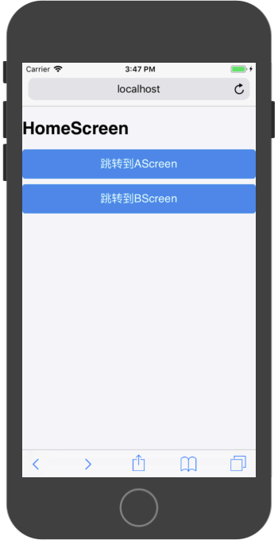
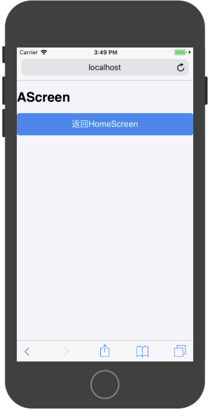
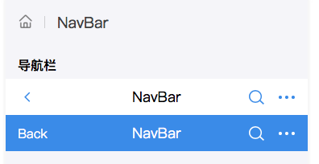
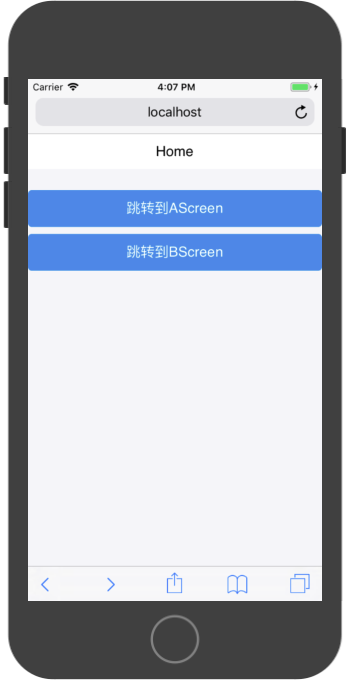
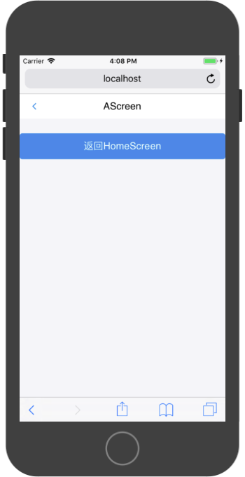

# ReactRouter

`ReactRouter`提供了WebApp中`ScreenComponent`的导航能力。其提供了三个导航容器可以根据产品需求进行选择：

* `BrowserRouter`
* `HashRouter`
* `MemoryRouter`

`BrowserRouter`为传统导航容器，按照浏览器地址栏中的相对路径请求响应的服务页面，这样的导航方式并不适合以组件化开发的WebApp。因WebApp的所有页面都在浏览器中，后台仅提供JSON格式的数据。

`HashRouter`适合组件化开发的WebApp导航，其导航为以`#`为地址的相对导航路径，该路径首先在浏览器中进行处理。

`MemoryRouter`导航容器无地址变化，适合在无地址栏的场景下使用，例如微信中打开一个页面。以下案例使用该导航容器

### 基础配置

使用`ReactRouter`时，首先我们需要对工程中的`index.js`进行修改。

原`index.js`文件为：

```
import React from 'react';
import ReactDOM from 'react-dom';
import './index.css';
import App from './App';

import registerServiceWorker from './registerServiceWorker';

ReactDOM.render(<App />, document.getElementById('root'));
registerServiceWorker();
```

在源文件的基础上首先引入`ReactRouter`中的`MemoryRouter`组件：


```
import React from 'react';
import ReactDOM from 'react-dom';
import './index.css';
import App from './App';

import { MemoryRouter } from "react-router-dom";

import registerServiceWorker from './registerServiceWorker';

ReactDOM.render(<App />, document.getElementById('root'));
registerServiceWorker();
```

然后使用`MemoryRouter`对`<App/>`元素进行包裹，这样App组件就有了Screen导航能力：

```
import React from 'react';
import ReactDOM from 'react-dom';
import './index.css';
import App from './App';

import { MemoryRouter } from "react-router-dom";

import registerServiceWorker from './registerServiceWorker';

ReactDOM.render(
    <MemoryRouter>
        <App />
    </MemoryRouter>, 
    document.getElementById('root')
);
registerServiceWorker();
```

### 构造Screen对象

这里我们构造三个Screen对象：

* `HomeScreen`
* `AScreen`
* `BScreen`

在`HomeScreen`对象中，防止两个按钮，点击分别可以跳转到`AScreen`或`BScreen`。在`AScreen`和`BScreen`中分别放置一个按钮，点击可以返回到`HomeScreen`。

`HomeScreen`文件：

```
import React, { Component } from 'react'

import { Button , WhiteSpace } from 'antd-mobile'

export default class HomeScreen extends Component {
  render() {
    return (
      <div>
        <h1>HomeScreen</h1>
        <Button
            type={'primary'}
            onClick={()=>{
                //跳转到AScreen
            }}
        >
            跳转到AScreen
        </Button>
        <WhiteSpace/>
        <Button
            type={'primary'}
            onClick={()=>{
                //跳转到BScreen
            }}
        >
            跳转到BScreen
        </Button>
      </div>
    )
  }
}
```



`AScreen`文件：

```
import React, { Component } from 'react'

import { Button , WhiteSpace } from 'antd-mobile'

export default class AScreen extends Component {
  render() {
    return (
      <div>
        <h1>AScreen</h1>
        <Button
            type={'primary'}
            onClick={()=>{
                //返回HomeScreen
            }}
        >
            返回HomeScreen
        </Button>
      </div>
    )
  }
}
```




`BScreen`文件：

```
import React, { Component } from 'react'

import { Button , WhiteSpace } from 'antd-mobile'

export default class BScreen extends Component {
  render() {
    return (
      <div>
        <h1>BScreen</h1>
        <Button
            type={'primary'}
            onClick={()=>{
                //返回HomeScreen
            }}
        >
            返回HomeScreen
        </Button>
      </div>
    )
  }
}
```


### 构建页面导航

在App组件中，需要构造页面导航规则即，地址和组件直接的映射关系。通过`Route`进行指定。

```
import React, { Component } from 'react';

import { Route } from "react-router-dom";

import HomeScreen from './Screen/HomeScreen';
import AScreen from './Screen/AScreen';
import BScreen from './Screen/BScreen';

export default class App extends Component {

  
  render() {

    return (
        <div>
          <Route 
            exact={true} 
            path={'/'}
            component={HomeScreen}
          />
          <Route
            path={'/AScreen'}
            component={AScreen}
          />
          <Route
            path={'/BScreen'}
            component={BScreen}
          />
        </div>
    );
  }
}
```

`Route`下的组件不会全部展示在屏幕，只有请求地址和`Route`中的`path`值一致时，才会在屏幕上显示该组件。通过`exact`属性，可以标准该组件准确匹配路径，否则在请求'/AScreen'时，HomeScreen也会被渲染，因HomeScreen对于的路径为'/'，而'/AScreen'也包含'/'。


### 页面`push`和`goBack`

在页面管理中，`push`和`goBack`是最常用的两个操作，通过`push`可以在屏幕上展示当前路径对应的`Screen`组件，通过`goBack`可以返回之前的页面。

`push`和`goBack`是ReactRouter对象的中`history`属性的方法，需要通过如下代码获取：

```
this.props.history.push(path)

this.props.history.goBack()
```


HomeScreen文件：

```
import React, { Component } from 'react'

import { Button , WhiteSpace } from 'antd-mobile'

export default class HomeScreen extends Component {
  render() {
    return (
      <div>
        <h1>HomeScreen</h1>
        <Button
            type={'primary'}
            onClick={()=>{
                //跳转到AScreen
                this.props.history.push('/AScreen')
            }}
        >
            跳转到AScreen
        </Button>
        <WhiteSpace/>
        <Button
            type={'primary'}
            onClick={()=>{
                //跳转到BScreen
                this.props.history.push('/BScreen')
            }}
        >
            跳转到BScreen
        </Button>
      </div>
    )
  }
}

```

AScreen文件：

```
import React, { Component } from 'react'

import { Button , WhiteSpace } from 'antd-mobile'

export default class AScreen extends Component {
  render() {
    return (
      <div>
        <h1>AScreen</h1>
        <Button
            type={'primary'}
            onClick={()=>{
                //返回HomeScreen
                this.props.history.goBack();
            }}
        >
            返回HomeScreen
        </Button>
      </div>
    )
  }
}

```

BScreen文件：

```
import React, { Component } from 'react'

import { Button , WhiteSpace } from 'antd-mobile'

export default class BScreen extends Component {
  render() {
    return (
      <div>
        <h1>BScreen</h1>
        <Button
            type={'primary'}
            onClick={()=>{
                //返回HomeScreen
                this.props.history.goBack();
            }}
        >
            返回HomeScreen
        </Button>
      </div>
    )
  }
}

```

### 页面导航栏

在使用堆栈导航时，需要为页面提供一个`NavBar`来展示当前页面和提供功能按钮，例如：




组件API：

|属性|说明|类型|默认值|
|:---|:---|:---|
|mode|	模式|	string	|'dark' enum{'dark', 'light'}|
|icon|	出现在最左边的图标占位符|	ReactNode	|-|
|leftContent|	导航左边内容|	any	|无|
|rightContent|	导航右边内容|	any	|无|
|onLeftClick|	导航左边点击回调|	(e: Object): void	|无|




```
import React, { Component } from 'react'

import { Button , WhiteSpace,NavBar } from 'antd-mobile'

export default class HomeScreen extends Component {
  render() {
    return (
      <div>
        <NavBar
            mode="light"
        >Home</NavBar>
        <WhiteSpace/>
        <WhiteSpace/>
        <WhiteSpace/>
        <Button
            type={'primary'}
            onClick={()=>{
                //跳转到AScreen
                this.props.history.push('/AScreen')
            }}
        >
            跳转到AScreen
        </Button>
        <WhiteSpace/>
        <Button
            type={'primary'}
            onClick={()=>{
                //跳转到BScreen
                this.props.history.push('/BScreen')
            }}
        >
            跳转到BScreen
        </Button>
      </div>
    )
  }
}

```




```
import React, { Component } from 'react'

import { Button , WhiteSpace,NavBar ,Icon} from 'antd-mobile'

export default class AScreen extends Component {
  render() {
    return (
      <div>
        <NavBar
          mode="light"
          icon={<Icon type="left" />}
          onLeftClick={() => {this.props.history.goBack();}}
        >AScreen</NavBar>
        <WhiteSpace/>
        <WhiteSpace/>
        <WhiteSpace/>
        <Button
            type={'primary'}
            onClick={()=>{
                //返回HomeScreen
                this.props.history.goBack();
            }}
        >
            返回HomeScreen
        </Button>
      </div>
    )
  }
}

```


```
import React, { Component } from 'react'

import { Button , WhiteSpace ,NavBar,Icon} from 'antd-mobile'

export default class BScreen extends Component {
  render() {
    return (
      <div>
        <NavBar
          mode="light"
          icon={<Icon type="left" />}
          onLeftClick={() => {this.props.history.goBack();}}
        >AScreen</NavBar>
        <WhiteSpace/>
        <WhiteSpace/>
        <WhiteSpace/>
        <Button
            type={'primary'}
            onClick={()=>{
                //返回HomeScreen
                this.props.history.goBack();
            }}
        >
            返回HomeScreen
        </Button>
      </div>
    )
  }
}
```

### 页面间传值

ReactRouter允许在页面`push`时携带参数。在地址后面可以再添加一个对象，用来传递参数，

```
this.props.history.push('/AScreen',{name:'tom'})
```

该对象会被展示的组件接收，通过下面代码获取传递的参数

```
this.props.history.location.state
```


HomeScreen

```
import React, { Component } from 'react'

import { Button , WhiteSpace,NavBar } from 'antd-mobile'

export default class HomeScreen extends Component {
  render() {
    return (
      <div>
        <NavBar
            mode="light"
        >Home</NavBar>
        <WhiteSpace/>
        <WhiteSpace/>
        <WhiteSpace/>
        <Button
            type={'primary'}
            onClick={()=>{
                //跳转到AScreen
                this.props.history.push('/AScreen',{name:'tom'})
            }}
        >
            跳转到AScreen
        </Button>
        <WhiteSpace/>
        <Button
            type={'primary'}
            onClick={()=>{
                //跳转到BScreen
                this.props.history.push('/BScreen')
            }}
        >
            跳转到BScreen
        </Button>
      </div>
    )
  }
}

```

AScreen

```
import React, { Component } from 'react'

import { Button , WhiteSpace,NavBar ,Icon} from 'antd-mobile'

export default class AScreen extends Component {


  render() {
    return (
      <div>
        <NavBar
          mode="light"
          icon={<Icon type="left" />}
          onLeftClick={() => {this.props.history.goBack();}}
        >AScreen</NavBar>
        <WhiteSpace/>
        <WhiteSpace/>
        <WhiteSpace/>
        <p>{this.props.history.location.state.name}</p>
        <Button
            type={'primary'}
            onClick={()=>{
                //返回HomeScreen
                this.props.history.goBack();
            }}
        >
            返回HomeScreen
        </Button>
      </div>
    )
  }
}

```

### 页面`replace`

在使用ReactRouter时，可以通过浏览器中地址栏直接访问对于的组件，但在有登录授权的情况下，用户访问没有授权的页面时，应自动调整到登录或指定页面。

ReactRouter中通过`replace`实现。在组件的`componentDidMount()`函数中，通过对授权的相关信息进行验证，不符合要求的调用`this.props.history.replace('/');`或指定页面。

```
componentDidMount(){
    if(判断条件){
      this.props.history.replace('/');
    }
  }
```

下面代码实现了BScreen组件的登陆判断，BScreen只能通过HomeScreen跳转进入，不能通过地址栏直接进入。

```
import React, { Component } from 'react'

import { Button , WhiteSpace ,NavBar,Icon} from 'antd-mobile'

export default class BScreen extends Component {

  componentDidMount(){
    if(!this.props.history.location.state){
      this.props.history.replace('/');
    }
  }

  render() {
    return (
      <div>
        <NavBar
          mode="light"
          icon={<Icon type="left" />}
          onLeftClick={() => {this.props.history.goBack();}}
        >BScreen</NavBar>
        <WhiteSpace/>
        <WhiteSpace/>
        <WhiteSpace/>
        <Button
            type={'primary'}
            onClick={()=>{
                //返回HomeScreen
                this.props.history.goBack();
            }}
        >
            返回HomeScreen
        </Button>
      </div>
    )
  }
}
```

```
import React, { Component } from 'react'

import { Button , WhiteSpace,NavBar } from 'antd-mobile'

export default class HomeScreen extends Component {
  render() {
    return (
      <div>
        <NavBar
            mode="light"
        >Home</NavBar>
        <WhiteSpace/>
        <WhiteSpace/>
        <WhiteSpace/>
        <Button
            type={'primary'}
            onClick={()=>{
                //跳转到AScreen
                this.props.history.push('/AScreen',{name:'tom'})
            }}
        >
            跳转到AScreen
        </Button>
        <WhiteSpace/>
        <Button
            type={'primary'}
            onClick={()=>{
                //跳转到BScreen
                this.props.history.push('/BScreen',{})
            }}
        >
            跳转到BScreen
        </Button>
      </div>
    )
  }
}
```


