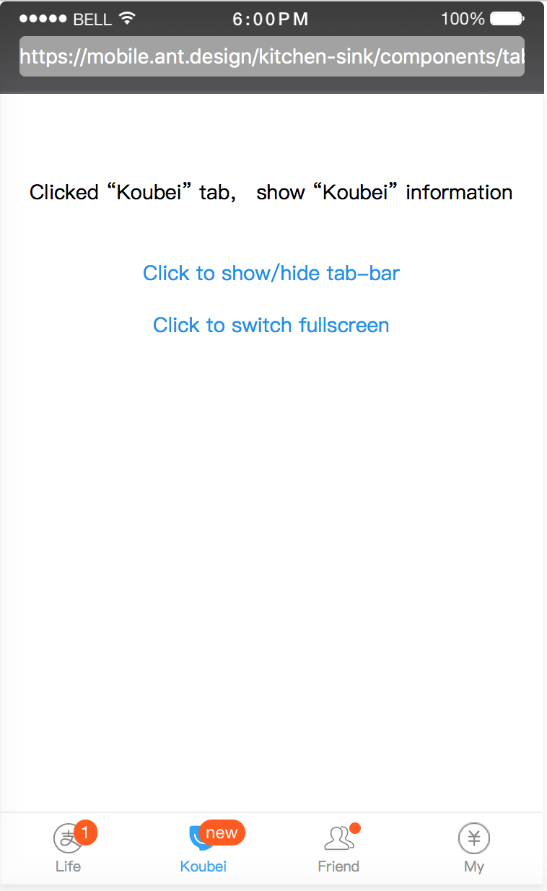
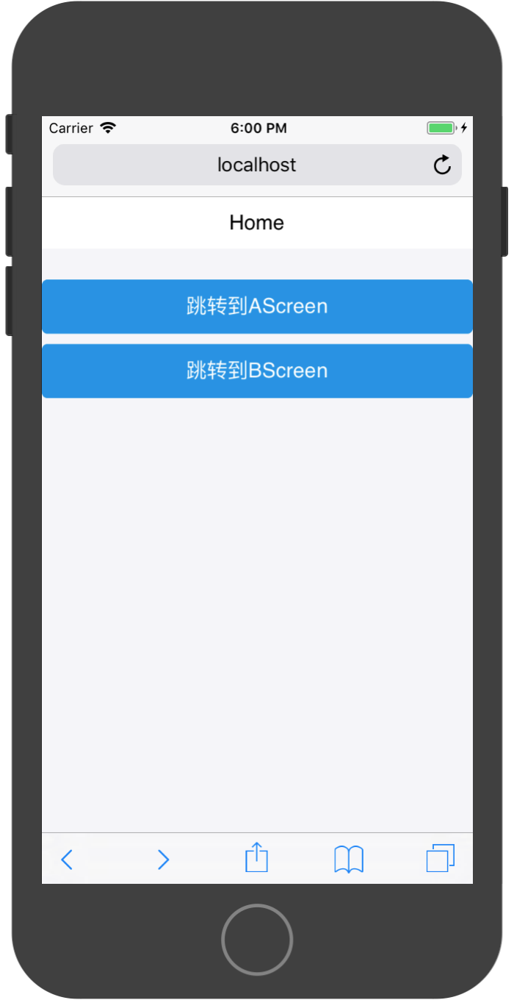
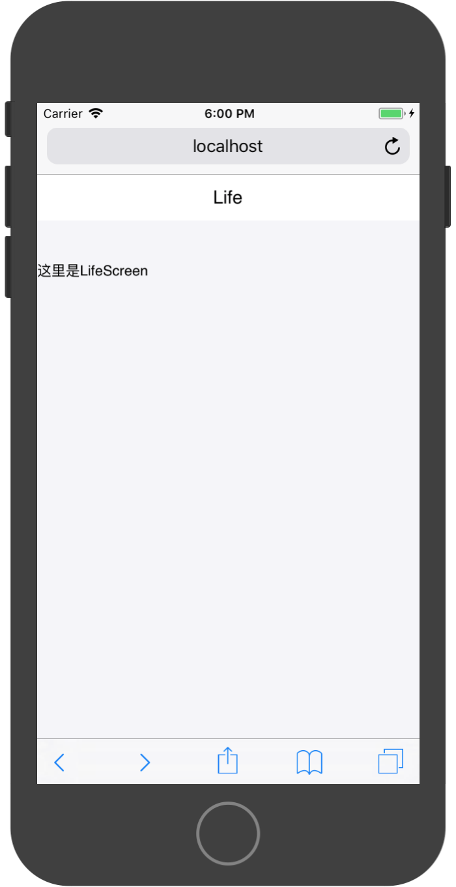
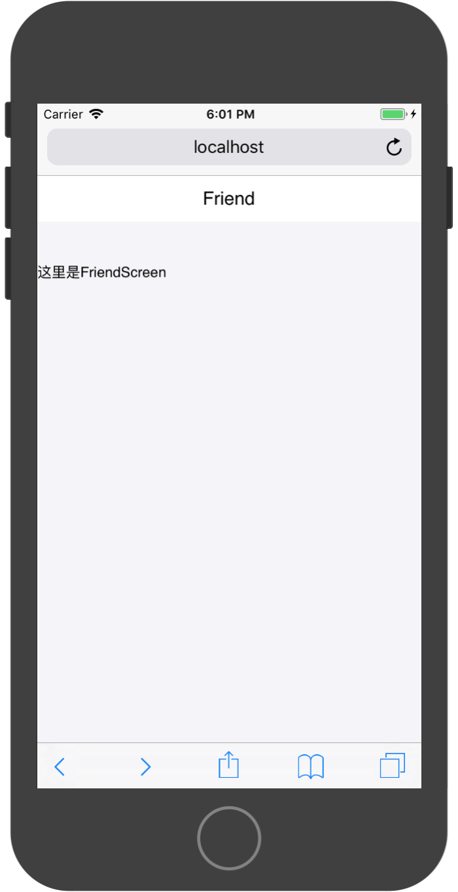
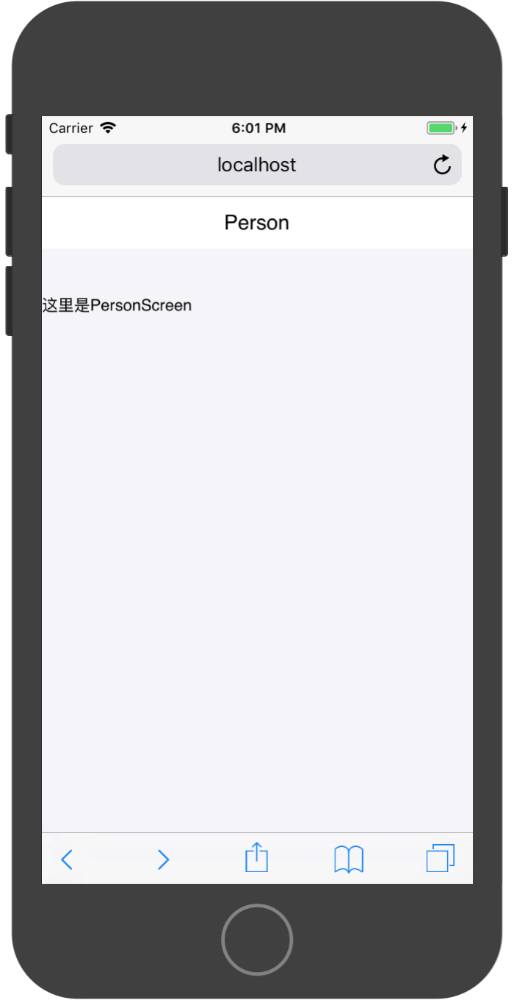
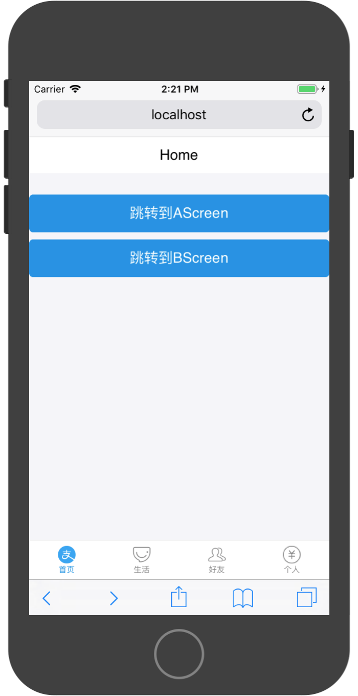
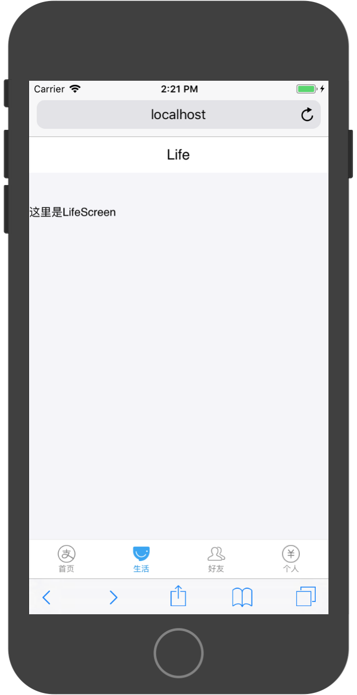

# TabBar

`TabBar`是提供页面进行标签栏导航的组件。展示演示为：




`TabBar`为一个容器组件，承载内容为`TabBar.Item`，通过`TabBar.Item`装载`ScreenComponent`。当某一个`TabBar.Item`被用户选中时，其装载的`ScreenComponent`便会显示在屏幕上。


`TabBar`API：

|属性|说明|类型|默认值|
|:---|:---|:---|:---|
|barTintColor|	tabbar 背景色|	String|	white|
|tintColor|	选中的字体颜色|	String|	#108ee9|
|unselectedTintColor|	未选中的字体颜色|	String|	'#888'|
|hidden (web only)|	是否隐藏|	Boolean	|false|

`TabBar`可以承载3-5个`TabBar.Item`组件，负载此范围内的页面布局通过其他方式实现。该组件在使用时需要配置`style`样式为：`{ position: 'fixed', height: '100%', width: '100%', top: 0 }`以实现`TabBar`在屏幕最底部展示。

`TabBar.Item`API：

|属性|说明|类型|默认值|
|:---|:---|:---|:---|
|badge|	徽标数	|Number \ String|	无|
|dot|	是否在右上角显示小红点（在设置badge的情况下失效）|	Boolean	|false|
|onPress	|bar 点击触发|	Function	|无|
|selected|	是否选中|	Boolean	|false|
|icon	|默认展示图片	| {uri:imageURL}或div| 无|
|selectedIcon|	选中后的展示图片|{uri:imageURL}或div	|无|	
|title|	标题文字|	String||	
|key	|唯一标识|	String|	无|

`TabBar.Item`不能保存自身状态，其使用方法和受控组件模式一致，通过`state`保存其选中状态。

`TabBar.Item`的图片分为选中和非选中模式下，需要通过`div`组件配置`width`、`height`和`background`。其`background`推荐使用`url(imageurl)`模式。

### 构造Screen对象

这里我们构造了4个Screen对象用于被`TabBar`展示，分别为:

* `HomeScreen`
* `LifeScreen`
* `FriendScreen`
* `PersonScreen`







除HomeScreen外的实现代码：

```
import React, { Component } from 'react'

import { Button , WhiteSpace,NavBar } from 'antd-mobile'

export default class FriendScreen extends Component {
  render() {
    return (
      <div>
        <NavBar
            mode="light"
        >Friend</NavBar>
        <WhiteSpace/>
        <WhiteSpace/>
        <WhiteSpace/>
        <p>这里是FriendScreen</p>
      </div>
    )
  }
}

```

### 构造TabBarScreen

通过`TabBar`和`TabBar.Item`组件构造一个TabBarScreen，通过该Screen即可对其包含的Screen的展现进行管理。TabBarScreen底部包含一个标签栏，通过选择标签栏上不通的标签，与之相对应的Screen即可展现在屏幕上。





1，构造Component组件

```
import React, { Component } from 'react'

export default class TabBarScreen extends Component {
  render() {
    return (
      <div>
        
      </div>
    )
  }
}
```

2，配置`div`的`style`属性，引入所要管理的Screen组件

```
import React, { Component } from 'react'

import { TabBar } from 'antd-mobile';

import HomeScreen from './HomeScreen';
import LifeScreen from './LifeScreen';
import FriendScreen from './FriendScreen';
import PersonScreen from './PersonScreen';

export default class TabBarScreen extends Component {
  render() {
    return (
      <div style={{ position: 'fixed', height: '100%', width: '100%', top: 0 } }>
        <TabBar>
        </TabBar>
      </div>
    )
  }
}
```

3，逐个构建`TabBar.Item`，配置其下列属性：

* `key`
* `title`
* `icon`
* `selectedIcon`

并将与之对应的Screen组件包含在其元素内。


```
import React, { Component } from 'react'

import { TabBar } from 'antd-mobile';

import HomeScreen from './HomeScreen';
import LifeScreen from './LifeScreen';
import FriendScreen from './FriendScreen';
import PersonScreen from './PersonScreen';

export default class TabBarScreen extends Component {
  render() {
    return (
      <div style={{ position: 'fixed', height: '100%', width: '100%', top: 0 } }>
        <TabBar>
            <TabBar.Item
                key={'home'}
                title={'首页'}
                icon={{uri:'https://zos.alipayobjects.com/rmsportal/sifuoDUQdAFKAVcFGROC.svg'}}
                selectedIcon={{uri:'https://zos.alipayobjects.com/rmsportal/iSrlOTqrKddqbOmlvUfq.svg'}}

            >
                <HomeScreen/>
            </TabBar.Item>
        </TabBar>
      </div>
    )
  }
}
```

>以上代码只演示了一个`TabBar.Item`的配置过程

4，添加选择状态管理，`TabBar`组件并不会保存选择状态，需要TabBarScreen来保存选择状态。保存方法为。在TabBarScreen中添加一个`state`状态对象，在`TabBar.Item`的`onPress`响应处理函数中修改`state`对象中的选择值，然后在`TabBar.Item`的`selected`属性中，使用自身`key`与`state`中的选择值做比较。

具体实现代码为：

```
import React, { Component } from 'react'

import { TabBar } from 'antd-mobile';

import HomeScreen from './HomeScreen';
import LifeScreen from './LifeScreen';
import FriendScreen from './FriendScreen';
import PersonScreen from './PersonScreen';

export default class TabBarScreen extends Component {

    constructor(props) {
        super(props)

        this.state = {
            selectedTab:'home',
        }
    }

    render() {
    return (
        <div style={{ position: 'fixed', height: '100%', width: '100%', top: 0 } }>
        <TabBar>
            <TabBar.Item
                key={'home'}
                title={'首页'}
                icon={{uri:'https://zos.alipayobjects.com/rmsportal/sifuoDUQdAFKAVcFGROC.svg'}}
                selectedIcon={{uri:'https://zos.alipayobjects.com/rmsportal/iSrlOTqrKddqbOmlvUfq.svg'}}
                selected={this.state.selectedTab === 'home'}
                onPress={()=>{
                    this.setState({
                        selectedTab:'home'
                    })
                }}

            >
                <HomeScreen/>
            </TabBar.Item>
        </TabBar>
        </div>
    )
    }
}
```

完整演示代码：

```
import React, { Component } from 'react'

import HomeScreen from './HomeScreen';
import LifeScreen from './LifeScreen';
import FriendScreen from './FriendScreen';
import PersonScreen from './PersonScreen';

import { TabBar } from 'antd-mobile';

export default class TabBarScreen extends Component {

    constructor(props) {
      super(props)
    
      this.state = {
        selectedTab:'home',
      }
    }
    
  render() {
    return (
      <div style={{ position: 'fixed', height: '100%', width: '100%', top: 0 } }>
        <TabBar>
            <TabBar.Item
                key={'home'}
                title={'首页'}
                selected={this.state.selectedTab === 'home'}
                onPress={()=>{
                    this.setState({
                        selectedTab:'home'
                    })
                }}
                icon={{uri:'https://zos.alipayobjects.com/rmsportal/sifuoDUQdAFKAVcFGROC.svg'}}
                selectedIcon={{uri:'https://zos.alipayobjects.com/rmsportal/iSrlOTqrKddqbOmlvUfq.svg'}}

            >
                <HomeScreen {...this.props}/>
            </TabBar.Item>
            <TabBar.Item
                key={'life'}
                title={'生活'}
                selected={this.state.selectedTab === 'life'}
                onPress={()=>{
                    this.setState({
                        selectedTab:'life'
                    })
                }}
                icon={{uri:'https://gw.alipayobjects.com/zos/rmsportal/BTSsmHkPsQSPTktcXyTV.svg'}}
                selectedIcon={{uri:'https://gw.alipayobjects.com/zos/rmsportal/ekLecvKBnRazVLXbWOnE.svg'}}

            >
                <LifeScreen/>
            </TabBar.Item>
            <TabBar.Item
                key={'friend'}
                title={'好友'}
                selected={this.state.selectedTab === 'friend'}
                onPress={()=>{
                    this.setState({
                        selectedTab:'friend'
                    })
                }}
                icon={{uri:'https://zos.alipayobjects.com/rmsportal/psUFoAMjkCcjqtUCNPxB.svg'}}
                selectedIcon={{uri:'https://zos.alipayobjects.com/rmsportal/IIRLrXXrFAhXVdhMWgUI.svg'}}

            >
                <FriendScreen/>
            </TabBar.Item>
            <TabBar.Item
                key={'person'}
                title={'个人'}
                selected={this.state.selectedTab === 'person'}
                onPress={()=>{
                    this.setState({
                        selectedTab:'person'
                    })
                }}
                icon={{uri:'https://zos.alipayobjects.com/rmsportal/asJMfBrNqpMMlVpeInPQ.svg'}}
                selectedIcon={{uri:'https://zos.alipayobjects.com/rmsportal/gjpzzcrPMkhfEqgbYvmN.svg'}}

            >
                <PersonScreen/>
            </TabBar.Item>
        </TabBar>
      </div>
    )
  }
}
```

### TabBar与ReactRouter配合使用

WebApp中多页面管理时，通常一起使用ReactRouter和TabBar。TabBarScreen作为WebApp的根视图呈现，从TabBarScreen的子Screen中可以`push`到各个子页面。例如从HomeScreen中`push`到AScreen或BScreen中。

`push()`由`this.props.history`对象提供，该对象只存在与被`Route`配置的组件中，而在TabBarScreen中的HomeScreen并没有被`Route`配置，所以默认情况下，HomeScreen中不存在`this.props.history`对象。但TabBarScreen被`Route`配置为根视图，而HomeScreen又存在与TabBarScreen中，所以可以将TabBarScreen中的`this.props.history`对象传递给HomeScreen。

传递方法如为，在通过HomeScreen创建React元素时，通过展开操作符将TabBarScreen中的`this.props`注入到HomeScreen中。


```
<HomeScreen {...this.props} />
```

这样在HomeScreen中就可以使用`push()`函数切换Screen了。

实现代码：

App.js文件：

```
import React, { Component } from 'react';

import { Route } from "react-router-dom";

import AScreen from './Screen/AScreen';
import BScreen from './Screen/BScreen';
import TabBarScreen from './Screen/TabBarScreen'

export default class App extends Component {

  render() {

    return (
        <div>
          <Route 
            exact={true} 
            path={'/'}
            component={TabBarScreen}
          />
          <Route
            path={'/AScreen'}
            component={AScreen}
          />
          <Route
            path={'/BScreen'}
            component={BScreen}
          />
        </div>
    );
  }
}

```

TabBarScreen.js文件：

```
import React, { Component } from 'react'

import HomeScreen from './HomeScreen';
import LifeScreen from './LifeScreen';
import FriendScreen from './FriendScreen';
import PersonScreen from './PersonScreen';

import { TabBar } from 'antd-mobile';

export default class TabBarScreen extends Component {

    constructor(props) {
      super(props)
    
      this.state = {
        selectedTab:'home',
      }
    }
    
  render() {
    return (
      <div style={{ position: 'fixed', height: '100%', width: '100%', top: 0 } }>
        <TabBar>
            <TabBar.Item
                key={'home'}
                title={'首页'}
                selected={this.state.selectedTab === 'home'}
                onPress={()=>{
                    this.setState({
                        selectedTab:'home'
                    })
                }}
                icon={{uri:'https://zos.alipayobjects.com/rmsportal/sifuoDUQdAFKAVcFGROC.svg'}}
                selectedIcon={{uri:'https://zos.alipayobjects.com/rmsportal/iSrlOTqrKddqbOmlvUfq.svg'}}

            >
                <HomeScreen {...this.props}/>
            </TabBar.Item>
            <TabBar.Item
                key={'life'}
                title={'生活'}
                selected={this.state.selectedTab === 'life'}
                onPress={()=>{
                    this.setState({
                        selectedTab:'life'
                    })
                }}
                icon={{uri:'https://gw.alipayobjects.com/zos/rmsportal/BTSsmHkPsQSPTktcXyTV.svg'}}
                selectedIcon={{uri:'https://gw.alipayobjects.com/zos/rmsportal/ekLecvKBnRazVLXbWOnE.svg'}}

            >
                <LifeScreen {...this.props} />
            </TabBar.Item>
            <TabBar.Item
                key={'friend'}
                title={'好友'}
                selected={this.state.selectedTab === 'friend'}
                onPress={()=>{
                    this.setState({
                        selectedTab:'friend'
                    })
                }}
                icon={{uri:'https://zos.alipayobjects.com/rmsportal/psUFoAMjkCcjqtUCNPxB.svg'}}
                selectedIcon={{uri:'https://zos.alipayobjects.com/rmsportal/IIRLrXXrFAhXVdhMWgUI.svg'}}

            >
                <FriendScreen {...this.props} />
            </TabBar.Item>
            <TabBar.Item
                key={'person'}
                title={'个人'}
                selected={this.state.selectedTab === 'person'}
                onPress={()=>{
                    this.setState({
                        selectedTab:'person'
                    })
                }}
                icon={{uri:'https://zos.alipayobjects.com/rmsportal/asJMfBrNqpMMlVpeInPQ.svg'}}
                selectedIcon={{uri:'https://zos.alipayobjects.com/rmsportal/gjpzzcrPMkhfEqgbYvmN.svg'}}

            >
                <PersonScreen {...this.props} />
            </TabBar.Item>
        </TabBar>
      </div>
    )
  }
}
```

HomeScreen.js文件：

```
import React, { Component } from 'react'

import { Button , WhiteSpace,NavBar } from 'antd-mobile'

export default class HomeScreen extends Component {
  render() {
    return (
      <div>
        <NavBar
            mode="light"
        >Home</NavBar>
        <WhiteSpace/>
        <WhiteSpace/>
        <WhiteSpace/>
        <Button
            type={'primary'}
            onClick={()=>{
                //跳转到AScreen
                this.props.history.push('/AScreen',{name:'tom'})
            }}
        >
            跳转到AScreen
        </Button>
        <WhiteSpace/>
        <Button
            type={'primary'}
            onClick={()=>{
                //跳转到BScreen
                this.props.history.push('/BScreen',{})
            }}
        >
            跳转到BScreen
        </Button>
      </div>
    )
  }
}
```