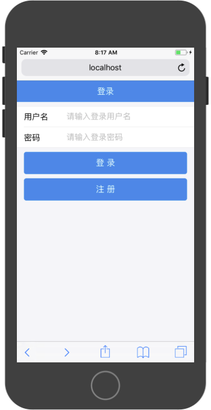
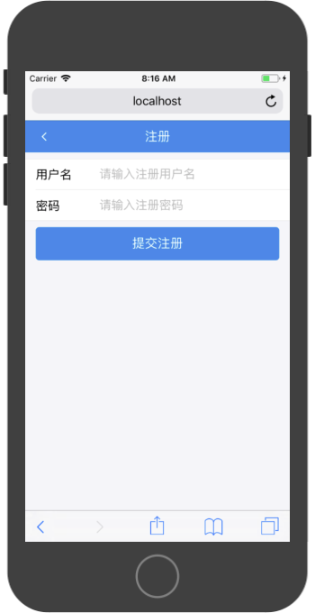
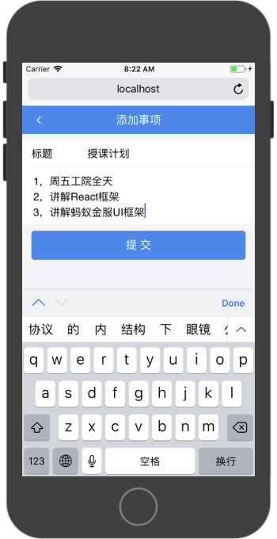
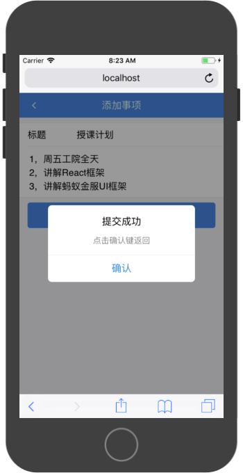
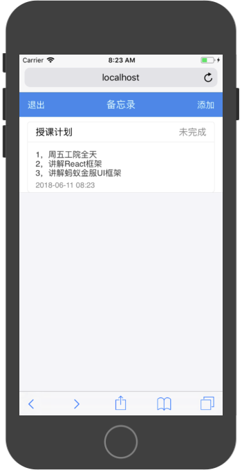
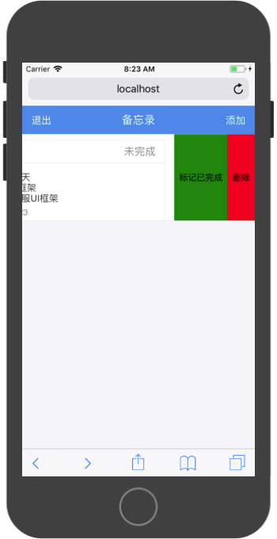

# 综合实战2-备忘录App

### 产品原型

登录注册模块：

提供用户登录和注册功能





事项管理模块：

提供发布代办事项、展示代办事项、删除代办事项和标记代办事项已完成功能。







### API文档

**元数据**

账户对象

```
{
	id:0
	username:'',
	password:'',
	access_token:'',
}
```

Todo条目对象

```
{
	id:0
	title:'',
	content:'',
	isFinish:true OR false,
}
```

**错误代码**

|错误代码|内容|
|:---|:---|
|10001|系统错误|
|10002|用户名错误|
|10003|密码错误|
|10004|access_token无效|
|10005|TodoID无效|
|10006|参数无效|
|10007|用户名已存在|

错误返回值：

```
{
    success:false,
    errorCode:10001,
    errorMessage:'系统错误'
}
```


**接口服务**

请求基础地址

`http://localhost:5000`

注册

请求链接：`/api/register`

请求方式：`POST`

|参数名称|参数描述|
|:---|:---|
|username|用户名|
|password|密码|

```
{
    "success": true,
    "data": {
        "id": 2,
        "username": "tom1",
        "password": "1234",
        "access_token": "16e088f3d62c4c132e8728ef79eaf353",
        "updatedAt": "2018-06-06T08:05:13.664Z",
        "createdAt": "2018-06-06T08:05:13.664Z"
    }
}
```

登录

请求链接：`/api/login`

请求方式：`POST`

|参数名称|参数描述|
|:---|:---|
|username|账户名|
|password|密码|

```
{
    "success": true,
    "data": {
        "id": 2,
        "username": "tom1",
        "password": "1234",
        "access_token": "8e58260409dc169009b87800dfe5128f",
        "createdAt": "2018-06-06T08:05:13.000Z",
        "updatedAt": "2018-06-06T08:11:18.442Z"
    }
}

```

提交备忘录条目

请求链接：`/api/postTodoItem`

请求方式：`POST`

|参数名称|参数描述|
|:---|:---|
|access_token|登录令牌|
|title|标题|
|content|内容|

```
{
    "success": true,
    "data": 
}

```

修改备忘录条目：

请求链接：`/api/updateTodoItem`

请求方式：`POST`

|参数名称|参数描述|
|:---|:---|
|access_token|登录令牌|
|id|条目ID|
|title|标题（可选）|
|content|内容（可选）|

```
{
    "success": true,
    "data": 
}

```

切换标记备忘录条目完成状态

请求链接：`/api/finishTodoItem`

请求方式：`POST`

|参数名称|参数描述|
|:---|:---|
|access_token|登录令牌|
|id|条目ID|

```
{
    "success": true,
    "data": 
}

```

删除备忘录条目

请求链接：`/api/deleteTodoItems`

请求方式：`POST`

|参数名称|参数描述|
|:---|:---|
|access_token|登录令牌|
|id|条目ID|

```
{
    "success": true,
}
```

### 数据服务层构建

1，安装API文档中的接口路径，构建`URLConfig.js`文件：

```
const host = 'http://localhost:';
const port = 5000;

const loginURL = host+port+'/api/login';
const registerURL = host+port+'/api/register';
const postTodoItemURL = host+port+'/api/postTodoItem';
const updateTodoItemURL = host+port+'/api/updateTodoItem';
const deleteTodoItemURL = host+port+'/api/deleteTodoItem';
const getTodoItemsURL = host+port+'/api/getTodoItems';
const finishTodoItemURL = host+port+'/api/finishTodoItem';

export {
    loginURL,
    registerURL,
    postTodoItemURL,
    updateTodoItemURL,
    deleteTodoItemURL,
    getTodoItemsURL,
    finishTodoItemURL
}
```


2，构建`UserManager`数据服务对象，对用户相关操作进行封装。该数据对象提供以下功能支撑：

* 用户注册（异步）
* 用户登录（异步）
* 保持登录信息
* 查询当前登录状态
* 登出操作（清空登录信息）

构建`UserManager`单例：

```
import { loginURL,registerURL } from './URLConfig';

class UserManager {

}

export default new UserManager();
```

构建注册功能模块。该模块通过控制器传入的用户名和密码向API发起网络请求，将用户名和密码提交给服务器，服务器通过业务系统进行处理，返回注册结果。如注册成功，该模块内使用`localStorage`对`access_token`登录令牌进行本地保存，以维持登录状态。并返回登录结果。

```
async register(username,password){
    try {
        const user = {
            username,
            password
        }

        const res = await fetch(registerURL,{
            method:'POST',
            headers:{
                'Accept':'application/json',
                'Content-Type':'application/json'
            },
            body:JSON.stringify(user)
        });

        const result = await res.json();

        if(result.success === true){
            localStorage.access_token = result.data.access_token 
        }

        return result;

    } catch (error) {
        return {
            success:false,
            errorMessage:'网络错误'
        }
    }
}
```

构建登录功能模块。该模块通过控制器传入的用户名和密码向API发起网络请求，将用户名和密码提交给服务器，服务器通过业务系统进行处理，返回注册结果。如注册成功，该模块内使用`localStorage`对`access_token`登录令牌进行本地保存，以维持登录状态。并返回登录结果。

```
async login(username,password){
    try {
        const user = {
            username,
            password
        }

        const res = await fetch(loginURL,{
            method:'POST',
            headers:{
                'Accept':'application/json',
                'Content-Type':'application/json'
            },
            body:JSON.stringify(user)
        });

        const result = await res.json();

        if(result.success === true){
            localStorage.access_token = result.data.access_token 
        }

        return result;

    } catch (error) {
        return {
            success:false,
            errorMessage:'网络错误'
        }
    }
}
```

构建查询登录状态功能模块。通过判断`localStorage`中`access_token`的值的情况，如果其值为空或者`''`空字符串，就表示当前为登出状态。

```
isLogin(){
    if(localStorage.access_token === '' || !localStorage.access_token){
        return false;
    } else {
        return true;
    }
}
```

构建登出功能。在该功能中对`localStorage`中`access_token`的值进行清除操作。

```
logout(){
    localStorage.access_token = '';
}
```

完整参考代码：

```
import { loginURL,registerURL } from './URLConfig';

class UserManager {
    
    async login(username,password){
        try {
            const user = {
                username,
                password
            }

            const res = await fetch(loginURL,{
                method:'POST',
                headers:{
                    'Accept':'application/json',
                    'Content-Type':'application/json'
                },
                body:JSON.stringify(user)
            });

            const result = await res.json();

            if(result.success === true){
                localStorage.access_token = result.data.access_token 
            }

            return result;

        } catch (error) {
            return {
                success:false,
                errorMessage:'网络错误'
            }
        }
    }

    logout(){
        localStorage.access_token = '';
    }

    isLogin(){
        if(localStorage.access_token === '' || !localStorage.access_token){
            return false;
        } else {
            return true;
        }
    }

    async register(username,password){
        try {
            const user = {
                username,
                password
            }

            const res = await fetch(registerURL,{
                method:'POST',
                headers:{
                    'Accept':'application/json',
                    'Content-Type':'application/json'
                },
                body:JSON.stringify(user)
            });

            const result = await res.json();

            if(result.success === true){
                localStorage.access_token = result.data.access_token 
            }

            return result;

        } catch (error) {
            return {
                success:false,
                errorMessage:'网络错误'
            }
        }
    }

}

export default new UserManager();

```

3，构建待办事项数据管理对象，该对象提供以下功能支撑：

* 发布待办事项（异步）
* 删除待办事项（异步）
* 修改待办事项（异步）
* 维护待办事项完成状态（异步）
* 获取当前用户下的所有待办事项（异步）

构建`TodoManager`单例对象：

```
import {
    postTodoItemURL,
    updateTodoItemURL,
    deleteTodoItemURL,
    getTodoItemsURL,
    finishTodoItemURL
} from './URLConfig';

class TodoManager {

}

export default new TodoManager();
```

构建发布待办事项功能模块。

```
async postTodo(title,content){
    try {
        const todo = {
            access_token:localStorage.access_token,
            title,
            content
        }

        const res = await fetch(postTodoItemURL,{
            method:'POST',
            headers:{
                'Accept':'application/json',
                'Content-Type':'application/json'
            },
            body:JSON.stringify(todo)
        });

        const result = await res.json();

        return result;

    } catch (error) {
        return {
            success:false,
            errorMessage:'网络错误'
        }
    }
}
```

构建删除待办事项功能模块：

```
async deleteTodo(id){
    try {
        const todo = {
            access_token:localStorage.access_token,
            id,
        }

        const res = await fetch(deleteTodoItemURL,{
            method:'POST',
            headers:{
                'Accept':'application/json',
                'Content-Type':'application/json'
            },
            body:JSON.stringify(todo)
        });

        const result = await res.json();

        return result;

    } catch (error) {
        return {
            success:false,
            errorMessage:'网络错误'
        }
    }
}
```

构建修改待办事项的功能模块：

```
async updateTodo(id,title,content){
    try {
        const todo = {
            access_token:localStorage.access_token,
            id,
            title,
            content
        }

        const res = await fetch(updateTodoItemURL,{
            method:'POST',
            headers:{
                'Accept':'application/json',
                'Content-Type':'application/json'
            },
            body:JSON.stringify(todo)
        });

        const result = await res.json();

        return result;

    } catch (error) {
        return {
            success:false,
            errorMessage:'网络错误'
        }
    }
}
```

构建标记待办事项完成的功能模块：

```
async finishTodo(id){
    try {
        const todo = {
            access_token:localStorage.access_token,
            id,
        }

        const res = await fetch(finishTodoItemURL,{
            method:'POST',
            headers:{
                'Accept':'application/json',
                'Content-Type':'application/json'
            },
            body:JSON.stringify(todo)
        });

        const result = await res.json();

        return result;

    } catch (error) {
        return {
            success:false,
            errorMessage:'网络错误'
        }
    }
}
```

构建获取当前用户下所有代待办事项的功能模块：

```
async getTodos(){
    try {
        const todo = {
            access_token:localStorage.access_token,
        }

        const res = await fetch(getTodoItemsURL,{
            method:'POST',
            headers:{
                'Accept':'application/json',
                'Content-Type':'application/json'
            },
            body:JSON.stringify(todo)
        });

        const result = await res.json();

        return result;

    } catch (error) {
        return {
            success:false,
            errorMessage:'网络错误'
        }
    }
}
```

### 构建Screen导航路径

根据产品原型构建Screen对象并在`App`组件中构建导航路径。

构造以下Screen对象：

* `LoginScreen`
* `RegisterScreen`
* `HomeScreen`
* `CreateTodoScreen`


在`App.js`中引入上述Screen对象，并配置路由。应用的根路径为'/'，在配置根路径对应的Screen对象时，需要对`exact`的值设置为`true`，以保证该路径不和其他保护'/'的路径发生混淆。

```
import React, { Component } from 'react';
import { Route } from "react-router-dom";

import LoginScreen from './Screen/LoginScreen';
import RegisterScreen from './Screen/RegisterScreen';
import HomeScreen from './Screen/HomeScreen';
import CreateTodoScreen from './Screen/CreateTodoScreen';

class App extends Component {
  render() {
    return (
      <div>
        <Route exact={true} path={'/'} component={LoginScreen} />
        <Route path={'/RegisterScreen'} component={RegisterScreen} />
        <Route path={'/HomeScreen'} component={HomeScreen} />
        <Route path={'/CreateTodoScreen'} component={CreateTodoScreen} />
      </div>
    );
  }
}

export default App;

```

### 非登录授权访问拦截

在有登录或授权的机制中，通过浏览器地址栏中访问非授权页面是需要根据当前授权状态判断是否拦截。在本App中，登录注册Screen访问为非授权访问，可以通过地址栏进行直接跳转。但HomeScreen和CreateTodoScreen需要根据登录状态进行拦截操作。

拦截操作通过`this.props.history.replace('/')`，跳转到跟视图。拦截操作在声明周期函数的`componentDidMount()`中进行。

参考代码：

```
import React, { Component } from 'react'

import userManager from '../DataServer/UserManager';

export default class XXXScreen extends Component {

    componentDidMount(){

        if(!userManager.isLogin()){
            this.props.history.replace('/');
            return;
        }
    }
}
```


### 构建LoginScreen

1，定义组件基本语法结构，引入相关组件。

```
import React, { Component } from 'react'

import { 
    Button,
    Toast,
    NavBar,
    WingBlank, 
    WhiteSpace ,
    List,
    InputItem,
} from 'antd-mobile';

import userManager from '../DataServer/UserManager';

export default class LoginScreen extends Component {

    constructor(props) {
      super(props)
    
      this.state = {
         
      }
    }
    

  render() {
    return (
      <div>
        
      </div>
    )
  }
}
```

2，在`render()`中构建静态页面

```
render() {
    return (
      <div>
        <NavBar
            mode="dark"
        >登录</NavBar>
        <WhiteSpace/>
        <List>
            <InputItem
                type={'text'}
                placeholder={'请输入登录用户名'}
            >
                用户名
            </InputItem>
            <InputItem
                type={'password'}
                placeholder={'请输入登录密码'}
            >
                密码
            </InputItem>
        </List>
        <WhiteSpace/>
        <WingBlank>
            <Button
                type={'primary'}
            >
                登录
            </Button>
            <WhiteSpace/>
            <Button
                type={'primary'}
            >
                注册
            </Button>
        </WingBlank>
      </div>
    )
  }
```
3，为输入组件添加受控组件机制：

```
import React, { Component } from 'react'

import { 
    Button,
    Toast,
    NavBar,
    WingBlank, 
    WhiteSpace ,
    List,
    InputItem,
} from 'antd-mobile';

import userManager from '../DataServer/UserManager';


export default class LoginScreen extends Component {

    constructor(props) {
      super(props)
    
      this.state = {
         username:'',
         password:''
      }
    }
    

  render() {
    return (
      <div>
        <NavBar
            mode="dark"
        >登录</NavBar>
        <WhiteSpace/>
        <List>
            <InputItem
                type={'text'}
                value={this.state.username}
                onChange={(username)=>{this.setState({username})}}
                placeholder={'请输入登录用户名'}
            >
                用户名
            </InputItem>
            <InputItem
                type={'password'}
                value={this.state.password}
                onChange={(password)=>{this.setState({password})}}
                placeholder={'请输入登录密码'}
            >
                密码
            </InputItem>
        </List>
        <WhiteSpace/>
        <WingBlank>
            <Button
                type={'primary'}
            >
                登录
            </Button>
            <WhiteSpace/>
            <Button
                type={'primary'}
            >
                注册
            </Button>
        </WingBlank>
      </div>
    )
  }
}

```

4，响应按钮事件：

登录按钮

```
onLoginClick = async ()=>{
    const reslut = await userManager.login(this.state.username,this.state.password);
    console.log(reslut);
    if(reslut.success === false){
        Toast.fail(reslut.errorMessage);
        return;
    }
    this.props.history.replace('/HomeScreen');
}
```

注册按钮

```
onRegisterClick = ()=>{
    this.props.history.push('/RegisterScreen')
}
```

配置按钮点击事件`onClick`属性

```
<Button
    type={'primary'}
    onClick={this.onLoginClick}
>
    登录
</Button>
<WhiteSpace/>
<Button
    type={'primary'}
    onClick={this.onRegisterClick}
>
    注册
</Button>
```

完整参考代码：

```
import React, { Component } from 'react'

import { 
    Button,
    Toast,
    NavBar,
    WingBlank, 
    WhiteSpace ,
    List,
    InputItem,
} from 'antd-mobile';

import userManager from '../DataServer/UserManager';


export default class LoginScreen extends Component {

    constructor(props) {
      super(props)
    
      this.state = {
         username:'',
         password:''
      }
    }
    

    

    render() {
        return (
            <div>
            <NavBar
                mode="dark"
            >登录</NavBar>
            <WhiteSpace/>
            <List>
                <InputItem
                    type={'text'}
                    value={this.state.username}
                    onChange={(username)=>{this.setState({username})}}
                    placeholder={'请输入登录用户名'}
                >
                    用户名
                </InputItem>
                <InputItem
                    type={'password'}
                    value={this.state.password}
                    onChange={(password)=>{this.setState({password})}}
                    placeholder={'请输入登录密码'}
                >
                    密码
                </InputItem>
            </List>
            <WhiteSpace/>
            <WingBlank>
                <Button
                    type={'primary'}
                    onClick={this.onLoginClick}
                >
                    登录
                </Button>
                <WhiteSpace/>
                <Button
                    type={'primary'}
                    onClick={this.onRegisterClick}
                >
                    注册
                </Button>
            </WingBlank>
            </div>
        )
    }

    onLoginClick = async ()=>{
        const reslut = await userManager.login(this.state.username,this.state.password);
        if(reslut.success === false){
            Toast.fail(reslut.errorMessage);
            return;
        }
        this.props.history.replace('/HomeScreen');
    }

    onRegisterClick = ()=>{
        this.props.history.push('/RegisterScreen')
    }
}

```

### 构建RegisterScreen

RegisterScreen和LoginScreen构建过程相似，唯一区别为点击按钮是调用`userManager`中的`register`方法。

参考代码：

```
import React, { Component } from 'react'

import { 
    Button,
    Toast,
    NavBar,
    WingBlank, 
    WhiteSpace ,
    List,
    InputItem,
    Icon
} from 'antd-mobile';

import userManager from '../DataServer/UserManager';

export default class RegisterScreen extends Component {


    constructor(props) {
      super(props)
    
      this.state = {
         username:'',
         password:''
      }
    }
    

  render() {
    return (
      <div>
        <NavBar
            mode="dark"
            icon={<Icon type="left" />}
            onLeftClick={() => {this.props.history.goBack()}}
        >注册</NavBar>
        <WhiteSpace/>
        <List>
            <InputItem
                type={'text'}
                value={this.state.username}
                onChange={(username)=>{this.setState({username})}}
                placeholder={'请输入注册用户名'}
            >
                用户名
            </InputItem>
            <InputItem
                type={'text'}
                value={this.state.password}
                onChange={(password)=>{this.setState({password})}}
                placeholder={'请输入注册密码'}
            >
                密码
            </InputItem>
        </List>
        <WhiteSpace/>
        <WingBlank>
            <Button
                type={'primary'}
                onClick={async()=>{
                    const reslut = await userManager.register(this.state.username,this.state.password);
                    console.log(reslut);
                    if(reslut.success === false){
                        Toast.fail(reslut.errorMessage);
                        return;
                    }
                    this.props.history.replace('/HomeScreen');
                    
                }}
            >
                提交注册
            </Button>
        </WingBlank>
      </div>
    )
  }
}
```

### 构建CreateTodoScreen

```
import React, { Component } from 'react'

import { 
    Button,
    Toast,
    NavBar,
    WingBlank, 
    WhiteSpace ,
    List,
    InputItem,
    Icon,
    TextareaItem,
    Modal
} from 'antd-mobile';

import todoManager from '../DataServer/TodoManager';
import userManager from '../DataServer/UserManager';


export default class CreateTodoScreen extends Component {

    constructor(props) {
      super(props)
    
      this.state = {
         title:'',
         content:''
      }
    }

    componentWillMount(){
        if(!userManager.isLogin()){
            this.props.history.replace('/');
        }
    }
    

  render() {
    return (
      <div>
        <NavBar
            mode="dark"
            icon={<Icon type="left" />}
            onLeftClick={() => {this.props.history.goBack()}}
        >添加事项</NavBar>
        <WhiteSpace/>
        <List>
            <InputItem
                type={'text'}
                value={this.state.title}
                onChange={(title)=>{this.setState({title})}}
                placeholder={'请输入事项标题'}
            >
                标题
            </InputItem>
            <TextareaItem
                type={'text'}
                value={this.state.content}
                onChange={(content)=>{this.setState({content})}}
                placeholder={'请输入内容'}
                autoHeight={true}
            />
        </List>
        <WhiteSpace/>
        <WingBlank>
            <Button
                type={'primary'}
                onClick={async()=>{
                    Toast.loading('内容上传中...',0);
                    const resutl = await todoManager.postTodo(this.state.title,this.state.content);
                    Toast.hide();
                    if(resutl.success === false){
                        Toast.fail(resutl.errorMessage);
                        return;
                    }
                    Modal.alert('提交成功','点击确认键返回',[{
                        text:'确认',
                        onPress:()=>{this.props.history.goBack()}
                    }])

                }}
            >
                提交
            </Button>
        </WingBlank>
      </div>
    )
  }
}

```

### 构建HomeScreen

HomeScreen中需要在页面加载完成之后通过数据服务对象请求所需展示的数据，在构建HomeScreen的过程中，不考虑数据展示样式，只需将所需展示数据以最简方式进行展示。


1，引入相关组件和数据服务对象：

```
import React, { Component } from 'react'

import { 
    Toast,
    NavBar,
    ListView,
} from 'antd-mobile';

import todoManager from '../DataServer/TodoManager';
import userManager from '../DataServer/UserManager';

export default class HomeScreen extends Component {


}
```

2，在`componentDidMount()`完成拦截和数据加载

```
async componentDidMount(){

    if(!userManager.isLogin()){
        this.props.history.replace('/');
        return;
    }

    const result = await todoManager.getTodos();
    console.log(result)
    if(result.success === false){
        Toast.fail(result.errorMessage);
        return;
    }

    this.setState((preState)=>{
        return{
            dataSource:preState.dataSource.cloneWithRows(result.data)
        }   
    })

}
```

3，编写`render()`函数完成以下功能：

* 配置NavBar的展示样式
* 配置NavBar左边的退出按钮及事件
* 配置NavBar右边的添加按钮及事件
* 使用ListView展示数据

```
render() {
    return (
      <div>
        <NavBar
            mode="dark"
            leftContent={[
                <span
                    key={1}
                    onClick={()=>{
                        this.props.history.replace('/');
                        userManager.logout();
                    }}
                >退出</span>
            ]}
            rightContent={[
                <span
                    key={2}
                    onClick={()=>{
                        this.props.history.push('/CreateTodoScreen');
                    }}
                >添加</span>
            ]}
        >备忘录</NavBar>
        <ListView
            useBodyScroll={true}
            dataSource={this.state.dataSource}
            renderRow={(todo)=>{
                console.log(todo)
                return (
                    <p>{`${todo.title}:${todo.content}`}</p>
                )
            }}
        />
      </div>
    )
  }
```

### 构建HomeListItem

通过`HomeListItem`对HomeScreen中的数据展示进行样式优化。并提供删除和标记已完成的事件接口。

1，使用Card组件对待办事项的展示效果进行封装

```
import React, { Component } from 'react'

import { 
    WingBlank, 
    WhiteSpace ,
    Card,
    SwipeAction
} from 'antd-mobile';

export default class HomeListItem extends Component {

  render() {
    return (
        <WingBlank>
            <WhiteSpace/>
            <Card>
                <Card.Header
                    title={this.props.title}
                    extra={this.props.isFinish?'已完成':'未完成'}
                />
                <Card.Body>
                    <span>
                    {this.props.content}
                    </span>
                </Card.Body>
                <Card.Footer
                    content={this.props.createdAt}
                />
            </Card>
        </WingBlank>
    )
  }
}
```

2，使用`moment`组件对日期进行格式化展示：

```
import moment from 'moment';

moment(this.props.createdAt).format('YYYY-MM-DD HH:mm')
```

3，使用CSS文件对该组件中的`span`样式进行调整：

```
span{
    word-break:normal;
    width:auto; 
    display:block; 
    white-space:pre-wrap;
    word-wrap : break-word ;
    overflow: hidden ;
}  
```

在组件中引入CSS文件使其生效：

```
import './HomeListItem.css'
```

4，通过`SwipeAction`组件为Item提供滑动功能并封装两个实际接口：

* `toggleFinish(id)`
* `del(id)`

参考实现代码：

```
import React, { Component } from 'react'

import moment from 'moment';

import './HomeListItem.css'

import { 
    WingBlank, 
    WhiteSpace ,
    Card,
    SwipeAction
} from 'antd-mobile';

export default class HomeListItem extends Component {
  render() {

    return (
        <SwipeAction
            autoClose={true}
            right={[
                {
                    text:this.props.isFinish?'标记未完成':'标记已完成',
                    style:{
                        backgroundColor:this.props.isFinish?'yellow':'green',
                    },
                    onPress:()=>{
                        if(this.props.toggleFinish){
                            this.props.toggleFinish(this.props.id);
                        }
                    }
                },
                {
                    text:'删除',
                    style:{
                        backgroundColor:'red'
                    },
                    onPress:()=>{
                        if(this.props.del){
                            this.props.del(this.props.id);
                        }
                    }
                },
            ]}

        >
            <WingBlank>
                <WhiteSpace/>
                <Card>
                    <Card.Header
                        title={this.props.title}
                        extra={this.props.isFinish?'已完成':'未完成'}
                    />
                    <Card.Body>
                        <span>
                        {this.props.content}
                        </span>
                    </Card.Body>
                    <Card.Footer
                        content={moment(this.props.createdAt).format('YYYY-MM-DD HH:mm')}
                    />
                </Card>
            </WingBlank>
        </SwipeAction>
    )
  }
}

```

### 优化HomeScreen中数据展示

引入HomeListItem并在ListView的`renderRow()`中使用其展示数据：

```
<ListView
    useBodyScroll={true}
    dataSource={this.state.dataSource}
    renderRow={(todo)=>{
        console.log(todo)
        return (
            <HomeListItem 
                {...todo} 
            />
        )
    }}
/>
```

### 在HomeScreen中响应HomeListItem事件


标记完成事件：

```
onToggleFinish = async (id)=>{
    Toast.loading('操作中',0);
    const result = await todoManager.finishTodo(id);
    
    if(result.success === false){
        Toast.hide();
        Toast.fail(result.errorMessage);
        return;
    }

    const result1 = await todoManager.getTodos();
    if(result1.success === false){
        Toast.hide();
        Toast.fail(result1.errorMessage);
        return;
    }

    this.setState((preState)=>{
        return{
            dataSource:preState.dataSource.cloneWithRows(result1.data)
        }   
    },()=>{
        Toast.hide(); 
    })
}
```

删除事件：

```
onDel = async (id)=>{
    Toast.loading('操作中',0);
    const result = await todoManager.deleteTodo(id);
    
    if(result.success === false){
        Toast.hide();
        Toast.fail(result.errorMessage);
        return;
    }

    const result1 = await todoManager.getTodos();
    if(result1.success === false){
        Toast.hide();
        Toast.fail(result1.errorMessage);
        return;
    }

    this.setState((preState)=>{
        return{
            dataSource:preState.dataSource.cloneWithRows(result1.data)
        }   
    },()=>{
        Toast.hide(); 
    })
}
```

配置HomeListItem事件接口：

```
<HomeListItem 
    {...todo} 
    toggleFinish={this.onToggleFinish}
    del={this.onDel}
/>
```

完整参考代码：

```
import React, { Component } from 'react'

import { 
    Toast,
    NavBar,
    ListView,
} from 'antd-mobile';

import todoManager from '../DataServer/TodoManager';
import userManager from '../DataServer/UserManager';

import HomeListItem from '../ViewComponent/HomeListItem';


export default class HomeScreen extends Component {


    async componentDidMount(){

        if(!userManager.isLogin()){
            this.props.history.replace('/');
            return;
        }

        const result = await todoManager.getTodos();
        console.log(result)
        if(result.success === false){
            Toast.fail(result.errorMessage);
            return;
        }

        this.setState((preState)=>{
            return{
                dataSource:preState.dataSource.cloneWithRows(result.data)
            }   
        })

    }

    constructor(props) {
        super(props)

        const dataSource = new ListView.DataSource({
            rowHasChanged:(row1, row2) => row1 !== row2,
        })

        this.state = {
            dataSource,
        }
    }

    onToggleFinish = async (id)=>{
        Toast.loading('操作中',0);
        const result = await todoManager.finishTodo(id);
        
        if(result.success === false){
            Toast.hide();
            Toast.fail(result.errorMessage);
            return;
        }

        const result1 = await todoManager.getTodos();
        if(result1.success === false){
            Toast.hide();
            Toast.fail(result1.errorMessage);
            return;
        }

        this.setState((preState)=>{
            return{
                dataSource:preState.dataSource.cloneWithRows(result1.data)
            }   
        },()=>{
            Toast.hide(); 
        })
    }

    onDel = async (id)=>{
        Toast.loading('操作中',0);
        const result = await todoManager.deleteTodo(id);
        
        if(result.success === false){
            Toast.hide();
            Toast.fail(result.errorMessage);
            return;
        }

        const result1 = await todoManager.getTodos();
        if(result1.success === false){
            Toast.hide();
            Toast.fail(result1.errorMessage);
            return;
        }

        this.setState((preState)=>{
            return{
                dataSource:preState.dataSource.cloneWithRows(result1.data)
            }   
        },()=>{
            Toast.hide(); 
        })
    }
    
    
  render() {
    return (
      <div>
        <NavBar
            mode="dark"
            leftContent={[
                <span
                    key={1}
                    onClick={()=>{
                        this.props.history.replace('/');
                        userManager.logout();
                    }}
                >退出</span>
            ]}
            rightContent={[
                <span
                    key={2}
                    onClick={()=>{
                        this.props.history.push('/CreateTodoScreen');
                    }}
                >添加</span>
            ]}
        >备忘录</NavBar>
        <ListView
            useBodyScroll={true}
            dataSource={this.state.dataSource}
            renderRow={(todo)=>{
                console.log(todo)
                return (
                    <HomeListItem 
                        {...todo} 
                        toggleFinish={this.onToggleFinish}
                        del={this.onDel}
                    />
                )
            }}
        />
      </div>
    )
  }
}

```